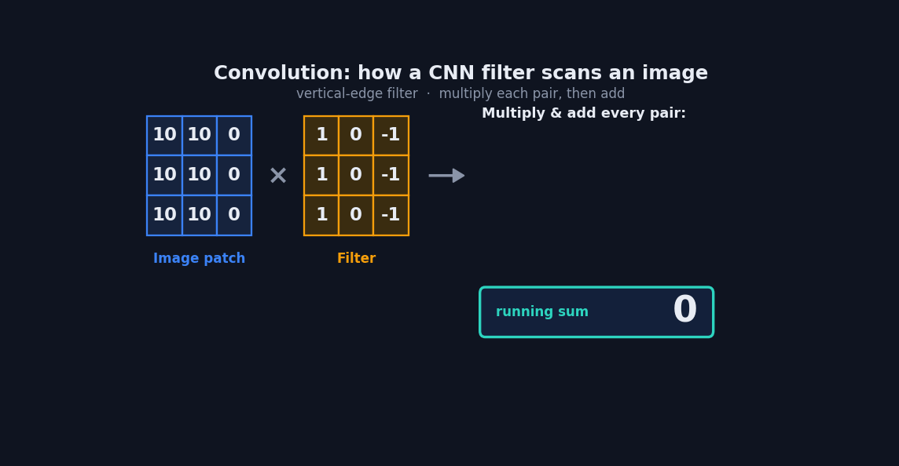
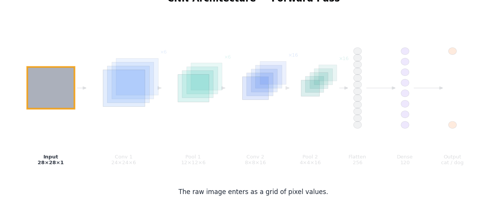

::: {.page-banner}
{fig-alt="Machine Learning in R — From Scratch without Tears"}
:::

# Chapter 12: Convolutional Neural Networks (CNNs)

> **Level**: Advanced | **Estimated Time**: 6–8 hours

---

## 12.1 Overview

A CNN is a type of neural network built to understand images. The core idea: instead of looking at every pixel all at once, it scans the image in small patches and learns to recognize patterns — starting simple and building up to complex.

Think of how you'd recognize a cat. You don't consciously analyze all 2 million pixels. Your brain notices edges, then combines edges into shapes (ears, eyes), then combines shapes into "cat." A CNN does exactly this, in layers.

The three key pieces:

**Convolution** is the "scanning" step. A small filter (say 3×3 pixels) slides across the image looking for one specific pattern — maybe a diagonal edge. Wherever it finds that pattern, it lights up. Early filters catch simple things (edges, colors); deeper filters catch complex things (textures, then whole objects). The network *learns* what these filters should look for during training - nobody programs them by hand.

**Pooling** is the "zoom out/summarize" step. After convolution, the network shrinks the image down (e.g. keeps only the strongest signal in each little region). This makes it faster and, more importantly, means the network doesn't care exactly *where* a feature is - a cat is a cat whether it's in the top-left or center.

**Fully connected layer** is the "make a decision" step at the end. After all the scanning and summarizing, the accumulated evidence gets fed into a regular neural network that outputs the final answer: "85% cat, 10% dog, 5% fox."

The magic is the stacking: convolution → pooling → convolution → pooling → ... → decision. Each round builds richer understanding on top of the last.

The key intuition to walk away with: a CNN isn't matching whole images against stored templates. It's learning a hierarchy of reusable pattern-detectors — edges become shapes, shapes become parts, parts become objects — and it figures out what to look for on its own during training. That's why the same trained network can spot a cat whether it's big, small, off to one side, or partly hidden.

---

## 12.2 The big idea in one breath

A regular neural network looks at every pixel on its own and drowns in numbers. A **CNN** is a neural network built for images. Instead of staring at raw pixels, it hunts for **local patterns**, an edge here, a curve there, a texture over there, using a trick called **convolution**.

Think of a tiny stencil (called a **filter** or **kernel**) sliding across the picture. At every spot it asks: *"Does my pattern show up right here?"* and answers with a single number.

---

## 12.3 An image is just a grid of numbers

A grayscale image is a grid where each cell is a pixel's brightness (say 0 = black, 255 = white). A color image is the same thing three times over, one grid for red, one for green, one for blue, stacked together. That stack of numbers is **all the CNN ever sees.**

---

## 12.4 The one piece of math that matters: convolution

Imagine you have a gray image that's just a bunch of numbers lined up in a grid (each number = how bright each spot is).

A **convolution** is just a way to look for patterns (like edges or corners) by sliding a tiny grid of numbers (called a "filter" or "kernel") over your big grid and, at each spot, mixing the numbers together in a special way.

Suppose your image is a grid $I$ (height $H$, width $W$), and your filter $K$ is a smaller grid ($f \times f$):

**The formula (don't panic!):**

$$
(I * K)[i,j] = \sum_m \sum_n I[i+m, j+n] \cdot K[m, n]
$$

Lay the filter $K$ on top of the image patch that starts at $(i, j)$. For every spot in the filter, multiply the filter's number by the image's number underneath, then add up all those results. That gives you one new number for that spot!

- You keep sliding the filter across the image – left-right, top-bottom – repeating this.
- The result is a new grid ("feature map") that shows where your filter "matched" the image.

Here's a 3x3 patch of an image and a 3x3 filter to spot vertical edges:

```
Image patch        Filter
10  10   0         1   0  -1
10  10   0    x    1   0  -1
10  10   0         1   0  -1
```

Multiply and add EVERY matching pair:

```
(10×1) + (10×0) + (0×-1) = 10
(10×1) + (10×0) + (0×-1) = 10
(10×1) + (10×0) + (0×-1) = 10
-------------------------------
                       total = 30
```

So, at this spot, the result is **30**. This big number means "hey, there's a vertical edge here!"

You slide this filter around on the image and make a new grid of results. Big numbers show where this pattern happens a lot.

### Sizes (so you're not confused by shapes):

- With no padding: output grid is $(H - f + 1) \times (W - f + 1)$
- With padding $p$: $(H - f + 2p + 1) \times (W - f + 2p + 1)$
- With stride $s$: $\left\lfloor \frac{H - f + 2p}{s} \right\rfloor + 1$

### The CNN's "magic trick":

You DON'T choose the filter numbers yourself! The network **learns** which numbers work best for the task, just by seeing tons of examples. This is what makes CNNs so powerful.

**Bonus tip:** "Parameter sharing" means you use the same filter/grid of numbers all over the image—it's not a new set for every spot. That's why CNNs use way fewer numbers than full neural networks, and can "see" patterns anywhere in the image!

---



### 12.5 Pooling

Pooling is just a way to make the picture (feature map) smaller and easier for the computer to work with.

Imagine you have a big grid of numbers (from a picture after filters were applied). Pooling goes over this grid, looks at little blocks (for example, 2×2 squares), and replaces each block with just ONE number!

There are two main types:

- **Max pooling:** Keep only the biggest number in each little block.
- **Average pooling:** Take all the numbers in the block, add them up, and divide by how many there are (just like getting the average in math class).

**Equation for max pooling in a 2×2 block:**
$$ \text{MaxPool}(X) = \max(X_{i,j}, X_{i,j+1}, X_{i+1,j}, X_{i+1,j+1}) $$

**Equation for average pooling in a 2×2 block:**
$$ \text{AvgPool}(X) = \frac{1}{4}(X_{i,j} + X_{i,j+1} + X_{i+1,j} + X_{i+1,j+1}) $$

Usually, we use 2×2 max pooling with stride 2, which means we move the window 2 steps at a time — so the grid gets half as tall and half as wide.

### 12.6 The full pipeline, step by step

Follow one photo of a cat all the way through:

| # | Step | What happens | Plain-English purpose |
|---|------|--------------|-----------------------|
| 1 | **Input** | Image becomes a grid (stack) of numbers | The only thing the network sees |
| 2 | **Convolution** | Slide learned filters, make feature maps | Find patterns: edges, curves, colors |
| 3 | **ReLU** | Turn negatives into 0: `max(0, x)` | Keep the "found it" signals, drop the rest; lets it learn complex shapes |
| 4 | **Pooling** | Scan small blocks, keep the biggest value | Shrink it; stop caring about exact pixel position |
| 5 | **Repeat 2–4** | Stack these layers several times | Edges → shapes → parts → whole objects |
| 6 | **Flatten** | Unroll the final grids into one long list | Prepare for an ordinary neural layer |
| 7 | **Fully connected** | Weighted sum of every feature | The actual "voting" on what the image is |
| 8 | **Output (softmax)** | Turn votes into probabilities | e.g. cat 92%, dog 8% → answer: **cat** |

---



### 12.7 Why stacking layers is the secret sauce

Here's the big idea: A CNN works so well because it does the SAME three steps (convolution → ReLU → pooling) OVER and OVER, each time learning more complex stuff.

Imagine it like this:

- **Layer 1:** Looks at the raw picture. It can only spot super basic things, like straight lines or colorful spots.
- **Layer 2:** Looks at what Layer 1 found. Now it can put those basic things together into simple shapes, like triangles or eye-like blobs.
- **Layer 3:** Takes the shapes from Layer 2 and puts them together to make bigger parts, like a cat's face or a paw.
- **Layers even deeper:** Combine those big parts to finally see the whole thing: "Oh hey, it's definitely a CAT!"

Each new layer has a "bigger imagination" than the one before. It goes from "I see a line" → "I see a shape" → "I see a face" → "I see a cat!"

That's why stacking layers is the magic: It lets the network go from basic doodles all the way up to recognizing whole objects. The more layers, the more complex things it can understand!

---

### 12.8 The three helper operations (Explained for Dummies)

**ReLU (activation):** Think of this like a bouncer at a club. If a number is negative, it gets bounced out (changed to 0). If it's positive, it goes inside (stays the same). So ReLU just means: "If it's less than 0, make it 0. If it's more than 0, keep it!" This helps the network notice interesting stuff and ignore boring (negative) signals.

**Pooling (downsampling):** Picture taking a big photo and shrinking it down by just keeping the most important bits. In max pooling, you look at little squares (like 2 by 2 blocks), and out of the four numbers inside, you keep ONLY the biggest one. This makes what the network sees smaller and simpler, kind of like making a thumbnail picture that still shows what's important, even if the cat moved a little.

**Fully connected layer (the decision):** This is like a giant voting round. Imagine unrolling all the numbers the network found so far into a big list. Each number casts a vote ("I saw whiskers!" "I saw paws!"). These votes are given different weights (some things matter more than others), added together, and at the end, the network decides what the picture is most likely showing. That's how it says, "I'm 92% sure it's a cat, 8% sure it's a dog." (The softmax part just makes all those vote totals turn into nice percentages that add up to 100%.)

---

### 12.9 How a CNN actually learns

1. Show it a labeled photo (you know it's a cat).
2. It makes a guess (say, "dog 70%").
3. Measure how wrong it was — the **error** (or "loss").
4. Nudge every filter and weight a tiny bit to reduce that error. This nudging is **backpropagation + gradient descent**.
5. Repeat across millions of images.

Over time, the filters organize themselves into edge-detectors, then shape-detectors, then object-detectors — **all learned, none hand-programmed.**

---

## 12.10 Key terms cheat sheet

| Term | Dummy definition |
|------|------------------|
| **Filter / Kernel** | A small grid of learned numbers that detects one pattern |
| **Feature map** | The grid you get after sliding a filter over the image |
| **Stride** | How many pixels the filter jumps each slide (bigger = smaller output) |
| **Padding** | Adding a border of zeros so filters can reach the edges |
| **Channel** | One "layer" of the image stack (e.g. the red channel) |
| **Epoch** | One full pass through all the training images |

---

### 12.11 The whole thing in one sentence

> **The convolution / ReLU / pooling stack builds features from raw pixels, and the fully connected layer turns those features into a decision.**

### 12.12. Where CNNs show up

Image classification, face recognition, medical imaging (tumor detection), self-driving car vision, satellite and agricultural imagery, and even non-image grids like spectrograms for audio. Anywhere the data has a **grid structure with local patterns**, a CNN is a natural fit.

### 12.13 From-Scratch R Implementation

```{r}
# cnn.R — 2D Convolution (grayscale)

conv2d <- function(image, kernel, stride = 1, padding = 0) {
  # 2D convolution (single channel). image: HxW matrix. kernel: fxf matrix.
  # Returns output feature map.
  H <- nrow(image); W <- ncol(image)
  f <- nrow(kernel)

  if (padding > 0) {
    padded <- matrix(0.0, H + 2 * padding, W + 2 * padding)
    padded[(padding + 1):(padding + H), (padding + 1):(padding + W)] <- image
  } else {
    padded <- image
  }

  pH <- nrow(padded); pW <- ncol(padded)
  out_H <- (pH - f) %/% stride + 1
  out_W <- (pW - f) %/% stride + 1

  output <- matrix(0.0, out_H, out_W)
  for (i in seq_len(out_H)) {
    ri <- (i - 1) * stride + 1
    for (j in seq_len(out_W)) {
      rj <- (j - 1) * stride + 1
      patch <- padded[ri:(ri + f - 1), rj:(rj + f - 1)]
      output[i, j] <- sum(patch * kernel)
    }
  }
  output
}

max_pool2d <- function(feature_map, pool_size = 2, stride = 2) {
  # 2D max pooling.
  H <- nrow(feature_map); W <- ncol(feature_map)
  out_H <- (H - pool_size) %/% stride + 1
  out_W <- (W - pool_size) %/% stride + 1
  output <- matrix(0.0, out_H, out_W)
  for (i in seq_len(out_H)) {
    ri <- (i - 1) * stride + 1
    for (j in seq_len(out_W)) {
      rj <- (j - 1) * stride + 1
      output[i, j] <- max(feature_map[ri:(ri + pool_size - 1), rj:(rj + pool_size - 1)])
    }
  }
  output
}

relu_2d <- function(feature_map) pmax(feature_map, 0.0)   # matrix must come first, or pmax() drops dim!

flatten <- function(feature_maps) {
  # Flatten a list of 2D feature maps to a 1D vector (row-major, like the Python version).
  unlist(lapply(feature_maps, function(fm) as.numeric(t(fm))))
}

# ── Edge Detection Demo ────────────────────────────────────────────────────

apply_filters <- function(image, filters) {
  # Apply multiple filters and return feature maps.
  lapply(filters, function(kernel) conv2d(image, kernel, stride = 1, padding = 1))
}

# ── Demo: Detect edges in a simple 5x5 "image" ───────────────────────────────

# 5x5 grayscale image (pixel values 0-1)
image <- matrix(c(
  0, 0, 0, 0, 0,
  0, 1, 1, 1, 0,
  0, 1, 1, 1, 0,
  0, 1, 1, 1, 0,
  0, 0, 0, 0, 0
), nrow = 5, byrow = TRUE)

# Sobel edge detection kernels
sobel_x <- matrix(c(-1, 0, 1, -2, 0, 2, -1, 0, 1), nrow = 3, byrow = TRUE)
sobel_y <- matrix(c(-1, -2, -1, 0, 0, 0, 1, 2, 1), nrow = 3, byrow = TRUE)

edge_x <- conv2d(image, sobel_x, stride = 1, padding = 1)
edge_y <- conv2d(image, sobel_y, stride = 1, padding = 1)

cat("Horizontal edge map (Sobel X):\n")
for (i in seq_len(nrow(edge_x))) cat(paste(sprintf("%5.1f", edge_x[i, ]), collapse = " "), "\n")

cat("\nMax Pooling (2x2) of edge_x:\n")
pooled <- max_pool2d(edge_x)
for (i in seq_len(nrow(pooled))) cat(paste(sprintf("%5.1f", pooled[i, ]), collapse = " "), "\n")

# Flatten for FC layer
flat <- flatten(list(pooled))
cat(sprintf("\nFlattened: [%s]\n", paste(sprintf("%.1f", flat), collapse = ", ")))
cat(sprintf("Ready for FC layer with %d inputs\n", length(flat)))
```

---

## 12.14 CNN on MNIST Dataset

We now train a **tiny CNN from scratch** on handwritten digits (MNIST), reusing `conv2d()`, `max_pool2d()`, `relu_2d()`, and `flatten()` from above.

**Rules for this section:** only base R (no torch, keras, or similar deep learning libraries).

**Pipeline:**

1. **Data preparation** — parse the local MNIST IDX files, normalize pixels to $[0,1]$, one-hot labels, train/val/test split
2. **Visualize** — sample digit grid and class-count bar chart
3. **Train** — convolution → ReLU → max-pool → flatten → fully connected → softmax, with backprop + SGD
4. **Loss curves** — plot training and validation cross-entropy (and val accuracy) over epochs
5. **Prediction** — `argmax` over class probabilities
6. **Validate** — accuracy on a held-out validation set, then a final test set

Because pure nested loops are slow, we train on a **small stratified subset** so the notebook finishes in a few minutes while still showing the full CNN learning loop.

### 12.14.1 Data preparation

Parse the local MNIST IDX files, scale pixels to $[0, 1]$, and build a stratified train / validation / test subset.

```{r}
# ── From-scratch CNN helpers for MNIST (Explained for Dummies!) ──────────────

# ---- Basic Functions for Neural Network Math ----

softmax_vec <- function(logits) {
  # Turns a vector of "scores" (any real numbers) into probabilities
  m <- max(logits)
  exps <- exp(logits - m)   # for stability, avoid huge exponents
  exps / sum(exps)
}

cross_entropy <- function(probs, y_onehot) {
  # How "bad" the predicted probabilities are, compared to the real answer.
  -sum(y_onehot * log(pmax(probs, 1e-12)))
}

one_hot <- function(label, n_classes = 10) {
  # Make a vector like c(0,0,1,0,0) for label 2 (if 5 classes). label is 0-indexed.
  v <- rep(0.0, n_classes)
  v[label + 1] <- 1.0
  v
}

accuracy_cnn <- function(y_true, y_pred) mean(y_true == y_pred)

# ---- Fully Connected Layer ("FC Layer") ----

fc_forward <- function(x, W, b) as.numeric(W %*% x) + b

fc_backward <- function(dout, x, W) {
  dW <- outer(dout, x)                  # how to tweak weights
  db <- dout                            # how to tweak bias
  dx <- as.numeric(t(W) %*% dout)       # how input affected result
  list(dx = dx, dW = dW, db = db)
}

# ---- "Backward" functions: how to go backwards through the CNN layers ----

conv2d_backward <- function(d_out, image, kernel, stride = 1, padding = 0) {
  # Computes: how to change the kernel/filter, and how much each input pixel mattered.
  H <- nrow(image); W <- ncol(image)
  f <- nrow(kernel)
  if (padding > 0) {
    padded <- matrix(0.0, H + 2 * padding, W + 2 * padding)
    padded[(padding + 1):(padding + H), (padding + 1):(padding + W)] <- image
  } else {
    padded <- image
  }

  d_kernel <- matrix(0.0, f, f)
  d_padded <- matrix(0.0, nrow(padded), ncol(padded))
  out_H <- nrow(d_out); out_W <- ncol(d_out)

  for (i in seq_len(out_H)) {
    ri <- (i - 1) * stride + 1
    for (j in seq_len(out_W)) {
      rj <- (j - 1) * stride + 1
      g <- d_out[i, j]
      patch <- padded[ri:(ri + f - 1), rj:(rj + f - 1)]
      d_kernel <- d_kernel + patch * g
      d_padded[ri:(ri + f - 1), rj:(rj + f - 1)] <- d_padded[ri:(ri + f - 1), rj:(rj + f - 1)] + kernel * g
    }
  }

  if (padding > 0) {
    d_image <- d_padded[(padding + 1):(padding + H), (padding + 1):(padding + W)]
  } else {
    d_image <- d_padded
  }
  list(d_kernel = d_kernel, d_image = d_image)
}

relu_2d_backward <- function(d_out, pre_relu) {
  # If value before ReLU was negative (0 after ReLU), don't pass any gradient
  d_out * (pre_relu > 0)
}

max_pool2d_forward_cache <- function(feature_map, pool_size = 2, stride = 2) {
  # Max pooling, but also remembers *where* each maximum came from (for learning).
  H <- nrow(feature_map); W <- ncol(feature_map)
  out_H <- (H - pool_size) %/% stride + 1
  out_W <- (W - pool_size) %/% stride + 1
  output <- matrix(0.0, out_H, out_W)
  switch_r <- matrix(0L, out_H, out_W)
  switch_c <- matrix(0L, out_H, out_W)
  for (i in seq_len(out_H)) {
    ri <- (i - 1) * stride + 1
    for (j in seq_len(out_W)) {
      rj <- (j - 1) * stride + 1
      block <- feature_map[ri:(ri + pool_size - 1), rj:(rj + pool_size - 1)]
      mi <- which(block == max(block), arr.ind = TRUE)[1, ]
      output[i, j] <- block[mi[1], mi[2]]
      switch_r[i, j] <- ri + mi[1] - 1
      switch_c[i, j] <- rj + mi[2] - 1
    }
  }
  list(output = output, switch_r = switch_r, switch_c = switch_c)
}

max_pool2d_backward <- function(d_out, switch_r, switch_c, in_H, in_W) {
  # Only the pixel that was "max" gets to learn.
  d_in <- matrix(0.0, in_H, in_W)
  for (i in seq_len(nrow(d_out))) {
    for (j in seq_len(ncol(d_out))) {
      r <- switch_r[i, j]; c <- switch_c[i, j]
      d_in[r, c] <- d_in[r, c] + d_out[i, j]
    }
  }
  d_in
}

flatten_backward <- function(d_flat, shapes) {
  # Splits a big flat gradient vector back into little 2D grids (one per feature map).
  grads <- list(); idx <- 1
  for (s in shapes) {
    Hh <- s[1]; Ww <- s[2]; n <- Hh * Ww
    chunk <- d_flat[idx:(idx + n - 1)]
    grads[[length(grads) + 1]] <- matrix(chunk, nrow = Hh, ncol = Ww, byrow = TRUE)
    idx <- idx + n
  }
  grads
}

# ---- Tiny, simple Neural Net that can actually learn to recognize numbers ----
#
# Very basic "convolutional neural network" for images that are 28x28 pixels.
# Process:
#   1. Run the image through a few little "filters" (3x3 each), like looking for edges/curves.
#   2. After filtering, set negatives to 0 (ReLU).
#   3. Shrink it down using max pooling (take biggest value from each little block).
#   4. Flatten all those little numbers into a single long row.
#   5. Run that through a regular neural network ("fully connected" layer).
#   6. Use softmax to get probabilities for each digit (0-9).

TinyCNN <- setRefClass(
  "TinyCNN",
  fields = list(n_filters = "numeric", n_classes = "numeric", lr = "numeric", n_flat = "numeric",
                kernels = "list", biases_c = "numeric", W = "matrix", b = "numeric",
                cache_ = "ANY"),
  methods = list(
    initialize = function(n_filters = 4, n_classes = 10, lr = 0.05, seed = 42, ...) {
      set.seed(seed)
      n_filters <<- n_filters; n_classes <<- n_classes; lr <<- lr

      # Initialize filters (3x3 "kernels") with some randomness, good for learning
      scale_k <- sqrt(2.0 / 9.0)   # standard trick to not explode gradients
      kernels <<- lapply(seq_len(n_filters), function(k) matrix(rnorm(9, 0, scale_k), 3, 3))
      biases_c <<- rep(0.0, n_filters)

      # After pooling, each filter's output is 14x14 (image is shrunk),
      # so we need to connect all those to each output digit:
      n_flat <<- 14 * 14 * n_filters
      scale_w <- sqrt(2.0 / n_flat)
      W <<- matrix(rnorm(n_classes * n_flat, 0, scale_w), nrow = n_classes, ncol = n_flat)
      b <<- rep(0.0, n_classes)
      cache_ <<- NULL
      callSuper(...)
    },

    forward = function(image) {
      # Run an image through the layers, saving steps for learning/backprop
      pre_relus <- list(); post_relus <- list(); pools <- list()
      switch_rs <- list(); switch_cs <- list()

      for (k in seq_len(n_filters)) {
        conv <- conv2d(image, kernels[[k]], stride = 1, padding = 1) + biases_c[k]
        pre_relus[[k]] <- conv
        act <- relu_2d(conv)               # set all negatives to zero
        post_relus[[k]] <- act
        pc <- max_pool2d_forward_cache(act, pool_size = 2, stride = 2)
        pools[[k]] <- pc$output
        switch_rs[[k]] <- pc$switch_r
        switch_cs[[k]] <- pc$switch_c
      }

      flat <- flatten(pools)                       # flatten into one big vector
      logits <- fc_forward(flat, W, b)              # matrix multiply into output "logits"
      probs <- softmax_vec(logits)                  # convert logits into probabilities

      cache_ <<- list(image = image, pre_relus = pre_relus, post_relus = post_relus,
                       pools = pools, switch_rs = switch_rs, switch_cs = switch_cs,
                       flat = flat, probs = probs)
      probs
    },

    backward = function(y_onehot) {
      c_ <- cache_
      # Figure out how wrong we were: softmax + cross-entropy
      d_logits <- c_$probs - y_onehot
      fcb <- fc_backward(d_logits, c_$flat, W)
      d_flat <- fcb$dx

      # Split up the big gradient back into each filter's pooled map
      pool_h <- nrow(c_$pools[[1]]); pool_w <- ncol(c_$pools[[1]])
      shapes <- rep(list(c(pool_h, pool_w)), n_filters)
      d_pools <- flatten_backward(d_flat, shapes)

      for (k in seq_len(n_filters)) {
        # Go backwards through max pooling (only winner pixel gets gradient)
        d_act <- max_pool2d_backward(d_pools[[k]], c_$switch_rs[[k]], c_$switch_cs[[k]],
                                      in_H = nrow(c_$post_relus[[k]]), in_W = ncol(c_$post_relus[[k]]))
        # Go backwards through ReLU
        d_conv <- relu_2d_backward(d_act, c_$pre_relus[[k]])
        d_bias <- sum(d_conv)
        # Find how to tweak the filter kernels
        cb <- conv2d_backward(d_conv, c_$image, kernels[[k]], stride = 1, padding = 1)

        # Apply update (tiny step opposite the gradient)
        kernels[[k]] <<- kernels[[k]] - lr * cb$d_kernel
        biases_c[k] <<- biases_c[k] - lr * d_bias
      }

      # Update fully connected layer weights and biases too
      W <<- W - lr * fcb$dW
      b <<- b - lr * fcb$db
    },

    predict_one = function(image) {
      # Predict the digit for one image (returns best guess and probabilities)
      probs <- forward(image)
      list(pred = which.max(probs) - 1L, probs = probs)
    },

    predict_batch = function(images) {
      # Predict digits for a list of images (returns guesses)
      sapply(images, function(img) predict_one(img)$pred)
    }
  )
)

cat("TinyCNN helpers ready (with explanations)!\n")
```

```{r}
# ── Download + parse MNIST (IDX format) ───────────────────────────────────────
# We already have the MNIST IDX files locally in ../Data/mnist (no download needed).

mnist_dir <- "../Data/mnist"

load_idx_labels <- function(path) {
  # Load the labels from the .gz file.
  con <- gzfile(path, "rb"); on.exit(close(con))
  magic <- readBin(con, integer(), n = 1, size = 4, endian = "big")
  n <- readBin(con, integer(), n = 1, size = 4, endian = "big")
  stopifnot(magic == 2049)   # make sure this is a label file
  as.integer(readBin(con, raw(), n = n))
}

load_idx_images_at <- function(path, indices) {
  # Load just the images at the given (0-indexed) indices, as H x W matrices in [0, 1].
  con <- gzfile(path, "rb"); on.exit(close(con))
  magic <- readBin(con, integer(), n = 1, size = 4, endian = "big")
  n <- readBin(con, integer(), n = 1, size = 4, endian = "big")
  rows <- readBin(con, integer(), n = 1, size = 4, endian = "big")
  cols <- readBin(con, integer(), n = 1, size = 4, endian = "big")
  stopifnot(magic == 2051)
  buf <- readBin(con, raw(), n = n * rows * cols)
  size <- rows * cols
  images <- lapply(indices, function(i) {
    base <- i * size
    px <- as.integer(buf[(base + 1):(base + size)]) / 255.0
    matrix(px, nrow = rows, ncol = cols, byrow = TRUE)
  })
  list(images = images, rows = rows, cols = cols)
}

# Pick the same number of indices for every digit class (0-9), for a balanced dataset.
stratified_indices <- function(labels, n_per_class, seed = 42) {
  set.seed(seed)
  chosen <- integer(0)
  for (c in 0:9) {
    class_idx <- which(labels == c) - 1L   # 0-indexed, to match image-buffer offsets
    chosen <- c(chosen, sample(class_idx, n_per_class))
  }
  sample(chosen)   # shuffle
}

# Split into train/val/test (default 70% train, 15% val, 15% test)
train_val_test_split_mnist <- function(X, y, train_frac = 0.7, val_frac = 0.15, seed = 42) {
  set.seed(seed)
  n <- length(X)
  idx <- sample(n)
  n_train <- floor(n * train_frac)
  n_val <- floor(n * val_frac)
  tr <- idx[1:n_train]
  va <- idx[(n_train + 1):(n_train + n_val)]
  te <- idx[(n_train + n_val + 1):n]
  list(X_train = X[tr], y_train = y[tr], X_val = X[va], y_val = y[va],
       X_test = X[te], y_test = y[te])
}

# 1. Read in all the train labels
all_labels <- load_idx_labels(file.path(mnist_dir, "train-labels-idx1-ubyte.gz"))
cat(sprintf("Full MNIST train labels: %d\n", length(all_labels)))

# 2. We only want a small sample for speed: 40 examples per digit = 400 total
n_per_class <- 40
idx_sub <- stratified_indices(all_labels, n_per_class = n_per_class, seed = 42)
cat(sprintf("Loading %d selected images ...\n", length(idx_sub)))

# 3. Load the corresponding images and labels
img_data <- load_idx_images_at(file.path(mnist_dir, "train-images-idx3-ubyte.gz"), idx_sub)
X_sub <- img_data$images
y_sub <- all_labels[idx_sub + 1]
cat(sprintf("Image size: %dx%d\n", img_data$rows, img_data$cols))

# 4. Split into training, validation, and test sets
split_mnist <- train_val_test_split_mnist(X_sub, y_sub, train_frac = 0.7, val_frac = 0.15, seed = 42)
X_train <- split_mnist$X_train; y_train <- split_mnist$y_train
X_val   <- split_mnist$X_val;   y_val   <- split_mnist$y_val
X_test  <- split_mnist$X_test;  y_test  <- split_mnist$y_test

cat(sprintf("Subset sizes - train: %d, val: %d, test: %d\n", length(X_train), length(X_val), length(X_test)))
cat("Label example (first 20 train):", y_train[1:20], "\n")
cat(sprintf("Pixel range check: min=%.3f, max=%.3f\n", min(X_train[[1]]), max(X_train[[1]])))
```

### 12.14.2 Visualize MNIST data

Before training, inspect the subset: a grid of handwritten digits and the class counts in each split.

```{r}
#| fig-width: 10
#| fig-height: 2.5
# ── Visualize MNIST subset (EXPLAINED FOR DUMMIES) ───────────────────────────

show_digit_grid <- function(images, labels, title, n_rows = 2, n_cols = 10, seed = 0) {
  # Show a table of digit pictures with their number above each one.
  set.seed(seed)
  idxs <- sample(seq_along(images))
  idxs <- idxs[1:min(length(idxs), n_rows * n_cols)]

  par(mfrow = c(n_rows, n_cols), mar = c(0.3, 0.3, 1.3, 0.3))
  for (i in idxs) {
    img <- images[[i]]
    image(t(img[nrow(img):1, ]), col = gray.colors(256, start = 0, end = 1), axes = FALSE,
          main = labels[i], cex.main = 1.0)
  }
  par(mfrow = c(1, 1))
  mtext(title, side = 3, line = -1.5, outer = TRUE, cex = 1.0)
}

# This function counts how many of each digit we have
count_labels <- function(y, n_classes = 10) sapply(0:(n_classes - 1), function(c) sum(y == c))

# Show a sample grid of digit pictures from our training data
show_digit_grid(X_train, y_train, "MNIST training samples (subset)", n_rows = 2, n_cols = 10)
```

```{r}
#| fig-width: 9
#| fig-height: 3.5
# Now let's see how many examples we have for each digit, in each data split
counts_mat <- rbind(Train = count_labels(y_train), Val = count_labels(y_val), Test = count_labels(y_test))
colnames(counts_mat) <- 0:9

barplot(counts_mat, beside = TRUE, col = c("steelblue", "orange", "forestgreen"),
        xlab = "Digit", ylab = "Count", main = "Class counts in the MNIST subset",
        legend.text = TRUE, args.legend = list(x = "topright", bty = "n"))

cat(sprintf("Train images: %d  |  shape: %dx%d\n", length(X_train), nrow(X_train[[1]]), ncol(X_train[[1]])))
cat(sprintf("Pixel range: [%.2f, %.2f]\n", min(X_train[[1]]), max(X_train[[1]])))
```

### 12.14.3 Train

Architecture: **4 filters (3×3)** → ReLU → **2×2 max-pool** → flatten → **fully connected (10 logits)** → softmax.
Loss: cross-entropy. Optimizer: plain SGD.

```{r}
# ── Train TinyCNN on MNIST subset ────────────────────────────────────────────

evaluate_cnn <- function(model, X, y) {
  # Checks how well our model is doing: predictions and average loss.
  preds <- model$predict_batch(X)
  loss <- 0.0
  for (i in seq_along(X)) {
    probs <- model$forward(X[[i]])
    loss <- loss + cross_entropy(probs, one_hot(y[i]))
  }
  list(loss = loss / length(X), acc = accuracy_cnn(y, preds))
}

train_cnn <- function(model, X_train, y_train, X_val, y_val, epochs = 5, batch_size = 20) {
  # Feeds lots of images through the model so it can practice and get better.
  history <- list(train_loss = numeric(0), val_loss = numeric(0), val_acc = numeric(0))
  n <- length(X_train)

  for (epoch in seq_len(epochs)) {
    order_ <- sample(n)   # shuffle so every epoch sees a different order
    running_loss <- 0.0

    for (start in seq(1, n, by = batch_size)) {
      end_ <- min(start + batch_size - 1, n)
      batch <- order_[start:end_]
      for (i in batch) {
        probs <- model$forward(X_train[[i]])
        y_oh <- one_hot(y_train[i])
        running_loss <- running_loss + cross_entropy(probs, y_oh)
        model$backward(y_oh)   # let the model adjust itself
      }
    }

    train_loss <- running_loss / n
    ev <- evaluate_cnn(model, X_val, y_val)
    history$train_loss <- c(history$train_loss, train_loss)
    history$val_loss <- c(history$val_loss, ev$loss)
    history$val_acc <- c(history$val_acc, ev$acc)

    cat(sprintf("Epoch %d/%d  train_loss=%.4f  val_loss=%.4f  val_acc=%.1f%%\n",
                epoch, epochs, train_loss, ev$loss, ev$acc * 100))
  }
  history
}

set.seed(42)
cnn <- TinyCNN$new(n_filters = 4, n_classes = 10, lr = 0.05, seed = 42)
cat(sprintf("Model: %d conv filters -> %d features -> %d classes\n",
            cnn$n_filters, cnn$n_flat, cnn$n_classes))
cat("Training (pure R -- please wait) ...\n\n")

history <- train_cnn(cnn, X_train, y_train, X_val, y_val, epochs = 5, batch_size = 20)
cat("\nTraining complete.\n")
```

### 12.14.4 Training and validation loss

Plot the cross-entropy curves stored in `history` after each epoch. Training loss should fall; validation loss shows how well the model generalizes.

```{r}
# ── Plot training / validation loss ───────────────────────────────────────────

epochs_range <- seq_along(history$train_loss)

par(mfrow = c(1, 2))

plot(epochs_range, history$train_loss, type = "o", col = "steelblue", pch = 16,
     xlab = "Epoch", ylab = "Cross-entropy loss", main = "Training vs validation loss", xaxt = "n")
axis(1, at = epochs_range)
lines(epochs_range, history$val_loss, type = "o", col = "tomato", pch = 15)
legend("topright", legend = c("Train loss", "Val loss"), col = c("steelblue", "tomato"),
       pch = c(16, 15), bty = "n")
grid()

plot(epochs_range, history$val_acc * 100, type = "o", col = "forestgreen", pch = 16,
     xlab = "Epoch", ylab = "Accuracy (%)", main = "Validation accuracy", ylim = c(0, 100), xaxt = "n")
axis(1, at = epochs_range)
grid()

par(mfrow = c(1, 1))

cat(sprintf("Final train loss: %.4f  |  Final val loss: %.4f  |  Final val acc: %.1f%%\n",
            tail(history$train_loss, 1), tail(history$val_loss, 1), tail(history$val_acc, 1) * 100))
```

### 12.14.5 Prediction and validation

Predict digit labels with `argmax` over softmax probabilities, measure accuracy on the validation and test splits, and inspect a few sample predictions.

```{r}
# ── Predict + validate (EXPLAINED FOR DUMMIES) ────────────────────────────────

ascii_digit <- function(image, threshold = 0.4) {
  # Show a tiny version of a 28x28 digit image using just '#' and '.'
  lines_out <- c()
  for (r in seq(1, 28, by = 2)) {
    row_str <- ""
    for (c in seq(1, 28, by = 2)) {
      r2 <- min(r + 1, 28); c2 <- min(c + 1, 28)
      v <- (image[r, c] + image[r, c2] + image[r2, c] + image[r2, c2]) / 4.0
      row_str <- paste0(row_str, if (v > threshold) "#" else ".")
    }
    lines_out <- c(lines_out, row_str)
  }
  paste(lines_out, collapse = "\n")
}

# Get predictions for all validation images using our trained CNN
val_preds <- cnn$predict_batch(X_val)
val_acc <- accuracy_cnn(y_val, val_preds)
cat(sprintf("Validation accuracy: %.1f%%  (%d/%d)\n", val_acc * 100, sum(y_val == val_preds), length(y_val)))

# Now do the same for the test set (images the model never saw)
test_preds <- cnn$predict_batch(X_test)
test_acc <- accuracy_cnn(y_test, test_preds)
cat(sprintf("Test accuracy:       %.1f%%  (%d/%d)\n", test_acc * 100, sum(y_test == test_preds), length(y_test)))

# Let's see how often the model gets each digit right or wrong
cat("\nValidation confusion (true -> predicted counts):\n")
for (true_c in 0:9) {
  idxs <- which(y_val == true_c)
  if (length(idxs) == 0) next
  pred_counts <- sapply(0:9, function(c) sum(val_preds[idxs] == c))
  top <- order(pred_counts, decreasing = TRUE)[1:3]
  parts <- character(0)
  for (c_i in top) {
    if (pred_counts[c_i] > 0) parts <- c(parts, sprintf("%d:%d", c_i - 1, pred_counts[c_i]))
  }
  cat(sprintf("  digit %d: %s\n", true_c, paste(parts, collapse = ", ")))
}

# Show a few examples: what the model predicted vs. the real answer
cat("\nSample predictions (true vs pred):\n")
for (i in 1:min(5, length(X_test))) {
  res <- cnn$predict_one(X_test[[i]])
  pred <- res$pred; probs <- res$probs
  conf <- probs[pred + 1]
  cat(sprintf("\n--- sample %d: true=%d  pred=%d  conf=%.2f ---\n", i - 1, y_test[i], pred, conf))
  cat(ascii_digit(X_test[[i]]), "\n")
}
```

---

## 12.15 Key CNN Concepts

| Concept | Purpose |
|---------|---------|
| Convolution | Local pattern detection with shared weights |
| Padding | Control output size; preserve border info |
| Stride | Control downsampling rate |
| Pooling | Reduce spatial dimensions, add invariance |
| Feature maps | Multiple filters → multiple channels |
| Parameter sharing | Each kernel reused across entire input |

---

## 12.16 Classic Architectures (Reference)

| Model | Year | Key Innovation |
|-------|------|----------------|
| LeNet-5 | 1998 | First practical CNN |
| AlexNet | 2012 | Deep CNN + ReLU + Dropout |
| VGGNet | 2014 | Very deep, small 3×3 kernels |
| ResNet | 2015 | Skip connections (residual learning) |
| EfficientNet | 2019 | Compound scaling |

---

## Exercises

1. Increase `n_filters` from 4 to 8 and compare validation accuracy (expect slower training).
2. What is the **receptive field** of a pixel after 3 conv layers with 3×3 kernels (stride 1, no pool)?
3. Why does parameter sharing make CNNs dramatically more efficient than fully connected nets on images?
4. Add a second fully connected hidden layer (e.g. 64 units + ReLU) before the 10-class output and retrain.

---

## Summary

This chapter introduced Convolutional Neural Networks (CNNs), a class of neural networks especially effective for image data.
It covered the core building blocks of CNNs—convolutions, padding, stride, pooling, feature maps, and parameter sharing—explaining
how these techniques enable local pattern detection while greatly reducing the number of parameters compared to fully connected networks.
You learned how to implement and train a simple CNN from scratch, visualized its predictions, and saw how CNNs can learn to classify
image data. The chapter also outlined classic CNN architectures such as LeNet, AlexNet, VGG, and ResNet,
providing historical perspective on how the field evolved. Exercises encouraged hands-on experimentation to deepen understanding of
receptive fields, efficiency gains from parameter sharing, and architectural tweaks. Overall, this notebook established practical and theoretical
foundations for convolutional networks and prepared you for deeper explorations of advanced architectures.

**← Previous:** [Chapter 11: Neural Networks](chapter-11-neural-networks.qmd)

**→ Next:** [Chapter 13: CNN-Advanced](chapter-13-cnn-advanced.qmd)
