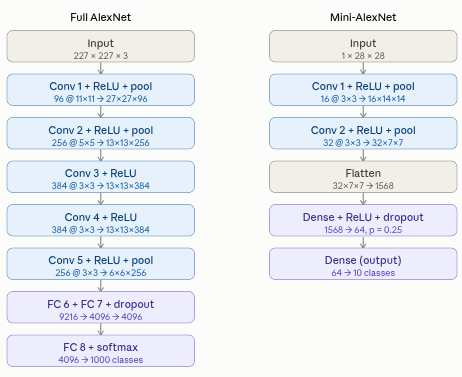
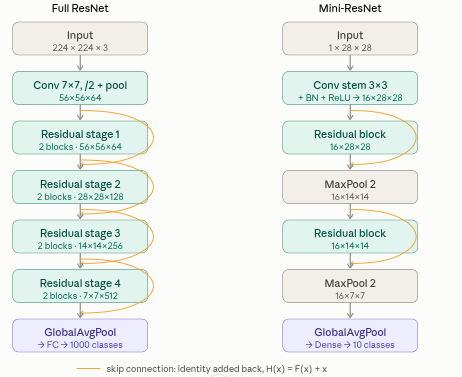
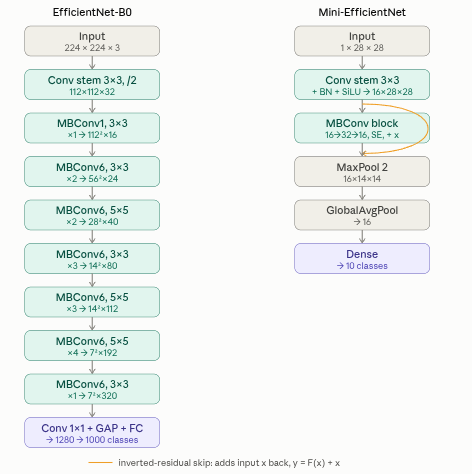
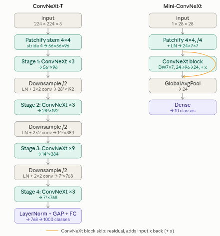
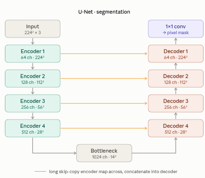

::: {.page-banner}
{fig-alt="Machine Learning in R — From Scratch without Tears"}
:::

# Chapter 13: CNNs-Advanced Architectures

> **Level**: Advanced | **Estimated Time**: 6–8 hours | **Prerequisites**: Chapter 12 (CNNs), Chapter 11 (Neural Networks)

---

## 13.1 Overview

Chapter 12 covered the mechanics of convolution, pooling, and building a basic CNN. This chapter goes deeper:

- **Batch Normalisation**: stabilise training, allow higher learning rates
- **Residual (skip) connections**: train networks hundreds of layers deep
- **Depthwise separable convolutions**: drastic parameter reduction
- **Modern architectures**: LeNet → AlexNet → VGG → ResNet family
- **Object detection**: sliding windows, anchor boxes, IoU, NMS

---

## 13.2 Batch Normalization

### Theory

Training deep networks is unstable because the distribution of each layer's inputs shifts as parameters change — **internal covariate shift**.

**Batch Norm** normalises each feature across the mini-batch, then applies learned scale $\gamma$ and shift $\beta$:

$$\mu_B = \frac{1}{m} \sum_{i=1}^{m} x_i \quad \text{(batch mean)}$$

$$\sigma^2_B = \frac{1}{m} \sum_{i=1}^{m} (x_i - \mu_B)^2 \quad \text{(batch variance)}$$

$$\hat{x}_i = \frac{x_i - \mu_B}{\sqrt{\sigma^2_B + \varepsilon}}$$

$$y_i = \gamma \hat{x}_i + \beta \quad \text{(learned scale and shift)}$$

At inference, use running mean/variance accumulated during training.

**Benefits**: higher learning rates, less sensitive to initialisation, slight regularisation effect.

### From-Scratch Implementation

Let's see how Batch Normalization works by building it step by step,
explaining each part along the way. We'll use simple code so you can understand
what's happening under the hood, not just rely on a framework.

```{r}
# Batch normalization evens out (normalizes) data in a batch, so each feature (a "column"
# in your data) has a mean close to 0 and a standard deviation close to 1. This helps
# neural networks train faster and more reliably!

BatchNorm1D <- setRefClass(
  "BatchNorm1D",
  fields = list(num_features = "numeric", eps = "numeric", momentum = "numeric",
                gamma = "numeric", beta = "numeric",
                running_mean = "numeric", running_var = "numeric", training = "logical"),
  methods = list(
    initialize = function(num_features, eps = 1e-5, momentum = 0.1, ...) {
      # eps: tiny number to keep division safe. momentum: how fast we update our
      # "memory" of past means/variances. gamma & beta: learned scale/shift.
      num_features <<- num_features; eps <<- eps; momentum <<- momentum
      gamma <<- rep(1.0, num_features)   # start with no scaling
      beta  <<- rep(0.0, num_features)   # start with no shifting
      running_mean <<- rep(0.0, num_features)
      running_var  <<- rep(1.0, num_features)
      training <<- TRUE   # when TRUE, normalize using the CURRENT batch's stats
      callSuper(...)
    },

    forward = function(X) {
      # X: matrix, one example per row, one feature per column.
      # Returns a matrix of the same shape, but normalized!
      if (training) {
        # Step 1: mean and variance for this batch, per feature (column)
        mean_ <- colMeans(X)
        var_  <- colMeans(sweep(X, 2, mean_, "-")^2)

        # Step 2: update running averages so we remember "normal" for later
        running_mean <<- (1 - momentum) * running_mean + momentum * mean_
        running_var  <<- (1 - momentum) * running_var  + momentum * var_
      } else {
        # Not training? Use the running averages we've collected so far.
        mean_ <- running_mean
        var_  <- running_var
      }

      # Step 3: normalize (subtract mean, divide by stddev), then scale/shift
      out <- sweep(X, 2, mean_, "-")
      out <- sweep(out, 2, sqrt(var_ + eps), "/")
      out <- sweep(out, 2, gamma, "*")
      out <- sweep(out, 2, beta, "+")
      out
    }
  )
)

# Example usage — showing what the numbers look like after normalization
bn <- BatchNorm1D$new(num_features = 3)
batch <- rbind(
  c(1.0, 2.0, 3.0),
  c(4.0, 5.0, 6.0),
  c(7.0, 8.0, 9.0)
)
normed <- bn$forward(batch)
cat("Batch Norm output (should have ~0 mean, ~1 std per feature):\n")
for (col in 1:3) {
  vals <- normed[, col]
  m_ <- mean(vals)
  sdv <- sqrt(mean((vals - m_)^2))
  cat(sprintf("  Feature %d: mean=%.4f, std=%.4f\n", col - 1, m_, sdv))
}
```

---

## 13.3 Residual (Skip) Connections

### The Vanishing Gradient Problem in Deep CNNs

In a 50-layer network, gradients must pass through 50 successive multiplications. Even gradients slightly less than 1 vanish exponentially.

### ResNet's Insight

Instead of learning a mapping $\mathbf{F}(\mathbf{x})$, learn the **residual** $\mathbf{H}(\mathbf{x}) - \mathbf{x}$:

$$\mathbf{H}(\mathbf{x}) = \mathbf{F}(\mathbf{x}) + \mathbf{x} \quad \leftarrow \text{add the input directly to the output}$$

If the optimal transform is close to identity, it's much easier to learn $\mathbf{F}(\mathbf{x}) \to 0$ than to learn $\mathbf{F}(\mathbf{x}) \to \mathbf{x}$ from scratch.

Crucially, gradients can flow backward through the **skip connection** (the $+ \mathbf{x}$ path) without passing through any learned weights → no vanishing gradient on that path.

```
Input x
   │
   ├──────────────┐  (skip / identity shortcut)
   │              │
  Conv 3×3       │
  BatchNorm       │
  ReLU            │
  Conv 3×3       │
  BatchNorm       │
   │              │
   └──────── + ──┘
             │
            ReLU
             │
           Output
```

### Building a Residual Block from the Ground Up

The code implementation below demonstrates all steps of this process, using plain R vectors and functions (no deep learning library required). We'll step through how each component—matrices for weights, activation functions, batch normalization, and the addition of the "shortcut"—comes together to form a residual block, which is the building block of many modern deep neural networks.

```{r}
# RELU: if the number is negative, turn it into 0; if it's positive, keep it.
relu_vec <- function(v) pmax(v, 0.0)

# Multiply a matrix by a vector (combining weights and inputs in a layer)
mat_vec_mul <- function(Wm, x) as.numeric(Wm %*% x)

# "Xavier" init: randomly pick starting weights, sized so numbers aren't too big/small
xavier_init <- function(rows, cols, seed = 0) {
  set.seed(seed)
  limit <- sqrt(6.0 / (rows + cols))
  matrix(runif(rows * cols, -limit, limit), nrow = rows, ncol = cols)
}

# The main event: A Residual Block!
# This is a dumbed-down (demo) version of a ResNet "residual block". Normally these use
# images and convolutions; here, it's just numbers in vectors to show the idea.
ResidualBlockDemo <- setRefClass(
  "ResidualBlockDemo",
  fields = list(W1 = "matrix", b1 = "numeric", W2 = "matrix", b2 = "numeric",
                bn1 = "ANY", bn2 = "ANY"),
  methods = list(
    initialize = function(dim, seed = 0, ...) {
      W1 <<- xavier_init(dim, dim, seed)
      b1 <<- rep(0.0, dim)
      W2 <<- xavier_init(dim, dim, seed + 1)
      b2 <<- rep(0.0, dim)
      bn1 <<- BatchNorm1D$new(dim)
      bn2 <<- BatchNorm1D$new(dim)
      callSuper(...)
    },

    forward = function(x) {
      # 1. Multiply by first weight matrix, add bias
      out <- mat_vec_mul(W1, x) + b1
      # 2. Run through batchnorm ("bn1") to stabilize
      out <- bn1$forward(matrix(out, nrow = 1))[1, ]
      # 3. Apply RELU
      out <- relu_vec(out)
      # 4. Multiply by second weight matrix, add bias
      out <- mat_vec_mul(W2, out) + b2
      # 5. Run through batchnorm again ("bn2")
      out <- bn2$forward(matrix(out, nrow = 1))[1, ]
      # 6. THE COOL PART: add the input x directly to the result (the "skip connection")
      out <- out + x
      # 7. One last RELU
      relu_vec(out)
    }
  )
)

# Let's see a demo!
block <- ResidualBlockDemo$new(dim = 4, seed = 42)
x_demo <- c(1.0, -0.5, 2.0, 0.3)
out_demo <- block$forward(x_demo)
cat("\nResidual Block demo:\n")
cat(sprintf("  Input:  %s\n", paste(round(x_demo, 3), collapse = ", ")))
cat(sprintf("  Output: %s\n", paste(round(out_demo, 3), collapse = ", ")))
cat("  The skip connection ensures output ~= input when weights are near 0.\n")
```

### Intersection over Union (IoU)

The following code explains how to compute the Intersection over Union (IoU), a common metric in computer vision to measure the overlap between two bounding boxes. IoU is used in tasks such as object detection to evaluate how well two boxes (such as a predicted box and a ground-truth box) overlap. It is defined as the area of overlap divided by the area of union between the two boxes.

---

## 13.4 Depthwise Separable Convolution

A standard 3×3 convolution on a C-channel input to produce C' channels costs:

$$\text{Params} = 3 \times 3 \times C \times C'$$

$$\text{FLOPs} = 3 \times 3 \times C \times C' \times H \times W$$

**Depthwise separable convolution** splits this into two steps:

1. **Depthwise conv**: apply one 3×3 filter per input channel → $C$ feature maps
2. **Pointwise conv**: apply $C'$ separate 1×1 filters across all channels

$$\text{Cost ratio} = \frac{3 \times 3 + C'}{3 \times 3 \times C'} \approx \frac{1}{9} \quad (8\text{–}9\times \text{ cheaper})$$

Used in MobileNet, EfficientNet, Xception.

| | Params |
|---|---|
| Standard | $9 \cdot C \cdot C'$ |
| Depthwise | $9 \cdot C$ |
| Pointwise | $C \cdot C'$ |
| Total depthwise separable | $C(9 + C')$ vs $9CC'$ → ~$9\times$ fewer params |

---

## 13.5 Architecture Evolution

| Model | Year | Innovation | Top-5 Error |
|-------|------|-----------|-------------|
| LeNet-5 | 1998 | First CNN for digits | — |
| AlexNet | 2012 | Deep CNN, ReLU, dropout | 15.3% |
| VGG-16 | 2014 | Only 3×3 convs, very deep | 7.3% |
| GoogLeNet | 2014 | Inception modules, 1×1 conv | 6.7% |
| ResNet-50 | 2015 | Skip connections, 50 layers | 3.6% |
| DenseNet | 2017 | All-to-all skip connections | 3.5% |
| MobileNetV2 | 2018 | Depthwise separable | ~4.0% |
| EfficientNet | 2019 | Compound scaling | 2.9% |

---

## 13.6 Object Detection Concepts

### 13.6.1 Intersection over Union (IoU)

Measures overlap between a predicted bounding box and ground-truth box:

$$\text{IoU} = \frac{\text{Area}(\text{Predicted} \cap \text{Ground Truth})}{\text{Area}(\text{Predicted} \cup \text{Ground Truth})}$$

A prediction is a true positive if $\text{IoU} > \text{threshold}$ (typically 0.5).

### 13.6.2 Non-Maximum Suppression (NMS)

When a detector fires multiple times on the same object, NMS keeps only the highest-confidence box:

```
1. Sort all predicted boxes by confidence score (descending)
2. Pick the top box, add to output
3. Remove all boxes with IoU > threshold vs the picked box
4. Repeat until no boxes remain
```

### 13.6.3 From-Scratch IoU and NMS

```{r}
compute_iou <- function(box_a, box_b) {
  # Computes the "Intersection over Union" (IoU) of two rectangles (boxes).
  # For dummies: imagine both boxes drawn on a picture. IoU tells us how much they
  # overlap. 1.0 = perfect overlap; 0.0 = no overlap at all.
  # box_a, box_b: each is (x1, y1, x2, y2) - top-left / bottom-right corners.

  x_left   <- max(box_a[1], box_b[1])
  y_top    <- max(box_a[2], box_b[2])
  x_right  <- min(box_a[3], box_b[3])
  y_bottom <- min(box_a[4], box_b[4])

  inter_w <- max(0.0, x_right - x_left)
  inter_h <- max(0.0, y_bottom - y_top)
  intersection <- inter_w * inter_h

  area_a <- (box_a[3] - box_a[1]) * (box_a[4] - box_a[2])
  area_b <- (box_b[3] - box_b[1]) * (box_b[4] - box_b[2])

  union <- area_a + area_b - intersection
  if (union > 0) intersection / union else 0.0
}

non_max_suppression <- function(boxes, scores, iou_threshold = 0.5) {
  # Removes overlapping boxes that are probably about the *same object*.
  # boxes: list of (x1,y1,x2,y2). scores: confidence for each box.
  # Returns: indices (1-based) of boxes to keep.
  order_ <- order(scores, decreasing = TRUE)
  kept <- integer(0)

  while (length(order_) > 0) {
    best <- order_[1]
    kept <- c(kept, best)
    order_ <- order_[-1]
    if (length(order_) == 0) break
    keep_mask <- sapply(order_, function(i) compute_iou(boxes[[best]], boxes[[i]]) < iou_threshold)
    order_ <- order_[keep_mask]
  }

  kept
}

# --- DEMO ---

boxes <- list(
  c(10, 10, 50, 50),     # box 1
  c(12, 12, 52, 52),     # box 2, very close to box 1 (lots of overlap)
  c(100, 100, 150, 150)  # box 3, far away, should never overlap
)
scores <- c(0.9, 0.75, 0.85)

kept <- non_max_suppression(boxes, scores, iou_threshold = 0.5)
cat("\nNMS Demo (for dummies):\n")
cat(sprintf("  Input boxes:  %d\n", length(boxes)))
cat("  Kept indices (1-based):", kept, "\n")
cat("  Kept boxes:\n")
for (i in kept) cat("   ", paste(boxes[[i]], collapse = ", "), "\n")
cat("  (Box 2 disappears because it's too close to box 1, which had a higher score!)\n")

# Demo for IoU: 2 squares that overlap half-way
iou_demo <- compute_iou(c(0, 0, 10, 10), c(5, 5, 15, 15))
cat(sprintf("\nIoU of 50%% overlapping boxes: %.3f\n", iou_demo))
```

---

## 13.7 Data Augmentation

What does "data augmentation" mean? Imagine you're training a computer to recognize cats in photos, but you only have a few pictures. If you keep showing the same pictures over and over, the computer gets really good at spotting *those* specific cats, but fails on new images.

Data augmentation is a trick to make your training set look much bigger and more varied! You take each picture and, every time you use it, you randomly *change* it - just a little bit each time. This way, the computer can't memorize one exact photo; it has to learn what's generally "cat-like."

**Example:**
  - You have a photo of a cat facing left. With augmentation, one time you might flip it so the cat faces right; next time, make it slightly brighter; another time, crop part of it, or add a bit of noise so it looks blurry.
  - It's like giving the computer a "new" cat each time, even though it all comes from one photo!

**Common ways to augment an image:**
- *Horizontal flip*: Mirror the photo left–right (cat swaps direction)
- *Random crop*: Cut out a part of the image, then resize it to original size
- *Colour jitter*: Randomly change brightness, contrast, or colour
- *Random rotation*: Tilt the photo a few degrees left or right
- *Gaussian noise*: Add a little random "static" (like an old TV picture)
- *Cutout / random erasing*: Black out a small patch (like placing a sticker over part of the image)

Below we implement each transform **from scratch** (base R only - no image-augmentation packages) and apply them to the Upatta logo.

```{r}
# ---------------------------------------------------------------------------
# Helpers
# ---------------------------------------------------------------------------

clip01 <- function(img) pmin(pmax(img, 0.0), 1.0)

bilinear_grid_sample <- function(img, xs, ys, fill = 1.0) {
  # For every pixel in the new (augmented) image, figure out where (xs, ys) it came
  # from in the old image - possibly in-between grid points! Take a weighted average
  # of the four closest pixels ("bilinear interpolation"). Out-of-bounds -> 'fill'.
  H <- dim(img)[1]; W <- dim(img)[2]
  is_color <- length(dim(img)) == 3
  C <- if (is_color) dim(img)[3] else 1
  oH <- nrow(xs); oW <- ncol(xs)

  out <- if (is_color) array(fill, dim = c(oH, oW, C)) else matrix(fill, oH, oW)

  for (i in 1:oH) {
    for (j in 1:oW) {
      x <- xs[i, j]; y <- ys[i, j]
      if (x < 0 || x > W - 1 || y < 0 || y > H - 1) next   # outside image: keep fill
      x0 <- floor(x); y0 <- floor(y)
      x1 <- min(x0 + 1, W - 1); y1 <- min(y0 + 1, H - 1)
      wx <- x - x0; wy <- y - y0
      x0r <- x0 + 1; x1r <- x1 + 1; y0r <- y0 + 1; y1r <- y1 + 1   # to 1-indexed
      if (is_color) {
        for (c in 1:C) {
          v00 <- img[y0r, x0r, c]; v01 <- img[y0r, x1r, c]
          v10 <- img[y1r, x0r, c]; v11 <- img[y1r, x1r, c]
          out[i, j, c] <- (1 - wy) * ((1 - wx) * v00 + wx * v01) + wy * ((1 - wx) * v10 + wx * v11)
        }
      } else {
        v00 <- img[y0r, x0r]; v01 <- img[y0r, x1r]
        v10 <- img[y1r, x0r]; v11 <- img[y1r, x1r]
        out[i, j] <- (1 - wy) * ((1 - wx) * v00 + wx * v01) + wy * ((1 - wx) * v10 + wx * v11)
      }
    }
  }
  out
}

resize_bilinear <- function(img, out_h, out_w, fill = 1.0) {
  # Change the size of the image to (out_h, out_w) using smooth interpolation.
  H <- dim(img)[1]; W <- dim(img)[2]
  xo <- (seq(0, out_w - 1) + 0.5) * W / out_w - 0.5
  yo <- (seq(0, out_h - 1) + 0.5) * H / out_h - 0.5
  xs <- matrix(xo, nrow = out_h, ncol = out_w, byrow = TRUE)
  ys <- matrix(yo, nrow = out_h, ncol = out_w, byrow = FALSE)
  bilinear_grid_sample(img, xs, ys, fill = fill)
}

# ---------------------------------------------------------------------------
# 1. Horizontal flip (mirror left-right)
# ---------------------------------------------------------------------------
horizontal_flip <- function(img) {
  if (length(dim(img)) == 3) img[, rev(seq_len(dim(img)[2])), , drop = FALSE]
  else img[, rev(seq_len(ncol(img)))]
}

# ---------------------------------------------------------------------------
# 2. Random crop (cut out part, stretch back to original size)
# ---------------------------------------------------------------------------
random_crop <- function(img, scale = c(0.6, 1.0), seed = NULL) {
  if (!is.null(seed)) set.seed(seed)
  H <- dim(img)[1]; W <- dim(img)[2]
  frac <- runif(1, scale[1], scale[2])
  crop_h <- max(1, round(H * sqrt(frac)))
  crop_w <- max(1, round(W * sqrt(frac)))
  y0 <- sample(0:(H - crop_h), 1)
  x0 <- sample(0:(W - crop_w), 1)
  patch <- img[(y0 + 1):(y0 + crop_h), (x0 + 1):(x0 + crop_w), , drop = FALSE]
  resize_bilinear(patch, H, W)
}

# ---------------------------------------------------------------------------
# 3. Colour jitter (brightness, contrast, saturation)
# ---------------------------------------------------------------------------
colour_jitter <- function(img, brightness = 0.3, contrast = 0.3, saturation = 0.3, seed = NULL) {
  if (!is.null(seed)) set.seed(seed)
  out <- img
  rgb <- out[, , 1:3]

  b <- runif(1, -brightness, brightness)   # brighten/darken
  rgb <- rgb + b

  cc <- runif(1, 1 - contrast, 1 + contrast)   # nudge away/toward the average colour
  m <- mean(rgb)
  rgb <- (rgb - m) * cc + m

  s <- runif(1, 1 - saturation, 1 + saturation)   # blend with grey, or make it pop
  grey <- 0.2989 * rgb[, , 1] + 0.5870 * rgb[, , 2] + 0.1140 * rgb[, , 3]
  for (c in 1:3) rgb[, , c] <- grey + s * (rgb[, , c] - grey)

  out[, , 1:3] <- clip01(rgb)
  out
}

# ---------------------------------------------------------------------------
# 4. Random rotation (tilt the image)
# ---------------------------------------------------------------------------
random_rotation <- function(img, max_degrees = 15.0, seed = NULL, fill = 1.0) {
  if (!is.null(seed)) set.seed(seed)
  angle <- runif(1, -max_degrees, max_degrees)
  rad <- angle * pi / 180
  cos_a <- cos(rad); sin_a <- sin(rad)

  H <- dim(img)[1]; W <- dim(img)[2]
  cx <- (W - 1) / 2.0; cy <- (H - 1) / 2.0
  xx <- matrix(0:(W - 1), nrow = H, ncol = W, byrow = TRUE)
  yy <- matrix(0:(H - 1), nrow = H, ncol = W, byrow = FALSE)
  dx <- xx - cx; dy <- yy - cy
  xs <-  cos_a * dx + sin_a * dy + cx
  ys <- -sin_a * dx + cos_a * dy + cy
  bilinear_grid_sample(img, xs, ys, fill = fill)
}

# ---------------------------------------------------------------------------
# 5. Gaussian noise (random static)
# ---------------------------------------------------------------------------
gaussian_noise <- function(img, sigma = 0.05, seed = NULL) {
  if (!is.null(seed)) set.seed(seed)
  noise <- array(rnorm(length(img), 0.0, sigma), dim = dim(img))
  out <- img
  if (length(dim(img)) == 3 && dim(img)[3] >= 3) {
    out[, , 1:3] <- clip01(out[, , 1:3] + noise[, , 1:3])
  } else {
    out <- clip01(out + noise)
  }
  out
}

# ---------------------------------------------------------------------------
# 6. Cutout / random erasing
# ---------------------------------------------------------------------------
cutout <- function(img, hole_frac = 0.2, fill = 0.0, seed = NULL) {
  if (!is.null(seed)) set.seed(seed)
  H <- dim(img)[1]; W <- dim(img)[2]
  side <- max(1, round(min(H, W) * hole_frac))
  y0 <- sample(0:(H - side), 1)
  x0 <- sample(0:(W - side), 1)
  out <- img
  out[(y0 + 1):(y0 + side), (x0 + 1):(x0 + side), ] <- fill
  out
}

# ---------------------------------------------------------------------------
# Combined random augmentation pipeline
# ---------------------------------------------------------------------------
augment_image <- function(img, seed = NULL) {
  if (!is.null(seed)) set.seed(seed)
  out <- img
  if (runif(1) < 0.5) out <- horizontal_flip(out)
  if (runif(1) < 0.5) out <- random_crop(out, seed = sample(1:1e9, 1))
  if (runif(1) < 0.5) out <- colour_jitter(out, seed = sample(1:1e9, 1))
  if (runif(1) < 0.5) out <- random_rotation(out, seed = sample(1:1e9, 1))
  if (runif(1) < 0.5) out <- gaussian_noise(out, seed = sample(1:1e9, 1))
  if (runif(1) < 0.5) out <- cutout(out, seed = sample(1:1e9, 1))
  out
}
```

### Apply Augmentation on Upatta Logo

```{r}
#| fig-width: 11
#| fig-height: 6
# ---------------------------------------------------------------------------
# Demo: Show each image augmentation step-by-step for beginners
# ---------------------------------------------------------------------------

replicate_channel <- function(m, C) array(rep(as.vector(m), C), dim = c(dim(m), C))

plot_rgb_image <- function(im, title) {
  im_clamped <- pmin(pmax(im, 0), 1)
  plot(0:1, 0:1, type = "n", axes = FALSE, xlab = "", ylab = "", main = title, cex.main = 0.9)
  rasterImage(as.raster(im_clamped), 0, 0, 1, 1)
}

# 1. Find the Upatta logo image file
logo_path <- "../Images/upatta_logo.png"

# 2. Load and prepare the image (png::readPNG already returns values in [0,1], RGBA)
raw <- png::readPNG(logo_path)
if (dim(raw)[3] == 3) {
  raw <- array(c(raw, array(1, dim = c(dim(raw)[1], dim(raw)[2], 1))), dim = c(dim(raw)[1], dim(raw)[2], 4))
}

# 3. Separate the transparency (alpha channel)
alpha <- raw[, , 4]

# 4. Blend the image onto a white background, so transparent edges look white
alpha3 <- replicate_channel(alpha, 3)
img <- clip01(raw[, , 1:3] * alpha3 + (1.0 - alpha3))

# 5. Create a list of demo images, each showing a different transformation
demos <- list(
  list(title = "Original",         im = img),
  list(title = "Horizontal flip",  im = horizontal_flip(img)),
  list(title = "Random crop",      im = random_crop(img, seed = 42)),
  list(title = "Colour jitter",    im = colour_jitter(img, seed = 7)),
  list(title = "Random rotation",  im = random_rotation(img, max_degrees = 15, seed = 3)),
  list(title = "Gaussian noise",   im = gaussian_noise(img, sigma = 0.08, seed = 11)),
  list(title = "Cutout / erasing", im = cutout(img, hole_frac = 0.25, seed = 5)),
  list(title = "Combined random",  im = augment_image(img, seed = 99))
)

# 6. Show all the images in a 2-row, 4-column grid
par(mfrow = c(2, 4), mar = c(0.5, 0.5, 1.8, 0.5))
for (d in demos) plot_rgb_image(d$im, d$title)
par(mfrow = c(1, 1))
mtext("From-scratch data augmentation on Upatta logo", side = 3, line = -1.5, outer = TRUE, font = 2)

# 7. Print out some info for reference
cat(sprintf("Loaded %s -> shape %s, values in [0, 1]\n", logo_path, paste(dim(img), collapse = "x")))
cat("Transforms: horizontal_flip, random_crop, colour_jitter,\n")
cat("            random_rotation, gaussian_noise, cutout, augment_image\n")
```

---

## 13.8 Six Landmark Architectures — Built & Trained From Scratch on MNIST

Sections 13.2–13.4 gave us the *ingredients* (batch norm, skip connections,
depthwise separable convolutions). Now we assemble them into the six
architectures that shaped modern computer vision, **implement every one from
scratch**, and race them against the plain CNN from **Chapter 12** on MNIST.

**Ground rules for "from scratch":**

* Only **base R array arithmetic** is used. There is **no torch, keras, or similar
  deep learning library** anywhere.
* Every layer's **forward *and* backward** pass (convolution, depthwise
  convolution, batch/layer norm, ReLU/GELU/SiLU, pooling, upsampling,
  squeeze-excite, residual add, dense concat, softmax cross-entropy) is
  written by hand and gradient-checked.
* The **data pipeline and the baseline CNN come from Chapter 12** and are
  reused (re-declared fresh in this self-contained document).

| # | Model | Year | The one idea to remember |
|---|-------|------|--------------------------|
| 1 | **AlexNet** | 2012 | Deep CNN + ReLU + dropout — the model that started the revolution |
| 2 | **ResNet** | 2015 | Skip connection `H(x)=F(x)+x` lets you train very deep nets |
| 3 | **DenseNet** | 2017 | *Concatenate* every earlier feature map — maximum reuse |
| 4 | **EfficientNet** | 2019 | MBConv (depthwise + squeeze-excite) + compound scaling |
| 5 | **ConvNeXt** | 2022 | A ResNet "modernised" with Transformer-era tricks |
| 6 | **U-Net** | 2015 | Encoder–decoder + long skips for pixel-wise output |

> Because everything runs in pure base R, the models below are
> **MNIST-scale miniatures**: each keeps its architecture's *signature block*
> but uses few channels so it trains in minutes, not hours.

### 13.8.1 AlexNet — going deep with ReLU and dropout

Before 2012, neural nets were shallow and used slow,
saturating activations. AlexNet stacked **five convolutional layers + three
fully-connected layers**, trained on two GPUs, and crushed the ImageNet
competition. It popularised three habits we still use:

1. **ReLU** activation $f(x)=\max(0,x)$ — no saturation, so gradients stay
   healthy and training is much faster than with $\tanh$/sigmoid.
2. **Dropout** in the dense layers — randomly zero a fraction $p$ of
   activations each step (then scale by $1/(1-p)$) so neurons can't co-adapt.
   This is cheap, powerful regularisation.
3. **Overlapping max-pooling** and heavy **data augmentation**.

**Math of dropout.** With mask $m_i \sim \text{Bernoulli}(1-p)$,
$$\tilde{a}_i = \frac{m_i}{1-p}\, a_i,$$
so the *expected* activation is unchanged and no rescaling is needed at test time.

**Our mini-AlexNet (input $1\times28\times28$).**
```
Conv(1→16,3) → ReLU → MaxPool2        # 16×14×14
Conv(16→32,3) → ReLU → MaxPool2       # 32×7×7
Flatten → Dense(→64) → ReLU → Dropout(0.25) → Dense(→10)
```



### 13.8.2 ResNet - the skip connection

Stacking more layers should never *hurt* — a deep net could
just copy its input through the extra layers. In practice, plain deep nets got
**worse** because the identity is hard to learn through many nonlinearities.
ResNet fixes this by *wiring the identity in for free*: each block learns only a
**residual** $F(x)$ and adds the input back.

$$\mathbf{H}(\mathbf{x}) = \mathbf{F}(\mathbf{x}) + \mathbf{x}$$

**Why the gradient stops vanishing.** Differentiating the block,
$$\frac{\partial \mathbf{H}}{\partial \mathbf{x}} = 1 + \frac{\partial \mathbf{F}}{\partial \mathbf{x}}.$$
That **$+1$** is a gradient *highway*: even if $\partial\mathbf{F}/\partial\mathbf{x}$
is tiny, the gradient still flows straight through the skip. This is what makes
100+ layer networks trainable.

**Our mini-ResNet.**
```
Conv(1→16,3) → BN → ReLU                     # stem, 16×28×28
[ Conv→BN→ReLU→Conv→BN  (+ x) → ReLU ]       # residual block
MaxPool2                                     # 16×14×14
[ residual block ] → MaxPool2                # 16×7×7
GlobalAvgPool → Dense(→10)
```



### 13.8.3 EfficientNet - MBConv + squeeze-excite + compound scaling

EfficientNet combines two ideas.

**(a) The MBConv block** (from MobileNetV2) — an *inverted residual* built on the
**depthwise separable** convolution from §13.4:
* **expand** channels with a $1\times1$ conv,
* filter cheaply with a **depthwise** $3\times3$ conv,
* recalibrate channels with **squeeze-and-excitation**,
* **project** back down with a $1\times1$ conv, and add a residual.

Squeeze-Excitation learns a per-channel importance gate:
$$\mathbf{s} = \sigma\big(W_2\,\mathrm{ReLU}(W_1\,\text{GAP}(\mathbf{x}))\big),
\qquad \mathbf{y} = \mathbf{x}\odot\mathbf{s}$$
GAP squeezes each channel to one number; two tiny dense layers decide how much to
amplify or suppress it. Activations use **Swish/SiLU**: $f(x)=x\,\sigma(x)$.

**(b) Compound scaling.** Instead of ad-hoc widening, scale depth, width and
resolution **together** with one coefficient $\phi$:
$$\text{depth}\propto\alpha^{\phi},\quad \text{width}\propto\beta^{\phi},\quad
\text{resolution}\propto\gamma^{\phi},\qquad \alpha\cdot\beta^{2}\cdot\gamma^{2}\approx 2.$$

**Our mini-EfficientNet.**
```
Conv(1→16,3)→BN→SiLU                                 # stem
MBConv: 1×1(16→32)→BN→SiLU → DWConv3×3→BN→SiLU
        → SE(32) → 1×1(32→16)→BN   (+ x)             # inverted residual
MaxPool2 → GlobalAvgPool → Dense(→10)
```



### 13.8.4 DenseNet — concatenate everything

**For dummies.** ResNet *adds* the shortcut. DenseNet **concatenates** it:
layer $\ell$ receives the feature maps of **all** preceding layers stacked along
the channel axis.

$$\mathbf{x}_\ell = H_\ell\big([\mathbf{x}_0, \mathbf{x}_1, \dots, \mathbf{x}_{\ell-1}]\big)$$

where $[\cdot]$ is channel-wise concatenation. If each layer outputs $k$ feature
maps (the **growth rate**), then layer $\ell$ sees $k_0 + k(\ell-1)$ input
channels. Because features are never overwritten, information and gradients are
reused maximally, so DenseNets hit high accuracy with **surprisingly few
parameters**. **Transition layers** ($1\times1$ conv + average pool) periodically
compress the channel count.

**Add vs. concat — the key contrast.**

| | ResNet | DenseNet |
|---|---|---|
| Shortcut op | $F(x) + x$ (sum) | $[x, F(x)]$ (concat) |
| Channels | constant | grow by $k$ each layer |

**Our mini-DenseNet** (growth $k=8$):
```
Conv(1→16,3)→BN→ReLU                    # 16×28×28
DenseLayer → 24ch → DenseLayer → 32ch → DenseLayer → 40ch
Transition: Conv1×1(40→20) → AvgPool2   # 20×14×14
GlobalAvgPool → Dense(→10)
```

### 13.8.5 ConvNeXt - a ConvNet modernised

After Vision Transformers (2020) briefly dethroned CNNs,
researchers asked: *what if we just modernise a ResNet with the same training
tricks?* The result, **ConvNeXt (2022)**, is a **pure convolutional net** that
matches Transformers. The upgrades:

* **Patchify stem**: a $4\times4$ stride-4 conv chops the image into
  non-overlapping patches (like a Transformer's tokeniser).
* **Large-kernel depthwise conv**: a $7\times7$ depthwise conv gives a big
  receptive field cheaply.
* **Fewer norms/activations**, and swap BatchNorm→**LayerNorm**, ReLU→**GELU**.
* **Inverted bottleneck**: expand $\times4$ with $1\times1$, then project back.

**GELU** (smooth ReLU): $\;\mathrm{GELU}(x)=x\,\Phi(x)\approx
0.5x\big(1+\tanh[\sqrt{2/\pi}(x+0.044715x^3)]\big).$

**LayerNorm** here normalises across **channels** at each spatial location
(no batch statistics), which is why it behaves well with tiny batches.

**Our mini-ConvNeXt.**
```
Conv(1→24,4,stride4) → LayerNorm             # patchify → 24×7×7
DWConv7×7 → LayerNorm → 1×1(24→96) → GELU → 1×1(96→24)   (+ x)
GlobalAvgPool → Dense(→10)
```



### 13.8.6 U-Net: encoder–decoder with long skip connections

The five models above answer *"what is in this image?"* (one
label). **U-Net** answers *"which pixels are what?"* — **segmentation**. It has a
**U** shape:

* the **encoder** (left) downsamples, building abstract *what* features while
  losing *where*;
* the **decoder** (right) upsamples back to full resolution;
* **long skip connections** copy each encoder feature map straight across and
  **concatenate** it with the matching decoder stage, restoring the sharp spatial
  detail that pooling threw away.

**Skip type contrast.** ResNet's skip is **short and additive** ($F(x)+x$ inside
one block). U-Net's is **long and concatenative** (encoder → decoder, across the
whole net): $\;\mathbf{d}_i' = \big[\,\text{Up}(\mathbf{d}_{i+1}),\ \mathbf{e}_i\,\big].$

**Caveat for this comparison.** U-Net's natural output is a *map*, not a class.
To race it fairly on MNIST *classification*, we bolt a
`GlobalAvgPool → Dense(→10)` head onto its final feature map. This demonstrates
the encoder–decoder + skip machinery; on a real task you would instead output a
per-pixel mask.

**Our mini-U-Net.**
```
enc1(1→16) ─────────────skip──────────────┐
   ↓pool                                   │
enc2(16→32) ──────skip─────┐               │
   ↓pool                   │               │
bottleneck(32)             │               │
   ↑up → concat → dec2(64→32)              │
        ↑up → concat → dec1(48→16) ────────┘
                 → GlobalAvgPool → Dense(→10)
```



### 13.8.7 The from-scratch R engine

Everything below is hand-written: `im2col`-based convolution, depthwise
convolution, batch/layer norm, activations, pooling, nearest-neighbour
upsampling, squeeze-excite, residual & concat containers, softmax
cross-entropy, and an Adam optimiser. Each layer exposes `forward()` and
`backward()`; containers aggregate their children's parameters.

```{r}
# mininn.R — a tiny deep-learning engine written from scratch in base R.
#
# EXPLANATION FOR DUMMIES:
#
# This code is a super simple neural network library written in R, using only base
# array arithmetic (no torch, keras, etc). It shows, at a low level, how deep learning
# "layers" are made. Every layer can do two things:
#  - `forward`: Given an input (like an image), it produces an output (feature map, etc).
#  - `backward`: Given the gradient of the output, it computes the gradient for its
#    input ("backpropagation" for learning).
#
# All "tensors" (data flowing through the net) are plain R arrays:
#   - images/feature maps: dim (N, C, H, W), where N=batch size, C=channels, H=height, W=width
#   - vectors: dim (N, D), e.g. for fully connected layers
#
# Major pieces:
# - `im2col`, `col2im`: Tricks to turn a sliding-window convolution into fast matrix ops.
# - `Conv2D`, `DepthwiseConv2D`: Convolutional layers.
# - `BatchNorm2D`, `LayerNorm2D`: Normalization layers.
# - Activations: `ReLU`, `GELU`, `SiLU`, `Sigmoid`.
# - Pooling: `MaxPool2D`, `AvgPool2D`, `GlobalAvgPool`, `Upsample2x`.
# - `Dense`: Standard fully connected layer. `Dropout`: regularization.
# - Composite modules: `Sequential`, `Residual`, `Concat2`, `ConcatSkip`, `Identity`.
# - `SEBlock`: Squeeze-and-Excitation (recalibrates channel importance).
# - Loss: `softmax_cross_entropy`. Optimizer: `Adam`.
#
# Every layer's params() returns a list of {get, set, grad} closures — these behave
# like references to the layer's own weight arrays, so the Adam optimizer can read
# gradients and write updated weights straight back into the layer (mirroring how
# Python mutates numpy arrays "in place").

# ----------------------------------------------------------------------
# im2col helpers (used by Conv2D, DepthwiseConv2D, and pooling)
# ----------------------------------------------------------------------

pad4d <- function(x, p) {
  # Pad a (N,C,H,W) tensor with 'p' zeros on each spatial edge.
  if (p == 0) return(x)
  d <- dim(x); N <- d[1]; C <- d[2]; H <- d[3]; W <- d[4]
  out <- array(0, dim = c(N, C, H + 2 * p, W + 2 * p))
  out[, , (p + 1):(p + H), (p + 1):(p + W)] <- x
  out
}

im2col <- function(x, k, s, p) {
  # Turn sliding kxk windows into a 6D array of "columns", for fast convolution.
  d <- dim(x); N <- d[1]; C <- d[2]; H <- d[3]; W <- d[4]
  xp <- pad4d(x, p)
  outH <- (H + 2 * p - k) %/% s + 1
  outW <- (W + 2 * p - k) %/% s + 1
  cols <- array(0, dim = c(N, C, k, k, outH, outW))
  for (i in 1:k) {
    for (j in 1:k) {
      ridx <- seq(i, by = s, length.out = outH)
      cidx <- seq(j, by = s, length.out = outW)
      cols[, , i, j, , ] <- xp[, , ridx, cidx, drop = FALSE]
    }
  }
  list(cols = cols, outH = outH, outW = outW)
}

col2im <- function(cols, x_shape, k, s, p) {
  # Opposite of im2col: reconstruct the image tensor from columns (accumulating overlaps).
  # NOTE: `cols[, , i, j, , ]` always drops the scalar-indexed (i,j) dims — but if N or C
  # also happens to be 1 (e.g. the very first conv layer sees a single grayscale channel),
  # R silently drops THOSE dims too, and `drop = FALSE` can't selectively stop just that
  # (it would stop the (i,j) dims from dropping as well, which we don't want). The robust
  # fix is to always force the shape back explicitly with `dim<-` after extracting.
  N <- x_shape[1]; C <- x_shape[2]; H <- x_shape[3]; W <- x_shape[4]
  outH <- (H + 2 * p - k) %/% s + 1
  outW <- (W + 2 * p - k) %/% s + 1
  xp <- array(0, dim = c(N, C, H + 2 * p, W + 2 * p))
  for (i in 1:k) {
    for (j in 1:k) {
      ridx <- seq(i, by = s, length.out = outH)
      cidx <- seq(j, by = s, length.out = outW)
      piece <- cols[, , i, j, , ]
      dim(piece) <- c(N, C, outH, outW)
      xp[, , ridx, cidx] <- xp[, , ridx, cidx, drop = FALSE] + piece
    }
  }
  if (p == 0) return(xp)
  xp[, , (p + 1):(p + H), (p + 1):(p + W), drop = FALSE]
}

abind_channels <- function(x1, x2) {
  # Concatenate two (N,C,H,W) tensors along the channel axis.
  d1 <- dim(x1); d2 <- dim(x2)
  out <- array(0, dim = c(d1[1], d1[2] + d2[2], d1[3], d1[4]))
  out[, 1:d1[2], , ] <- x1
  out[, (d1[2] + 1):(d1[2] + d2[2]), , ] <- x2
  out
}

# ----------------------------------------------------------------------
# Convolutions
# ----------------------------------------------------------------------

Conv2D <- setRefClass(
  "Conv2D",
  fields = list(cin = "numeric", cout = "numeric", k = "numeric", s = "numeric", p = "numeric",
                has_bias = "logical", W = "array", b = "ANY", dW = "array", db = "ANY",
                x_shape = "ANY", cols = "ANY", outHW = "ANY"),
  methods = list(
    initialize = function(cin = 1, cout = 1, k = 3, s = 1, p = 1, bias = TRUE, seed = 0, ...) {
      set.seed(seed)
      scale <- sqrt(2.0 / (cin * k * k))               # "He init"
      W <<- array(rnorm(cout * cin * k * k, 0, scale), dim = c(cout, cin, k, k))
      has_bias <<- bias
      if (bias) { b <<- rep(0.0, cout); db <<- rep(0.0, cout) } else { b <<- NULL; db <<- NULL }
      k <<- k; s <<- s; p <<- p; cin <<- cin; cout <<- cout
      dW <<- array(0, dim = dim(W))
      callSuper(...)
    },

    forward = function(x, train = TRUE) {
      x_shape <<- dim(x)
      ic <- im2col(x, k, s, p)
      cols <<- ic$cols
      oH <- ic$outH; oW <- ic$outW
      N <- dim(x)[1]
      cols2 <- cols; dim(cols2) <- c(N, cin * k * k, oH * oW)
      Wr <- W; dim(Wr) <- c(cout, cin * k * k)
      out <- array(0, dim = c(N, cout, oH * oW))
      for (n in seq_len(N)) out[n, , ] <- Wr %*% cols2[n, , ]
      if (has_bias) for (n in seq_len(N)) out[n, , ] <- out[n, , ] + b
      outHW <<- c(oH, oW)
      dim(out) <- c(N, cout, oH, oW)
      out
    },

    backward = function(gy) {
      N <- dim(gy)[1]
      oH <- outHW[1]; oW <- outHW[2]
      gy2 <- gy; dim(gy2) <- c(N, cout, oH * oW)
      cols2 <- cols; dim(cols2) <- c(N, cin * k * k, oH * oW)
      Wr <- W; dim(Wr) <- c(cout, cin * k * k)

      dW_flat <- matrix(0, cout, cin * k * k)
      for (n in seq_len(N)) dW_flat <- dW_flat + gy2[n, , ] %*% t(cols2[n, , ])
      dim(dW_flat) <- c(cout, cin, k, k)
      dW <<- dW_flat
      if (has_bias) db <<- apply(gy2, 2, sum)

      dcols2 <- array(0, dim = c(N, cin * k * k, oH * oW))
      for (n in seq_len(N)) dcols2[n, , ] <- t(Wr) %*% gy2[n, , ]
      dim(dcols2) <- c(N, cin, k, k, oH, oW)
      col2im(dcols2, x_shape, k, s, p)
    },

    params = function() {
      ps <- list(list(get = function() W, set = function(v) W <<- v, grad = function() dW))
      if (has_bias) ps <- c(ps, list(list(get = function() b, set = function(v) b <<- v, grad = function() db)))
      ps
    }
  )
)

# One kxk filter per input channel (no mixing between channels — like in MobileNet).
DepthwiseConv2D <- setRefClass(
  "DepthwiseConv2D",
  fields = list(ch = "numeric", k = "numeric", s = "numeric", p = "numeric",
                W = "array", b = "numeric", dW = "array", db = "numeric",
                x_shape = "ANY", cols = "ANY", outHW = "ANY"),
  methods = list(
    initialize = function(ch = 1, k = 3, s = 1, p = 1, seed = 0, ...) {
      set.seed(seed)
      scale <- sqrt(2.0 / (k * k))
      W <<- array(rnorm(ch * k * k, 0, scale), dim = c(ch, k, k))
      b <<- rep(0.0, ch)
      k <<- k; s <<- s; p <<- p; ch <<- ch
      dW <<- array(0, dim = dim(W)); db <<- rep(0.0, ch)
      callSuper(...)
    },
    forward = function(x, train = TRUE) {
      x_shape <<- dim(x)
      ic <- im2col(x, k, s, p)
      cols <<- ic$cols
      oH <- ic$outH; oW <- ic$outW
      N <- dim(x)[1]
      out <- array(0, dim = c(N, ch, oH, oW))
      for (i in 1:k) for (j in 1:k) {
        Wij <- W[, i, j]
        patch <- cols[, , i, j, , ]
        out <- out + sweep(patch, 2, Wij, "*")
      }
      out <- sweep(out, 2, b, "+")
      outHW <<- c(oH, oW)
      out
    },
    backward = function(gy) {
      dW_acc <- array(0, dim = dim(W))
      for (i in 1:k) for (j in 1:k) {
        patch <- cols[, , i, j, , ]
        dW_acc[, i, j] <- apply(patch * gy, 2, sum)
      }
      dW <<- dW_acc
      db <<- apply(gy, 2, sum)

      dcols <- array(0, dim = dim(cols))
      for (i in 1:k) for (j in 1:k) {
        Wij <- W[, i, j]
        dcols[, , i, j, , ] <- sweep(gy, 2, Wij, "*")
      }
      col2im(dcols, x_shape, k, s, p)
    },
    params = function() {
      list(list(get = function() W, set = function(v) W <<- v, grad = function() dW),
           list(get = function() b, set = function(v) b <<- v, grad = function() db))
    }
  )
)

# ----------------------------------------------------------------------
# Normalisation
# ----------------------------------------------------------------------

BatchNorm2D <- setRefClass(
  "BatchNorm2D",
  fields = list(ch = "numeric", eps = "numeric", mom = "numeric", g = "numeric", beta = "numeric",
                dg = "numeric", dbeta = "numeric", rm = "numeric", rv = "numeric",
                std = "ANY", xc = "ANY", xn = "ANY"),
  methods = list(
    initialize = function(ch = 1, eps = 1e-5, momentum = 0.1, ...) {
      ch <<- ch; eps <<- eps; mom <<- momentum
      g <<- rep(1.0, ch); beta <<- rep(0.0, ch)
      dg <<- rep(0.0, ch); dbeta <<- rep(0.0, ch)
      rm <<- rep(0.0, ch); rv <<- rep(1.0, ch)
      callSuper(...)
    },
    forward = function(x, train = TRUE) {
      if (train) {
        mu <- apply(x, 2, mean)
        varr <- apply(x, 2, function(z) mean((z - mean(z))^2))
        rm <<- (1 - mom) * rm + mom * mu
        rv <<- (1 - mom) * rv + mom * varr
      } else {
        mu <- rm; varr <- rv
      }
      std <<- sqrt(varr + eps)
      xc <<- sweep(x, 2, mu, "-")
      xn <<- sweep(xc, 2, std, "/")
      sweep(sweep(xn, 2, g, "*"), 2, beta, "+")
    },
    backward = function(gy) {
      d <- dim(gy); N <- d[1]; H <- d[3]; W <- d[4]
      m <- N * H * W
      dg <<- apply(gy * xn, 2, sum)
      dbeta <<- apply(gy, 2, sum)
      dxn <- sweep(gy, 2, g, "*")
      dvar <- apply(sweep(dxn * xc, 2, -0.5 * std^-3, "*"), 2, sum)
      dmu <- apply(sweep(dxn, 2, -1 / std, "*"), 2, sum) + dvar * apply(-2.0 * xc, 2, mean)
      sweep(dxn, 2, std, "/") + sweep(xc, 2, dvar * 2 / m, "*") + sweep(array(0, dim = dim(xc)), 2, dmu / m, "+")
    },
    params = function() {
      list(list(get = function() g, set = function(v) g <<- v, grad = function() dg),
           list(get = function() beta, set = function(v) beta <<- v, grad = function() dbeta))
    }
  )
)

# Normalise over the channel axis at each spatial location (like ConvNeXt does).
LayerNorm2D <- setRefClass(
  "LayerNorm2D",
  fields = list(ch = "numeric", eps = "numeric", g = "numeric", beta = "numeric",
                dg = "numeric", dbeta = "numeric", std = "ANY", xn = "ANY"),
  methods = list(
    initialize = function(ch = 1, eps = 1e-6, ...) {
      ch <<- ch; eps <<- eps
      g <<- rep(1.0, ch); beta <<- rep(0.0, ch)
      dg <<- rep(0.0, ch); dbeta <<- rep(0.0, ch)
      callSuper(...)
    },
    forward = function(x, train = TRUE) {
      d <- dim(x); N <- d[1]; C <- d[2]; H <- d[3]; W <- d[4]
      mu <- apply(x, c(1, 3, 4), mean)
      varr <- apply(x, c(1, 3, 4), function(z) mean((z - mean(z))^2))
      s <- sqrt(varr + eps)
      xn_ <- array(0, dim = d)
      for (c in 1:C) xn_[, c, , ] <- (x[, c, , ] - mu) / s
      xn <<- xn_; std <<- s
      out <- array(0, dim = d)
      for (c in 1:C) out[, c, , ] <- g[c] * xn_[, c, , ] + beta[c]
      out
    },
    backward = function(gy) {
      d <- dim(gy); N <- d[1]; C <- d[2]; H <- d[3]; W <- d[4]
      dg <<- sapply(1:C, function(c) sum(gy[, c, , ] * xn[, c, , ]))
      dbeta <<- sapply(1:C, function(c) sum(gy[, c, , ]))
      dxn <- array(0, dim = d)
      for (c in 1:C) dxn[, c, , ] <- gy[, c, , ] * g[c]
      dmu <- apply(dxn, c(1, 3, 4), sum)
      dvar <- array(0, dim = c(N, H, W))
      for (c in 1:C) dvar <- dvar + dxn[, c, , ] * xn[, c, , ]
      dx <- array(0, dim = d)
      for (c in 1:C) dx[, c, , ] <- (dxn[, c, , ] - dmu / C - xn[, c, , ] * dvar / C) / std
      dx
    },
    params = function() {
      list(list(get = function() g, set = function(v) g <<- v, grad = function() dg),
           list(get = function() beta, set = function(v) beta <<- v, grad = function() dbeta))
    }
  )
)

# ----------------------------------------------------------------------
# Activations
# ----------------------------------------------------------------------

ReLU <- setRefClass("ReLU", fields = list(mask = "ANY"),
  methods = list(
    forward = function(x, train = TRUE) { mask <<- x > 0; x * mask },
    backward = function(gy) gy * mask,
    params = function() list()
  ))

GELU <- setRefClass("GELU", fields = list(x = "ANY", t = "ANY"),
  methods = list(
    forward = function(x_, train = TRUE) {
      x <<- x_
      cc <- sqrt(2 / pi)
      t <<- tanh(cc * (x_ + 0.044715 * x_^3))
      0.5 * x_ * (1 + t)
    },
    backward = function(gy) {
      cc <- sqrt(2 / pi)
      dt <- cc * (1 + 3 * 0.044715 * x^2) * (1 - t^2)
      dx <- 0.5 * (1 + t) + 0.5 * x * dt
      gy * dx
    },
    params = function() list()
  ))

SiLU <- setRefClass("SiLU", fields = list(s = "ANY", x = "ANY"),   # "swish": x * sigmoid(x)
  methods = list(
    forward = function(x_, train = TRUE) { x <<- x_; s <<- 1 / (1 + exp(-x_)); x_ * s },
    backward = function(gy) gy * (s + x * s * (1 - s)),
    params = function() list()
  ))

Sigmoid <- setRefClass("Sigmoid", fields = list(s = "ANY"),
  methods = list(
    forward = function(x, train = TRUE) { s <<- 1 / (1 + exp(-x)); s },
    backward = function(gy) gy * s * (1 - s),
    params = function() list()
  ))

# ----------------------------------------------------------------------
# Pooling / resizing / shape
# ----------------------------------------------------------------------

MaxPool2D <- setRefClass(
  "MaxPool2D",
  fields = list(k = "numeric", s = "numeric", x_shape = "ANY", argmax = "ANY", cshape = "ANY", oHW = "ANY"),
  methods = list(
    initialize = function(k = 2, s = 2, ...) { k <<- k; s <<- s; callSuper(...) },
    forward = function(x, train = TRUE) {
      d <- dim(x); N <- d[1]; C <- d[2]
      x_shape <<- d
      ic <- im2col(x, k, s, 0)
      cols <- ic$cols; oH <- ic$outH; oW <- ic$outW
      dim(cols) <- c(N, C, k * k, oH, oW)
      argmax <<- apply(cols, c(1, 2, 4, 5), which.max)
      cshape <<- c(N, C, k * k, oH, oW)
      oHW <<- c(oH, oW)
      apply(cols, c(1, 2, 4, 5), max)
    },
    backward = function(gy) {
      d <- cshape; N <- d[1]; C <- d[2]; oH <- d[4]; oW <- d[5]
      dcols <- array(0, dim = cshape)
      idx_grid <- expand.grid(n = 1:N, c = 1:C, h = 1:oH, w = 1:oW)
      idx_mat <- cbind(idx_grid$n, idx_grid$c, as.vector(argmax), idx_grid$h, idx_grid$w)
      dcols[idx_mat] <- as.vector(gy)
      dim(dcols) <- c(N, C, k, k, oH, oW)
      col2im(dcols, x_shape, k, s, 0)
    },
    params = function() list()
  ))

AvgPool2D <- setRefClass(
  "AvgPool2D",
  fields = list(k = "numeric", s = "numeric", x_shape = "ANY", oHW = "ANY"),
  methods = list(
    initialize = function(k = 2, s = 2, ...) { k <<- k; s <<- s; callSuper(...) },
    forward = function(x, train = TRUE) {
      x_shape <<- dim(x)
      ic <- im2col(x, k, s, 0)
      oHW <<- c(ic$outH, ic$outW)
      apply(ic$cols, c(1, 2, 5, 6), mean)
    },
    backward = function(gy) {
      d <- dim(gy); N <- d[1]; C <- d[2]; oH <- d[3]; oW <- d[4]
      g <- gy / (k * k)
      dcols <- array(0, dim = c(N, C, k, k, oH, oW))
      for (i in 1:k) for (j in 1:k) dcols[, , i, j, , ] <- g
      col2im(dcols, x_shape, k, s, 0)
    },
    params = function() list()
  ))

GlobalAvgPool <- setRefClass("GlobalAvgPool", fields = list(x_shape = "ANY"),
  methods = list(
    forward = function(x, train = TRUE) { x_shape <<- dim(x); apply(x, c(1, 2), mean) },
    backward = function(gy) {
      d <- x_shape; N <- d[1]; C <- d[2]; H <- d[3]; W <- d[4]
      out <- array(0, dim = d)
      scale <- gy / (H * W)
      for (c in 1:C) out[, c, , ] <- array(scale[, c], dim = c(N, H, W))
      out
    },
    params = function() list()
  ))

Upsample2x <- setRefClass("Upsample2x", fields = list(),   # nearest-neighbor 2x upsampling
  methods = list(
    forward = function(x, train = TRUE) {
      d <- dim(x); N <- d[1]; C <- d[2]; H <- d[3]; W <- d[4]
      out <- array(0, dim = c(N, C, H * 2, W * 2))
      for (i in 1:2) for (j in 1:2) out[, , seq(i, H * 2, by = 2), seq(j, W * 2, by = 2)] <- x
      out
    },
    backward = function(gy) {
      d <- dim(gy); N <- d[1]; C <- d[2]; H <- d[3]; W <- d[4]
      out <- array(0, dim = c(N, C, H %/% 2, W %/% 2))
      for (i in 1:2) for (j in 1:2) out <- out + gy[, , seq(i, H, by = 2), seq(j, W, by = 2)]
      out
    },
    params = function() list()
  ))

Flatten <- setRefClass("Flatten", fields = list(shp = "ANY"),
  methods = list(
    forward = function(x, train = TRUE) {
      shp <<- dim(x)
      N <- shp[1]
      out <- x; dim(out) <- c(N, prod(shp[-1]))
      out
    },
    backward = function(gy) { out <- gy; dim(out) <- shp; out },
    params = function() list()
  ))

# ----------------------------------------------------------------------
# Dense / dropout
# ----------------------------------------------------------------------

Dense <- setRefClass(
  "Dense",
  fields = list(din = "numeric", dout = "numeric", W = "matrix", b = "numeric",
                dW = "matrix", db = "numeric", x = "ANY"),
  methods = list(
    initialize = function(din = 1, dout = 1, seed = 0, ...) {
      set.seed(seed)
      W <<- matrix(rnorm(din * dout, 0, sqrt(2.0 / din)), nrow = din, ncol = dout)
      b <<- rep(0.0, dout)
      din <<- din; dout <<- dout
      dW <<- matrix(0, din, dout); db <<- rep(0.0, dout)
      callSuper(...)
    },
    forward = function(x_, train = TRUE) { x <<- x_; sweep(x_ %*% W, 2, b, "+") },
    backward = function(gy) {
      dW <<- t(x) %*% gy
      db <<- apply(gy, 2, sum)
      gy %*% t(W)
    },
    params = function() {
      list(list(get = function() W, set = function(v) W <<- v, grad = function() dW),
           list(get = function() b, set = function(v) b <<- v, grad = function() db))
    }
  ))

Dropout <- setRefClass("Dropout", fields = list(p = "numeric", mask = "ANY"),
  methods = list(
    initialize = function(p = 0.3, ...) { p <<- p; callSuper(...) },
    forward = function(x, train = TRUE) {
      if (train && p > 0) {
        mask <<- (array(runif(length(x)), dim = dim(x)) > p) / (1 - p)
        x * mask
      } else x
    },
    backward = function(gy) gy * mask,
    params = function() list()
  ))

# ----------------------------------------------------------------------
# Composite blocks
# ----------------------------------------------------------------------

Sequential <- setRefClass("Sequential", fields = list(sublayers = "list"),
  methods = list(
    initialize = function(...) sublayers <<- list(...),
    forward = function(x, train = TRUE) { for (l in sublayers) x <- l$forward(x, train); x },
    backward = function(gy) { for (l in rev(sublayers)) gy <- l$backward(gy); gy },
    params = function() { ps <- list(); for (l in sublayers) ps <- c(ps, l$params()); ps }
  ))

Residual <- setRefClass("Residual", fields = list(block = "ANY", fx = "ANY"),
  # out = block(x) + x (shapes must match) — a "skip connection" like ResNet.
  methods = list(
    initialize = function(block_, ...) block <<- block_,
    forward = function(x, train = TRUE) { fx <<- block$forward(x, train); fx + x },
    backward = function(gy) block$backward(gy) + gy,   # gradient flows through the skip too!
    params = function() block$params()
  ))

Concat2 <- setRefClass("Concat2", fields = list(a = "ANY", b = "ANY", oa = "ANY", ob = "ANY", ca = "numeric"),
  # Concatenate two branches along the channel dimension: [A(x), B(x)].
  methods = list(
    initialize = function(a_, b_, ...) { a <<- a_; b <<- b_ },
    forward = function(x, train = TRUE) {
      oa <<- a$forward(x, train); ob <<- b$forward(x, train)
      ca <<- dim(oa)[2]
      abind_channels(oa, ob)
    },
    backward = function(gy) {
      d <- dim(gy)
      ga <- a$backward(gy[, 1:ca, , , drop = FALSE])
      gb <- b$backward(gy[, (ca + 1):d[2], , , drop = FALSE])
      ga + gb
    },
    params = function() c(a$params(), b$params())
  ))

Identity <- setRefClass("Identity", fields = list(),
  methods = list(forward = function(x, train = TRUE) x, backward = function(gy) gy, params = function() list()))

SEBlock <- setRefClass(
  "SEBlock",
  # Squeeze-and-Excitation block: weighs how important each channel is.
  fields = list(gap = "ANY", fc1 = "ANY", act = "ANY", fc2 = "ANY", sig = "ANY", x = "ANY", s = "ANY"),
  methods = list(
    initialize = function(ch, r = 4, seed = 0, ...) {
      gap <<- GlobalAvgPool$new()
      fc1 <<- Dense$new(ch, max(1, ch %/% r), seed = seed)
      act <<- ReLU$new()
      fc2 <<- Dense$new(max(1, ch %/% r), ch, seed = seed + 1)
      sig <<- Sigmoid$new()
    },
    forward = function(x_, train = TRUE) {
      x <<- x_
      s_ <- gap$forward(x_, train)
      s_ <- fc1$forward(s_, train)
      s_ <- act$forward(s_, train)
      s_ <- fc2$forward(s_, train)
      s_ <- sig$forward(s_, train)
      s <<- s_
      d <- dim(x_); N <- d[1]; C <- d[2]; H <- d[3]; W <- d[4]
      out <- array(0, dim = d)
      for (c in 1:C) out[, c, , ] <- x_[, c, , ] * array(s_[, c], dim = c(N, H, W))
      out
    },
    backward = function(gy) {
      d <- dim(gy); N <- d[1]; C <- d[2]; H <- d[3]; W <- d[4]
      dx <- array(0, dim = d)
      for (c in 1:C) dx[, c, , ] <- gy[, c, , ] * array(s[, c], dim = c(N, H, W))
      ds <- matrix(0, N, C)
      for (c in 1:C) ds[, c] <- apply(gy[, c, , ] * x[, c, , ], 1, sum)
      ds <- sig$backward(ds); ds <- fc2$backward(ds); ds <- act$backward(ds); ds <- fc1$backward(ds)
      dx + gap$backward(ds)
    },
    params = function() c(fc1$params(), fc2$params())
  ))

# ----------------------------------------------------------------------
# Loss
# ----------------------------------------------------------------------

softmax_cross_entropy <- function(logits, y) {
  # logits: matrix (N,K). y: integer labels 0-indexed, length N.
  z <- sweep(logits, 1, apply(logits, 1, max), "-")   # numerical stability
  e <- exp(z)
  p <- sweep(e, 1, apply(e, 1, sum), "/")              # softmax
  N <- nrow(logits)
  idx <- cbind(seq_len(N), y + 1)
  loss <- mean(-log(p[idx] + 1e-12))
  d <- p
  d[idx] <- d[idx] - 1
  list(loss = loss, dlogits = d / N)
}

# ----------------------------------------------------------------------
# Adam optimiser
# ----------------------------------------------------------------------

Adam <- setRefClass(
  "Adam",
  fields = list(lr = "numeric", b1 = "numeric", b2 = "numeric", eps = "numeric",
                m = "list", v = "list", t = "numeric"),
  methods = list(
    initialize = function(lr = 1e-3, b1 = 0.9, b2 = 0.999, eps = 1e-8, ...) {
      lr <<- lr; b1 <<- b1; b2 <<- b2; eps <<- eps
      m <<- list(); v <<- list(); t <<- 0
      callSuper(...)
    },
    step = function(params) {
      t <<- t + 1
      for (i in seq_along(params)) {
        pp <- params[[i]]
        g <- pp$grad()
        if (length(m) < i || is.null(m[[i]])) { m[[i]] <<- g * 0; v[[i]] <<- g * 0 }
        m[[i]] <<- b1 * m[[i]] + (1 - b1) * g
        v[[i]] <<- b2 * v[[i]] + (1 - b2) * (g * g)
        mh <- m[[i]] / (1 - b1^t)
        vh <- v[[i]] / (1 - b2^t)
        pp$set(pp$get() - lr * mh / (sqrt(vh) + eps))
      }
    }
  )
)

cat("mininn.R engine loaded!\n")
```

### 13.8.8 Sanity check — is the backprop correct?

Analytic gradients are only useful if they're right. We compare a few layers'
backward passes against **numerical** gradients (central differences). A
relative error near $10^{-7}$ or smaller means the hand-derived math is correct.

```{r}
# Checks the correctness of backpropagation of a given layer by comparing its
# analytical gradients to numerical gradients computed with central differences.
num_dx <- function(layer, x, seed = 1) {
  set.seed(seed)
  y <- layer$forward(x, train = TRUE)          # forward pass through the layer
  g0 <- array(rnorm(length(y)), dim = dim(y))  # random "upstream" gradient

  invisible(layer$forward(x, train = TRUE))    # (to set internal state, if needed)
  gx <- layer$backward(g0)                     # analytical gradient

  eps <- 1e-5
  ng <- array(0, dim = dim(x))
  # For speed, spot-check a random subset of input elements rather than every one.
  idxs <- sample(length(x), min(40, length(x)))
  for (idx in idxs) {
    xp <- x; xp[idx] <- xp[idx] + eps
    xm <- x; xm[idx] <- xm[idx] - eps
    ng[idx] <- (sum(layer$forward(xp, train = TRUE) * g0) -
                sum(layer$forward(xm, train = TRUE) * g0)) / (2 * eps)
  }
  max(abs(gx[idxs] - ng[idxs])) / (max(abs(ng[idxs])) + 1e-9)
}

set.seed(0)
x_check <- array(rnorm(2 * 4 * 6 * 6), dim = c(2, 4, 6, 6))

checks <- list(
  "Conv2D"          = Conv2D$new(4, 5, 3, 1, 1, seed = 1),
  "DepthwiseConv2D" = DepthwiseConv2D$new(4, 3, 1, 1, seed = 1),
  "BatchNorm2D"     = BatchNorm2D$new(4),
  "LayerNorm2D"     = LayerNorm2D$new(4),
  "GELU"            = GELU$new(),
  "SiLU"            = SiLU$new(),
  "MaxPool2D"       = MaxPool2D$new(2, 2),
  "Upsample2x"      = Upsample2x$new(),
  "SEBlock"         = SEBlock$new(4, r = 2, seed = 1),
  "Residual"        = Residual$new(Conv2D$new(4, 4, 3, 1, 1, seed = 1))
)

cat(sprintf("%-18s %-10s %s\n", "layer", "rel-err", "status"))
for (name in names(checks)) {
  e <- num_dx(checks[[name]], x_check)
  status <- if (e < 1e-4) "OK" else "CHECK"
  cat(sprintf("%-18s %.2e   %s\n", name, e, status))
}
```

### 13.8.9 The six architectures in code

Each builder returns a model assembled purely from the engine above. `Sequential`
chains layers; `Residual` adds the skip; `ConcatSkip` implements DenseNet's
concatenation; `UNet` is a small custom module that manages its long skips.

```{r}
# "cba" stands for Conv-BatchNorm-Activation: a common combo in neural nets.
cba <- function(cin, cout, k = 3, s = 1, p = 1, act_fn = function() ReLU$new(), seed = 0) {
  Sequential$new(Conv2D$new(cin, cout, k, s, p, seed = seed), BatchNorm2D$new(cout), act_fn())
}

# DenseNet primitive: output = concat(x, block(x)) along channels.
ConcatSkip <- setRefClass("ConcatSkip", fields = list(block = "ANY", cx = "numeric"),
  methods = list(
    initialize = function(block_, ...) block <<- block_,
    forward = function(x, train = TRUE) {
      cx <<- dim(x)[2]
      h <- block$forward(x, train)
      abind_channels(x, h)
    },
    backward = function(gy) {
      d <- dim(gy)
      gskip <- gy[, 1:cx, , , drop = FALSE]
      gh <- gy[, (cx + 1):d[2], , , drop = FALSE]
      gskip + block$backward(gh)
    },
    params = function() block$params()
  ))

# 1) AlexNet: one of the first famous convolutional neural nets.
build_alexnet <- function() {
  Sequential$new(
    Conv2D$new(1, 16, 3, 1, 1, seed = 1), ReLU$new(), MaxPool2D$new(2, 2),
    Conv2D$new(16, 32, 3, 1, 1, seed = 2), ReLU$new(), MaxPool2D$new(2, 2),
    Flatten$new(),
    Dense$new(32 * 7 * 7, 64, seed = 3), ReLU$new(), Dropout$new(0.25),
    Dense$new(64, 10, seed = 4)
  )
}

# 2) ResNet: uses "residual" connections, allowing the network to "skip" layers
build_resnet <- function() {
  resblock <- function(ch, seed) {
    Sequential$new(
      Residual$new(Sequential$new(
        Conv2D$new(ch, ch, 3, 1, 1, seed = seed), BatchNorm2D$new(ch), ReLU$new(),
        Conv2D$new(ch, ch, 3, 1, 1, seed = seed + 1), BatchNorm2D$new(ch)
      )),
      ReLU$new()
    )
  }
  Sequential$new(
    Conv2D$new(1, 16, 3, 1, 1, seed = 1), BatchNorm2D$new(16), ReLU$new(),
    resblock(16, 10),
    MaxPool2D$new(2, 2),
    resblock(16, 20),
    MaxPool2D$new(2, 2),
    GlobalAvgPool$new(),
    Dense$new(16, 10, seed = 5)
  )
}

# 3) DenseNet: each layer gets inputs from all previous layers (via ConcatSkip)
build_densenet <- function() {
  dlayer <- function(cin, seed) Sequential$new(BatchNorm2D$new(cin), ReLU$new(), Conv2D$new(cin, 8, 3, 1, 1, seed = seed))
  Sequential$new(
    Conv2D$new(1, 16, 3, 1, 1, seed = 1), BatchNorm2D$new(16), ReLU$new(),
    ConcatSkip$new(dlayer(16, 10)),   # 16+8 = 24
    ConcatSkip$new(dlayer(24, 11)),   # 24+8 = 32
    ConcatSkip$new(dlayer(32, 12)),   # 32+8 = 40
    Conv2D$new(40, 20, 1, 1, 0, seed = 13), AvgPool2D$new(2, 2),
    GlobalAvgPool$new(), Dense$new(20, 10, seed = 14)
  )
}

# 4) EfficientNet: MBConv blocks with squeeze-and-excite
build_efficientnet <- function() {
  mbconv <- Sequential$new(
    Conv2D$new(16, 32, 1, 1, 0, seed = 10), BatchNorm2D$new(32), SiLU$new(),        # expand
    DepthwiseConv2D$new(32, 3, 1, 1, seed = 11), BatchNorm2D$new(32), SiLU$new(),   # depthwise
    SEBlock$new(32, r = 4, seed = 12),                                              # squeeze-excite
    Conv2D$new(32, 16, 1, 1, 0, seed = 13), BatchNorm2D$new(16)                     # project back
  )
  Sequential$new(
    Conv2D$new(1, 16, 3, 1, 1, seed = 1), BatchNorm2D$new(16), SiLU$new(),
    Residual$new(mbconv),
    MaxPool2D$new(2, 2),
    GlobalAvgPool$new(), Dense$new(16, 10, seed = 5)
  )
}

# 5) ConvNeXt: depthwise convolutions + layer normalization
build_convnext <- function() {
  block <- Sequential$new(
    DepthwiseConv2D$new(24, 7, 1, 3, seed = 2),
    LayerNorm2D$new(24),
    Conv2D$new(24, 96, 1, 1, 0, seed = 3), GELU$new(),
    Conv2D$new(96, 24, 1, 1, 0, seed = 4)
  )
  Sequential$new(
    Conv2D$new(1, 24, 4, 4, 0, seed = 1), LayerNorm2D$new(24),   # patchify
    Residual$new(block),
    GlobalAvgPool$new(), Dense$new(24, 10, seed = 5)
  )
}

# 6) UNet: encoder-decoder with long skip connections, adapted for classification.
UNet <- setRefClass(
  "UNet",
  fields = list(enc1 = "ANY", pool1 = "ANY", enc2 = "ANY", pool2 = "ANY", bott = "ANY",
                up2 = "ANY", dec2 = "ANY", up1 = "ANY", dec1 = "ANY", gap = "ANY", fc = "ANY",
                e1 = "ANY", e2 = "ANY"),
  methods = list(
    initialize = function(...) {
      enc1 <<- cba(1, 16, seed = 1)
      pool1 <<- MaxPool2D$new(2, 2)
      enc2 <<- cba(16, 32, seed = 2)
      pool2 <<- MaxPool2D$new(2, 2)
      bott <<- cba(32, 32, seed = 3)
      up2 <<- Upsample2x$new()
      dec2 <<- cba(32 + 32, 32, seed = 4)
      up1 <<- Upsample2x$new()
      dec1 <<- cba(32 + 16, 16, seed = 5)
      gap <<- GlobalAvgPool$new()
      fc <<- Dense$new(16, 10, seed = 6)
    },
    forward = function(x, train = TRUE) {
      e1 <<- enc1$forward(x, train)              # 16x28x28
      p1 <- pool1$forward(e1, train)              # 16x14x14
      e2 <<- enc2$forward(p1, train)              # 32x14x14
      p2 <- pool2$forward(e2, train)              # 32x7x7
      b <- bott$forward(p2, train)                # 32x7x7
      u2 <- up2$forward(b, train)                 # 32x14x14
      c2 <- abind_channels(u2, e2)                # 64x14x14
      d2 <- dec2$forward(c2, train)               # 32x14x14
      u1 <- up1$forward(d2, train)                # 32x28x28
      c1 <- abind_channels(u1, e1)                # 48x28x28
      d1 <- dec1$forward(c1, train)               # 16x28x28
      g <- gap$forward(d1, train)
      fc$forward(g, train)
    },
    backward = function(gy) {
      gg <- fc$backward(gy)
      gd1 <- gap$backward(gg)
      gc1 <- dec1$backward(gd1)
      gu1 <- gc1[, 1:32, , , drop = FALSE]; ge1_skip <- gc1[, 33:48, , , drop = FALSE]
      gd2 <- up1$backward(gu1)
      gc2 <- dec2$backward(gd2)
      gu2 <- gc2[, 1:32, , , drop = FALSE]; ge2_skip <- gc2[, 33:64, , , drop = FALSE]
      gb <- up2$backward(gu2)
      gp2 <- bott$backward(gb)
      ge2 <- pool2$backward(gp2) + ge2_skip
      gp1 <- enc2$backward(ge2)
      ge1 <- pool1$backward(gp1) + ge1_skip
      enc1$backward(ge1)
    },
    params = function() {
      ps <- list()
      for (m in list(enc1, enc2, bott, dec2, dec1, fc)) ps <- c(ps, m$params())
      ps
    }
  ))

BUILDERS <- list(
  "AlexNet" = build_alexnet,
  "ResNet" = build_resnet,
  "DenseNet" = build_densenet,
  "EfficientNet" = build_efficientnet,
  "ConvNeXt" = build_convnext,
  "U-Net" = function() UNet$new()
)

cat("Six architecture builders defined:", paste(names(BUILDERS), collapse = ", "), "\n")
```

### 13.8.10 Data: the MNIST pipeline from Chapter 12

We reuse Chapter 12's IDX loader **unchanged**, then convert the
list-of-matrices images into R arrays of shape $(N,1,28,28)$ for the
advanced models. The list versions are kept for the Chapter-12 CNN baseline.

> **Runtime knobs.** Everything is pure base R, so we train on a small
> balanced subset. Increase `TRAIN_PER_CLASS` and `EPOCHS` for higher accuracy
> at the cost of time.

```{r}
mnist_dir <- "../Data/mnist"

TRAIN_PER_CLASS <- 50    # Number of training images per class (0-9), total 500 images
VAL_PER_CLASS   <- 20    # Number of validation images per class, total 200 images
TEST_PER_CLASS  <- 20    # Number of test images per class, total 200 images
EPOCHS <- 6              # Number of training epochs
BATCH  <- 32             # Batch size for training
LR     <- 3e-3           # Learning rate for the Adam optimizer

load_idx_labels3 <- function(path) {
  con <- gzfile(path, "rb"); on.exit(close(con))
  magic <- readBin(con, integer(), n = 1, size = 4, endian = "big")
  n <- readBin(con, integer(), n = 1, size = 4, endian = "big")
  as.integer(readBin(con, raw(), n = n))
}

load_idx_images_at3 <- function(path, indices) {
  con <- gzfile(path, "rb"); on.exit(close(con))
  magic <- readBin(con, integer(), n = 1, size = 4, endian = "big")
  n <- readBin(con, integer(), n = 1, size = 4, endian = "big")
  rows <- readBin(con, integer(), n = 1, size = 4, endian = "big")
  cols_ <- readBin(con, integer(), n = 1, size = 4, endian = "big")
  buf <- readBin(con, raw(), n = n * rows * cols_)
  size <- rows * cols_
  lapply(indices, function(i) {
    base <- i * size
    px <- as.integer(buf[(base + 1):(base + size)]) / 255.0
    matrix(px, nrow = rows, ncol = cols_, byrow = TRUE)
  })
}

stratified_indices3 <- function(labels, n_per_class, seed = 42) {
  set.seed(seed)
  chosen <- integer(0)
  for (c in 0:9) chosen <- c(chosen, sample(which(labels == c) - 1L, n_per_class))
  sample(chosen)
}

# ---- Prepare file paths and load label arrays for train/test ----
tr_labels <- load_idx_labels3(file.path(mnist_dir, "train-labels-idx1-ubyte.gz"))
te_labels <- load_idx_labels3(file.path(mnist_dir, "t10k-labels-idx1-ubyte.gz"))

# ---- Draw deterministic stratified train/val/test splits ----
combo <- stratified_indices3(tr_labels, TRAIN_PER_CLASS + VAL_PER_CLASS, seed = 42)
te_idx <- stratified_indices3(te_labels, TEST_PER_CLASS, seed = 7)

# ---- Load images for train/val/test splits ----
combo_imgs <- load_idx_images_at3(file.path(mnist_dir, "train-images-idx3-ubyte.gz"), combo)
combo_y <- tr_labels[combo + 1]
n_val <- VAL_PER_CLASS * 10

X_val_l <- combo_imgs[1:n_val]; y_val <- combo_y[1:n_val]
X_train_l <- combo_imgs[(n_val + 1):length(combo_imgs)]; y_train <- combo_y[(n_val + 1):length(combo_y)]

X_test_l <- load_idx_images_at3(file.path(mnist_dir, "t10k-images-idx3-ubyte.gz"), te_idx)
y_test <- te_labels[te_idx + 1]

# ---- Convert lists-of-matrices images to R tensors of shape (N,1,28,28) ----
to_tensor <- function(imgs) {
  N <- length(imgs)
  arr <- array(0, dim = c(N, 1, 28, 28))
  for (i in 1:N) arr[i, 1, , ] <- imgs[[i]]
  arr
}

Xtr <- to_tensor(X_train_l); ytr <- y_train
Xva <- to_tensor(X_val_l);   yva <- y_val
Xte <- to_tensor(X_test_l);  yte <- y_test

cat(sprintf("train %s  val %s  test %s\n",
            paste(dim(Xtr), collapse = "x"), paste(dim(Xva), collapse = "x"), paste(dim(Xte), collapse = "x")))
```

### 13.8.11 Baseline — the Chapter-12 CNN

The `TinyCNN` (single conv layer + max-pool + dense head) and its training loop
are reproduced from Chapter 12 so the comparison is honest and self-contained.

```{r}
# Simple explanations of a tiny convolutional neural network (CNN), for beginners.
# (Reproduced from Chapter 12, unchanged.)

conv2d <- function(image, kernel, stride = 1, padding = 0) {
  H <- nrow(image); W <- ncol(image); f <- nrow(kernel)
  if (padding > 0) {
    padded <- matrix(0.0, H + 2 * padding, W + 2 * padding)
    padded[(padding + 1):(padding + H), (padding + 1):(padding + W)] <- image
  } else padded <- image
  pH <- nrow(padded); pW <- ncol(padded)
  out_H <- (pH - f) %/% stride + 1; out_W <- (pW - f) %/% stride + 1
  output <- matrix(0.0, out_H, out_W)
  for (i in seq_len(out_H)) {
    ri <- (i - 1) * stride + 1
    for (j in seq_len(out_W)) {
      rj <- (j - 1) * stride + 1
      output[i, j] <- sum(padded[ri:(ri + f - 1), rj:(rj + f - 1)] * kernel)
    }
  }
  output
}

relu_2d <- function(fm) pmax(fm, 0.0)   # matrix first, or pmax() drops dim!

flatten <- function(fms) unlist(lapply(fms, function(fm) as.numeric(t(fm))))

softmax_v <- function(logits) { m <- max(logits); e <- exp(logits - m); e / sum(e) }

cross_entropy_v <- function(probs, y_onehot) -sum(y_onehot * log(pmax(probs, 1e-12)))

one_hot_v <- function(label, n_classes = 10) { v <- rep(0.0, n_classes); v[label + 1] <- 1.0; v }

accuracy_v <- function(y_true, y_pred) mean(y_true == y_pred)

fc_forward_v <- function(x, W, b) as.numeric(W %*% x) + b

fc_backward_v <- function(dout, x, W) {
  list(dx = as.numeric(t(W) %*% dout), dW = outer(dout, x), db = dout)
}

conv2d_backward_v <- function(d_out, image, kernel, stride = 1, padding = 0) {
  H <- nrow(image); W <- ncol(image); f <- nrow(kernel)
  if (padding > 0) {
    padded <- matrix(0.0, H + 2 * padding, W + 2 * padding)
    padded[(padding + 1):(padding + H), (padding + 1):(padding + W)] <- image
  } else padded <- image
  d_kernel <- matrix(0.0, f, f)
  d_padded <- matrix(0.0, nrow(padded), ncol(padded))
  out_H <- nrow(d_out); out_W <- ncol(d_out)
  for (i in seq_len(out_H)) {
    ri <- (i - 1) * stride + 1
    for (j in seq_len(out_W)) {
      rj <- (j - 1) * stride + 1
      g <- d_out[i, j]
      patch <- padded[ri:(ri + f - 1), rj:(rj + f - 1)]
      d_kernel <- d_kernel + patch * g
      d_padded[ri:(ri + f - 1), rj:(rj + f - 1)] <- d_padded[ri:(ri + f - 1), rj:(rj + f - 1)] + kernel * g
    }
  }
  d_image <- if (padding > 0) d_padded[(padding + 1):(padding + H), (padding + 1):(padding + W)] else d_padded
  list(d_kernel = d_kernel, d_image = d_image)
}

relu_2d_backward_v <- function(d_out, pre_relu) d_out * (pre_relu > 0)

max_pool2d_forward_cache_v <- function(feature_map, pool_size = 2, stride = 2) {
  H <- nrow(feature_map); W <- ncol(feature_map)
  out_H <- (H - pool_size) %/% stride + 1; out_W <- (W - pool_size) %/% stride + 1
  output <- matrix(0.0, out_H, out_W)
  switch_r <- matrix(0L, out_H, out_W); switch_c <- matrix(0L, out_H, out_W)
  for (i in seq_len(out_H)) {
    ri <- (i - 1) * stride + 1
    for (j in seq_len(out_W)) {
      rj <- (j - 1) * stride + 1
      block <- feature_map[ri:(ri + pool_size - 1), rj:(rj + pool_size - 1)]
      mi <- which(block == max(block), arr.ind = TRUE)[1, ]
      output[i, j] <- block[mi[1], mi[2]]
      switch_r[i, j] <- ri + mi[1] - 1; switch_c[i, j] <- rj + mi[2] - 1
    }
  }
  list(output = output, switch_r = switch_r, switch_c = switch_c)
}

max_pool2d_backward_v <- function(d_out, switch_r, switch_c, in_H, in_W) {
  d_in <- matrix(0.0, in_H, in_W)
  for (i in seq_len(nrow(d_out))) for (j in seq_len(ncol(d_out))) {
    r <- switch_r[i, j]; c <- switch_c[i, j]
    d_in[r, c] <- d_in[r, c] + d_out[i, j]
  }
  d_in
}

flatten_backward_v <- function(d_flat, shapes) {
  grads <- list(); idx <- 1
  for (s in shapes) {
    Hh <- s[1]; Ww <- s[2]; n <- Hh * Ww
    grads[[length(grads) + 1]] <- matrix(d_flat[idx:(idx + n - 1)], nrow = Hh, ncol = Ww, byrow = TRUE)
    idx <- idx + n
  }
  grads
}

TinyCNN <- setRefClass(
  "TinyCNN",
  fields = list(n_filters = "numeric", n_classes = "numeric", lr = "numeric", n_flat = "numeric",
                kernels = "list", biases_c = "numeric", W = "matrix", b = "numeric", cache_ = "ANY"),
  methods = list(
    initialize = function(n_filters = 4, n_classes = 10, lr = 0.05, seed = 42, ...) {
      set.seed(seed)
      n_filters <<- n_filters; n_classes <<- n_classes; lr <<- lr
      scale_k <- sqrt(2.0 / 9.0)
      kernels <<- lapply(seq_len(n_filters), function(k) matrix(rnorm(9, 0, scale_k), 3, 3))
      biases_c <<- rep(0.0, n_filters)
      n_flat <<- 14 * 14 * n_filters
      scale_w <- sqrt(2.0 / n_flat)
      W <<- matrix(rnorm(n_classes * n_flat, 0, scale_w), nrow = n_classes, ncol = n_flat)
      b <<- rep(0.0, n_classes)
      cache_ <<- NULL
      callSuper(...)
    },
    forward = function(image) {
      pre_relus <- list(); post_relus <- list(); pools <- list(); switch_rs <- list(); switch_cs <- list()
      for (k in seq_len(n_filters)) {
        conv <- conv2d(image, kernels[[k]], stride = 1, padding = 1) + biases_c[k]
        pre_relus[[k]] <- conv
        act <- relu_2d(conv)
        post_relus[[k]] <- act
        pc <- max_pool2d_forward_cache_v(act, pool_size = 2, stride = 2)
        pools[[k]] <- pc$output; switch_rs[[k]] <- pc$switch_r; switch_cs[[k]] <- pc$switch_c
      }
      flat <- flatten(pools)
      logits <- fc_forward_v(flat, W, b)
      probs <- softmax_v(logits)
      cache_ <<- list(image = image, pre_relus = pre_relus, post_relus = post_relus, pools = pools,
                       switch_rs = switch_rs, switch_cs = switch_cs, flat = flat, probs = probs)
      probs
    },
    backward = function(y_onehot) {
      c_ <- cache_
      d_logits <- c_$probs - y_onehot
      fcb <- fc_backward_v(d_logits, c_$flat, W)
      pool_h <- nrow(c_$pools[[1]]); pool_w <- ncol(c_$pools[[1]])
      shapes <- rep(list(c(pool_h, pool_w)), n_filters)
      d_pools <- flatten_backward_v(fcb$dx, shapes)
      for (k in seq_len(n_filters)) {
        d_act <- max_pool2d_backward_v(d_pools[[k]], c_$switch_rs[[k]], c_$switch_cs[[k]],
                                        in_H = nrow(c_$post_relus[[k]]), in_W = ncol(c_$post_relus[[k]]))
        d_conv <- relu_2d_backward_v(d_act, c_$pre_relus[[k]])
        d_bias <- sum(d_conv)
        cb <- conv2d_backward_v(d_conv, c_$image, kernels[[k]], stride = 1, padding = 1)
        kernels[[k]] <<- kernels[[k]] - lr * cb$d_kernel
        biases_c[k] <<- biases_c[k] - lr * d_bias
      }
      W <<- W - lr * fcb$dW
      b <<- b - lr * fcb$db
    },
    predict_one = function(image) { probs <- forward(image); which.max(probs) - 1L },
    predict_batch = function(images) sapply(images, function(img) predict_one(img))
  )
)

train_cnn <- function(model, X_train, y_train, X_val, y_val, epochs = 5, batch_size = 20) {
  history <- list(train_loss = numeric(0), val_loss = numeric(0), val_acc = numeric(0))
  n <- length(X_train)
  for (epoch in seq_len(epochs)) {
    order_ <- sample(n)
    running_loss <- 0.0
    for (start in seq(1, n, by = batch_size)) {
      end_ <- min(start + batch_size - 1, n)
      for (i in order_[start:end_]) {
        probs <- model$forward(X_train[[i]])
        y_oh <- one_hot_v(y_train[i])
        running_loss <- running_loss + cross_entropy_v(probs, y_oh)
        model$backward(y_oh)
      }
    }
    train_loss <- running_loss / n
    val_preds <- model$predict_batch(X_val)
    val_loss <- mean(sapply(seq_along(X_val), function(i) cross_entropy_v(model$forward(X_val[[i]]), one_hot_v(y_val[i]))))
    val_acc <- accuracy_v(y_val, val_preds)
    history$train_loss <- c(history$train_loss, train_loss)
    history$val_loss <- c(history$val_loss, val_loss)
    history$val_acc <- c(history$val_acc, val_acc)
    cat(sprintf("    epoch %d/%d  loss=%.3f  val_acc=%.1f%%\n", epoch, epochs, train_loss, val_acc * 100))
  }
  history
}

cat("Chapter-12 baseline TinyCNN ready.\n")
```

### 13.8.12 Train, validate & test every model

We train each network on the identical split. The Chapter-12 CNN uses its own
per-sample loop; the six advanced models share one mini-batch training loop with the
Adam optimiser. We record parameter count, wall-clock training time, and test
accuracy.

> This cell does the heavy lifting — expect a few minutes. DenseNet and
> EfficientNet are BatchNorm-heavy and converge more slowly, so they benefit
> most from raising `EPOCHS`.

```{r}
count_params <- function(model) sum(sapply(model$params(), function(p) length(p$get())))

train_numpy <- function(model, epochs, bs, lr) {
  opt <- Adam$new(lr = lr)
  n <- dim(Xtr)[1]
  hist <- list(train_loss = numeric(0), val_acc = numeric(0))
  for (ep in seq_len(epochs)) {
    set.seed(ep)
    idx <- sample(n)
    tot <- 0.0
    for (s in seq(1, n, by = bs)) {
      e <- min(s + bs - 1, n)
      b <- idx[s:e]
      logits <- model$forward(Xtr[b, , , , drop = FALSE], train = TRUE)
      res <- softmax_cross_entropy(logits, ytr[b])
      model$backward(res$dlogits)
      opt$step(model$params())
      tot <- tot + res$loss * length(b)
    }
    val_logits <- model$forward(Xva, train = FALSE)
    va <- mean(apply(val_logits, 1, which.max) - 1 == yva)
    hist$train_loss <- c(hist$train_loss, tot / n)
    hist$val_acc <- c(hist$val_acc, va)
    cat(sprintf("    epoch %d/%d  loss=%.3f  val_acc=%.1f%%\n", ep, epochs, tot / n, va * 100))
  }
  hist
}

test_np <- function(model) {
  logits <- model$forward(Xte, train = FALSE)
  mean(apply(logits, 1, which.max) - 1 == yte)
}

results <- list(); histories <- list()

# --- 1. Train and test the simple Chapter-12 CNN baseline ---
cat("CNN (Chapter 12) ...\n")
set.seed(42)
cnn <- TinyCNN$new(n_filters = 8, n_classes = 10, lr = 0.05, seed = 42)
t0 <- Sys.time()
h <- train_cnn(cnn, X_train_l, y_train, X_val_l, y_val, epochs = EPOCHS, batch_size = BATCH)
dt <- as.numeric(Sys.time() - t0, units = "secs")
p12 <- 8 * 9 + 8 + (14 * 14 * 8) * 10 + 10
results[["CNN (Ch.12)"]] <- list(params = p12, test = accuracy_v(y_test, cnn$predict_batch(X_test_l)), time = dt)
histories[["CNN (Ch.12)"]] <- h$val_acc
cat(sprintf("    test_acc=%.1f%%  (%.1fs)\n\n", results[["CNN (Ch.12)"]]$test * 100, dt))

# --- 2. Train and evaluate each of the 6 advanced models ---
for (name in names(BUILDERS)) {
  cat(sprintf("%s ...\n", name))
  set.seed(0)
  model <- BUILDERS[[name]]()
  t0 <- Sys.time()
  hist <- train_numpy(model, EPOCHS, BATCH, LR)
  dt <- as.numeric(Sys.time() - t0, units = "secs")
  results[[name]] <- list(params = count_params(model), test = test_np(model), time = dt)
  histories[[name]] <- hist$val_acc
  cat(sprintf("    test_acc=%.1f%%  (%.1fs)\n\n", results[[name]]$test * 100, dt))
}

cat("Done.\n")
```

### 13.8.13 Results & comparison

Test accuracy, parameter count, and training time side by side, plus the
validation-accuracy curves. (Absolute numbers depend on the subset size and
`EPOCHS`; the *relative* behaviour is the interesting part.)

```{r}
#| fig-width: 12
#| fig-height: 4.5
order_ <- c("CNN (Ch.12)", "AlexNet", "ResNet", "DenseNet", "EfficientNet", "ConvNeXt", "U-Net")
order_ <- order_[order_ %in% names(results)]

cat(sprintf("%-14s%10s%10s%10s\n", "Model", "Params", "Test acc", "Time (s)"))
cat(strrep("-", 44), "\n")
for (m in order_) {
  r <- results[[m]]
  cat(sprintf("%-14s%10d%9.1f%%%10.1f\n", m, r$params, r$test * 100, r$time))
}

par(mfrow = c(1, 2), mar = c(7, 4, 3, 1))

accs <- sapply(order_, function(m) results[[m]]$test * 100)
barcols <- c("#888888", rep("#2c7fb8", length(order_) - 1))
bp <- barplot(accs, names.arg = order_, col = barcols, ylim = c(0, 100), las = 2,
              ylab = "Test accuracy (%)", main = "Test accuracy on MNIST subset")
text(bp, accs + 3, sprintf("%.0f", accs), cex = 0.8)

plot(NULL, xlim = c(1, EPOCHS), ylim = c(0, 100), xlab = "Epoch", ylab = "Validation accuracy (%)",
     main = "Validation accuracy vs epoch")
palette_cols <- rainbow(length(order_))
for (i in seq_along(order_)) {
  m <- order_[i]
  lines(seq_along(histories[[m]]), histories[[m]] * 100, type = "o", col = palette_cols[i], pch = 16, cex = 0.6)
}
legend("bottomright", legend = order_, col = palette_cols, lwd = 1, cex = 0.6, ncol = 2, bty = "n")

par(mfrow = c(1, 1))
```

### 13.8.14 What to take away

* **The plumbing is universal.** Six very different networks were built from
  *one* small set of hand-written layers. Convolution + a few composition
  patterns (sequential, residual-add, dense-concat, encoder–decoder) is
  genuinely all modern vision architectures are made of.
* **Skip connections dominate.** ResNet (add), DenseNet (concat) and U-Net
  (long concat) all revolve around routing information — and gradients — around
  blocks rather than only through them.
* **Efficiency ≠ accuracy on toy data.** EfficientNet and ConvNeXt are designed
  to shine at ImageNet scale with heavy training; on a tiny MNIST subset with a
  handful of epochs their sophistication (SE gates, LayerNorm, large kernels)
  doesn't get to pay off, and BatchNorm-heavy models need more epochs for their
  running statistics to settle. Raise `TRAIN_PER_CLASS` and `EPOCHS` to watch
  the gap change.
* **Parameters vs. accuracy.** Note how few parameters DenseNet/EfficientNet use
  relative to AlexNet's dense head — the whole point of the post-2015
  architectures.

**Try it yourself.** (1) Push `TRAIN_PER_CLASS=200`, `EPOCHS=15` and re-rank the
models. (2) Give DenseNet a second dense block. (3) Turn the U-Net into a real
segmentation demo by training it to reconstruct the digit mask instead of
classifying. (4) Add a projection shortcut to ResNet so blocks can change width.

---

## Exercises

1. Implement a 2D BatchNorm layer for feature maps of shape (C, H, W).
2. Build a toy ResNet with 3 residual blocks using the `ResidualBlockDemo` class and train it on XOR-like data.
3. Compute the parameter count for MobileNet's first 5 layers and compare to VGG's first 5.
4. Implement Mean Average Precision (mAP) from scratch using IoU thresholds.
5. Add random rotation (±15°) to the `augment_image` function using bilinear interpolation.

---

## Summary

| Concept | Key Idea |
|---------|---------|
| Batch normalisation | Normalise each feature across mini-batch → stable training |
| Skip connections | Gradient highway bypassing layers → very deep networks |
| Depthwise separable conv | ~9× fewer parameters, comparable accuracy |
| IoU | Overlap metric for bounding box quality |
| NMS | Remove duplicate detections keeping only best |
| Data augmentation | Random transforms → implicit regularisation |

---

**← Previous:** [Chapter 12: CNN](chapter-12-cnn.qmd)
**→ Next:** [Chapter 14: RNNs](chapter-14-rnn.qmd)
