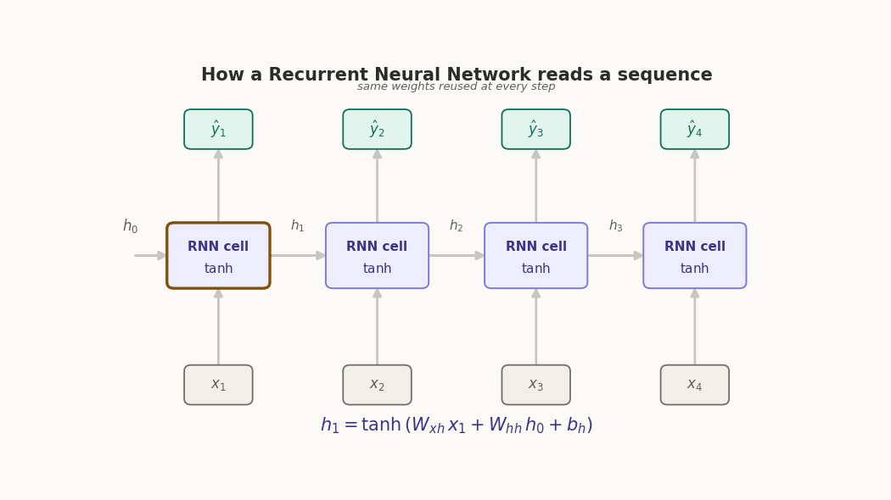

::: {.page-banner}
{fig-alt="Machine Learning in R — From Scratch without Tears"}
:::

# Chapter 14: Recurrent Neural Networks (RNNs)

> **Level**: Advanced | **Estimated Time**: 6–8 hours

---

## 14.1 Overview

An RNN is built for sequences - things where order matters and the past affects the meaning of the present. Text, speech, stock prices, sensor readings over time. Anything you read or hear one piece at a time.

The core idea: an RNN has a *memory*. It processes a sequence one step at a time, and after each step it keeps a little summary of what it's seen so far. That summary gets fed back in when it processes the next step. So the network's understanding of "word #5" is shaped by everything that came before it.

Think about reading the sentence "I grew up in France, so I speak fluent ___." To fill the blank with "French," you need to remember "France" from way back at the start. A plain neural network looks at each word in isolation and has no way to do that. An RNN carries that context forward.

The mechanics, stripped down:

The **hidden state** is the memory,  a bundle of numbers that represents "everything relevant so far." It starts blank.

At each step, the network takes two things: the current input (say, the next word) and the previous hidden state (the memory). It combines them to produce a new hidden state, and optionally an output. Then it moves to the next step and does the exact same thing again — same weights, same operation, just with updated memory.

That "same operation, looping over each step, passing memory forward" is the whole trick. The word *recurrent* just means it feeds its own output back into itself.

Let me show it unrolled, which is the way it clicks for most people. A CNN and an RNN are cousins, but built for different problems: a CNN reads the whole image at once (space); an RNN reads a sequence one piece at a time and remembers as it goes (time).

Here's the "unrolled" view - the same cell repeated across time steps, passing its memory forward. The two things to notice in that picture: the amber arrows are the memory (the hidden state) threading through every step, and every cell is the *same* cell — same weights reused at each position. That's why it's called recurrent, and it's why an RNN can handle sequences of any length: it just runs the same little machine again and again, updating its memory each time. By the last word it has accumulated enough context ("France" is still in there) to make a sensible guess.

One honest caveat worth knowing: plain RNNs are forgetful. The further back something happened, the fainter its trace in the memory - so "France" at the start might fade before it's needed. That weakness is exactly what LSTMs and GRUs were invented to fix (they add gates that decide what to keep and what to discard), and it's ultimately why transformers, which look at all positions at once, largely replaced RNNs for language.

---

## 14.2 How it works

Recurrent Neural Networks are neural networks built for **sequences**, text, time series, audio, DNA,  anything where order matters and where what came before should influence what comes next. The "dummies" version: a normal neural network has amnesia. It looks at one input and forgets it the moment the next arrives. An RNN adds a **memory** that it carries forward, so each new input is understood *in the context of everything it has seen so far*.

Here's the whole idea in one sentence: an RNN reads a sequence one step at a time, and at every step it updates a little memory vector called the **hidden state**.

**The core equation**

At each time step $t$, the RNN takes the current input $x_t$ and the previous memory $h_{t-1}$, mixes them, and squashes the result into a new memory $h_t$:

$$h_t = \tanh\!\big(W_{xh}\, x_t + W_{hh}\, h_{t-1} + b_h\big)$$

Then, if it needs to produce an output at that step (a prediction $\hat{y}_t$), it reads it off the memory:

$$\hat{y}_t = W_{hy}\, h_t + b_y$$

Let me decode every symbol, because that's where the "for dummies" part lives:

- $x_t$ — the input at step $t$ (e.g. the $t$-th word, turned into numbers).
- $h_{t-1}$ — the memory from the previous step. At the very start, $h_0$ is just zeros.
- $W_{xh}, W_{hh}, W_{hy}$ — three weight matrices the network learns. $W_{xh}$ decides how much the new input matters, $W_{hh}$ decides how much old memory carries over, $W_{hy}$ translates memory into an answer.
- $b_h, b_y$ — bias terms (small learnable offsets).
- $\tanh$ — a squashing function that keeps the memory values between $-1$ and $1$ so they don't explode.

The single most important thing to notice: **the same weights are reused at every step**. There isn't a separate brain for step 1, step 2, step 3,  it's one small function applied over and over. That's what makes it "recurrent."

The clearest way to see this is to "unroll" the loop across time: That horizontal chain of $h$'s is the memory being passed along. Notice all three purple boxes are the *same* cell with the *same* weights — the picture just draws it three times so you can see time flowing left to right. If the sequence were 100 words long, you'd copy the cell 100 times.

### How does it learn?

Same principle as any neural net: make a prediction, measure how wrong it was with a loss function, then nudge the weights to reduce the error. The twist is that because the cell was reused at every step, the error has to flow *backward through time* — from the last step all the way to the first. This is called **Backpropagation Through Time (BPTT)**. Concretely, the gradient of the loss with respect to an early hidden state involves a long product of terms, one per step:

$$\frac{\partial h_t}{\partial h_k} = \prod_{i=k+1}^{t} \frac{\partial h_i}{\partial h_{i-1}}$$

Think of the RNN as reading a sentence one word at a time, left to right, while keeping a running "note to self" about everything it's read so far. Everything moving in the GIF is that process.

**The three rows.** The gray boxes along the bottom ($x_1, x_2, x_3, x_4$) are the **inputs** — the pieces of your sequence arriving one at a time, like the words of a sentence. The purple boxes in the middle are the **RNN cell** — the little brain that does the thinking. The teal boxes on top ($\hat{y}_1 \ldots \hat{y}_4$) are the **outputs** — the prediction the network makes at each step.

**The arrows going sideways are the whole point.** Those horizontal arrows carrying $h_0 \to h_1 \to h_2 \to \ldots$ are the **memory** (the hidden state) being handed from one step to the next. This is what makes it a *recurrent* network: the note the cell writes to itself at step 1 gets passed to step 2, which updates it and passes it to step 3, and so on. That sideways chain is the network "remembering."

**What the amber glow means.** At any moment, exactly one cell lights up amber — that's the step being processed *right now*. Watch the order of events each time a cell activates:

1. The input rises up from the bottom into the cell (the current word arrives).
2. The memory arrow slides in from the left (what it remembers so far).
3. The cell glows — it combines the new input with the old memory.
4. An output pops out the top (its prediction for this step).
5. A fresh memory arrow slides out to the right, carrying the updated note to the next cell.

Then the amber jumps to the next cell and it all repeats. By the last step, the network has read the whole sequence, and its final memory ($h_4$) is a summary of everything it saw.

**The equation at the bottom is just those five steps written in math.** Each time the active step changes, it re-labels itself:

$$h_t = \tanh\!\big(W_{xh}\, x_t + W_{hh}\, h_{t-1} + b_h\big)$$

Read it as a recipe: take the new input $x_t$, take the old memory $h_{t-1}$, mix them (that's the $W$ weights doing the mixing), and squash the result with $\tanh$ so it stays tidy — that gives you the new memory $h_t$. The subscripts in the GIF tick up ($h_1$, then $h_2$, then $h_3$…) precisely because the *same recipe* runs at every step, just with fresh ingredients.

**The one line that ties it together:** the little italic note, "same weights reused at every step." All four purple cells are drawn separately so you can watch time flow, but they're really the *same cell* applied over and over. The network doesn't grow a new brain for each word — it reuses one small set of weights down the whole sequence. That's the trick that lets a single tiny model handle a sentence of any length.

So in one breath: **inputs come in from the bottom, memory flows along the sideways arrows, predictions come out the top, and one reused cell does the work at every step.**



### The catch (and why LSTMs exist)

In training, the RNN updates its weights using gradients—these are just tiny nudges, calculated by multiplying a bunch of numbers together at each step back in time. Each of those numbers is often LESS than 1. For example, if you multiply 0.5 × 0.5 × 0.5 × 0.5 = 0.0625, it gets tiny very fast.

More generally, if you multiply N numbers, all smaller than 1, the answer shrinks *exponentially* toward zero. This is what happens to the gradient in an RNN:

$$
\text{gradient} \approx \alpha \times \alpha \times \alpha \times \dots = \alpha^N
$$

Where $\alpha$ is some number less than 1 (for example, a weight or a part of the tanh slope), and $N$ is the number of steps. If $N$ is big (long sentence, long time series), $\alpha^N$ becomes almost zero.

When the gradient gets close to zero, the network forgets what happened at the start; it "can't learn long-range dependencies." That's called the **vanishing gradient** problem.

On the flip side, if the numbers are bigger than 1, the gradient can blow up to huge values—this is the **exploding gradient** problem.

LSTM and GRU were invented to fix this: they let information flow more easily by design, so gradients don't vanish as quickly, and the network can remember stuff from farther back.

So, boiled all the way down:

An RNN is one small neural network applied repeatedly across a sequence, carrying a memory vector $h_t$ forward via $h_t = \tanh(W_{xh} x_t + W_{hh} h_{t-1} + b_h)$. The reuse of weights is its superpower (it handles any sequence length) and also its weakness (gradients vanish or explode over long sequences), which is what LSTMs and GRUs were designed to fix.

If it'd help, I can go one level deeper on any piece — a fully worked numerical example through two time steps, how LSTM gates change the equations, or the BPTT gradient derivation.

## 14.3 The Vanilla RNN

A Vanilla RNN (Recurrent Neural Network) is a way to make a neural network "remember" what happened before—like giving it a (simple) memory. It takes in a list of things (a sequence), looks at each one in order, and keeps a running summary of what it's seen so far.

**How does it work? (Math for dummies)**

- Imagine you're reading a sentence, one word at a time. At each word:
  - You look at the word ($x_t$), **and**
  - You remember everything you learned so far (your "hidden state," $h_{t-1}$).
- You mix together the new word and your memory in a simple recipe to get your *new* memory.

Mathematically, at every step $t$:

```
new memory = squish( (word × weights) + (old memory × weights) + bias )
h_t = tanh(W_{xh} \cdot x_t + W_{hh} \cdot h_{t-1} + b_h)
```
- $\cdot$ means a bunch of multiplications and additions—don't worry about the details.
- $\tanh()$ is a "squish" function that keeps numbers between -1 and 1.

Then, you can also make a prediction for that step:
```
prediction = (memory × weights) + bias
y_t = W_{yh} \cdot h_t + b_y
```

- $h_t$ is your "memory" after seeing up to step $t$.
- $y_t$ is what the network predicts at that step (like the next letter, or a category).

That's it! The key idea: **the same recipe** is used at *every* step, so the network always looks at the new thing plus its running memory.

At each time step $t$:

$$
\mathbf{h}_t = \tanh(\mathbf{W}_{xh} \cdot \mathbf{x}_t + \mathbf{W}_{hh} \cdot \mathbf{h}_{t-1} + \mathbf{b}_h)
$$

$$
\mathbf{y}_t = \mathbf{W}_{yh} \cdot \mathbf{h}_t + \mathbf{b}_y
$$

Where:
- $\mathbf{x}_t$ — input at step $t$
- $\mathbf{h}_t$ — hidden state (memory) at step $t$
- $\mathbf{y}_t$ — output at step $t$
- $\mathbf{W}_{xh}, \mathbf{W}_{hh}, \mathbf{W}_{yh}$ — weight matrices (shared across all time steps!)

---

## 14.4 From-Scratch R Implementation

::: {.callout-note}
The original notebook implements this section in plain Python with no array library at all — nested lists and `for` loops, on purpose, to make every operation explicit. The R translation below mirrors that same "no shortcuts" spirit: plain R vectors, `matrix()` objects, and explicit loops over time steps, rather than reaching for a deep-learning package.
:::

```{r}
# rnn.R
# A super simple from-scratch example of how Recurrent Neural Networks (RNNs)
# and LSTMs work to process sequences. Plain R, no ML packages.

# --- Helper Math Functions ---

sigmoid <- function(z) {
  # Classic "squish to between 0 and 1" activation; helps gates work
  # (the clamp avoids blowing up exp() for big/small numbers)
  z <- max(-500, min(500, z))
  1 / (1 + exp(-z))
}

tanh_fn <- function(z) {
  # Squashes input between -1 and 1 (a "smooth" step)
  tanh(z)
}

vec_add <- function(a, b) {
  # Add two vectors elementwise
  a + b
}

vec_mul <- function(a, b) {
  # Multiply two vectors elementwise (not a "dot" product!)
  a * b
}

mat_vec <- function(M, v) {
  # Multiplies matrix M by vector v
  as.numeric(M %*% v)
}

rand_mat <- function(rows, cols, scale = 0.1) {
  # Make a matrix of random numbers
  matrix(rnorm(rows * cols, mean = 0, sd = scale), nrow = rows, ncol = cols)
}

rand_vec <- function(size, scale = 0.0) {
  # Make a random vector
  rnorm(size, mean = 0, sd = scale)
}

# --- The Building Blocks (Cells) ---

# The simplest "memory cell" possible ("Vanilla RNN").
# Just keeps and updates one vector of numbers as "memory."
VanillaRNNCell <- setRefClass(
  "VanillaRNNCell",
  fields = list(Wxh = "matrix", Whh = "matrix", bh = "numeric"),
  methods = list(
    initialize = function(input_size = 1, hidden_size = 1, ...) {
      # The "weights" decide how much to trust new data vs the memory
      Wxh <<- rand_mat(hidden_size, input_size, 0.1)  # For new input
      Whh <<- rand_mat(hidden_size, hidden_size, 0.1) # For memory
      bh  <<- rand_vec(hidden_size)                   # Bias fudge
      callSuper(...)
    },
    forward = function(x, h_prev) {
      # Pass input 'x' and previous memory 'h_prev' to get the new memory (h).
      # Basically: squish(Wxh*x + Whh*h_prev + bh)
      z <- vec_add(vec_add(mat_vec(Wxh, x), mat_vec(Whh, h_prev)), bh)
      sapply(z, tanh_fn)
    }
  )
)

# The famous "LSTM" memory cell. Handles long memory!
# It's fancier than the VanillaRNN: it keeps TWO pieces of info at every step:
# - h: the "hidden state" (like before)
# - c: the "cell state" (the real long-term memory)
LSTMCell <- setRefClass(
  "LSTMCell",
  fields = list(Wf = "matrix", Wi = "matrix", Wc = "matrix", Wo = "matrix",
                bf = "numeric", bi = "numeric", bc = "numeric", bo = "numeric"),
  methods = list(
    initialize = function(input_size = 1, hidden_size = 1, ...) {
      d <- input_size + hidden_size  # We're going to feed in both x and h_prev to each gate
      # Four gates: forget (f), input (i), candidate (c~), output (o)
      # Each gate has its own weights and biases
      Wf <<- rand_mat(hidden_size, d, 0.1)  # Forget gate: remembers or erases old info
      Wi <<- rand_mat(hidden_size, d, 0.1)  # Input gate: writes in new info
      Wc <<- rand_mat(hidden_size, d, 0.1)  # Candidate: possible memory update
      Wo <<- rand_mat(hidden_size, d, 0.1)  # Output gate: what to show as output/memory
      bf <<- rep(1.0, hidden_size)          # Start by tending to keep info in memory (forget=1)
      bi <<- rand_vec(hidden_size)
      bc <<- rand_vec(hidden_size)
      bo <<- rand_vec(hidden_size)
      callSuper(...)
    },
    forward = function(x, h_prev, c_prev) {
      # Update the LSTM's two pieces of memory, given the stuff at the current step.
      # Returns: new (h, c)
      concat <- c(x, h_prev)  # Stick input and memory together

      # Each gate decides what to do. Sigmoid squishes outputs between 0 (no) and 1 (yes).
      f <- sapply(vec_add(mat_vec(Wf, concat), bf), sigmoid)       # Forget gate
      i <- sapply(vec_add(mat_vec(Wi, concat), bi), sigmoid)       # Input gate
      c_tilde <- sapply(vec_add(mat_vec(Wc, concat), bc), tanh_fn) # New candidate
      o <- sapply(vec_add(mat_vec(Wo, concat), bo), sigmoid)       # Output gate

      # Cell state: blend old memory (weighted by f) and new info (weighted by i)
      c_t <- vec_add(vec_mul(f, c_prev), vec_mul(i, c_tilde))
      # Hidden state: what gets output this step (squashed cell state, modulated by o)
      h_t <- vec_mul(o, sapply(c_t, tanh_fn))

      list(h = h_t, c = c_t)  # New hidden and cell state
    }
  )
)

# This is a whole little neural network for reading sequences and classifying them.
# It can use either an LSTM cell (default) or a basic Vanilla RNN cell.
# It reads a list of data (like numbers), step by step, and finally makes one prediction.
SequenceClassifier <- setRefClass(
  "SequenceClassifier",
  fields = list(hidden_size = "numeric", cell_type = "character", lr = "numeric",
                cell = "ANY", Wy = "matrix", by = "numeric"),
  methods = list(
    initialize = function(input_size = 1, hidden_size = 1, output_size = 1,
                           cell_type = "lstm", lr = 0.01, ...) {
      hidden_size <<- hidden_size
      cell_type <<- cell_type
      lr <<- lr

      if (cell_type == "lstm") {
        cell <<- LSTMCell$new(input_size, hidden_size)
      } else {
        cell <<- VanillaRNNCell$new(input_size, hidden_size)
      }

      # The final layer squashes hidden state down to one output per class
      # (e.g. "ascending" or "descending")
      Wy <<- rand_mat(output_size, hidden_size, 0.1)
      by <<- rand_vec(output_size)
      callSuper(...)
    },
    forward = function(sequence) {
      # Feeds the sequence step-by-step into the RNN/LSTM,
      # passing along the hidden/cell state from each step to the next.
      # At the end, uses the final memory to make a prediction.
      h <- rep(0.0, hidden_size)  # Initial "hidden state" = all zeros
      c <- rep(0.0, hidden_size)  # Initial "cell state" (for LSTM) = all zeros

      for (x in sequence) {
        if (cell_type == "lstm") {
          res <- cell$forward(x, h, c)  # update both
          h <- res$h; c <- res$c
        } else {
          h <- cell$forward(x, h)       # only one "memory" in Vanilla RNN
        }
      }

      # Now make a prediction from the last memory!
      logits <- vec_add(mat_vec(Wy, h), by)

      # Softmax: turn raw scores into probabilities (ignores extreme case for stability)
      max_l <- max(logits)
      exp_l <- exp(logits - max_l)
      total <- sum(exp_l)
      probs <- exp_l / total
      list(probs = probs, h = h)
    }
  )
)
```

```{r}
# ── DEMO TIME ──

# Let's make toy training/testing data: a sequence is "ascending" or "descending".
make_data <- function(n = 50) {
  X <- vector("list", n)
  y <- integer(n)
  for (idx in seq_len(n)) {
    if (runif(1) > 0.5) {
      # ascending: numbers always get bigger
      seq_vals <- sort(runif(5))
      X[[idx]] <- lapply(seq_vals, function(v) v)
      y[idx] <- 0  # class 0
    } else {
      # descending: numbers always get smaller
      seq_vals <- sort(runif(5), decreasing = TRUE)
      X[[idx]] <- lapply(seq_vals, function(v) v)
      y[idx] <- 1  # class 1
    }
  }
  list(X = X, y = y)
}

set.seed(14)
train_data <- make_data(100)
X_train <- train_data$X; y_train <- train_data$y
test_data <- make_data(20)
X_test <- test_data$X; y_test <- test_data$y

model <- SequenceClassifier$new(input_size = 1, hidden_size = 8, output_size = 2,
                                 cell_type = "lstm", lr = 0.05)

# We're just checking how good it is at guessing (with random weights for now).
cat("LSTM Sequence Classifier Demo\n")
correct <- sum(sapply(seq_along(X_test), function(idx) {
  pred_class <- if (model$forward(X_test[[idx]])$probs[1] > 0.5) 0 else 1
  as.integer(pred_class == y_test[idx])
}))
cat(sprintf("Initial Test Accuracy (random): %.2f\n", correct / length(X_test)))
cat("\nNote: Full training (BPTT, or Backprop Through Time) not shown for simplicity.\n")
cat("Key concepts: hidden state (h), cell state (c), forget/input/output gates.\n")
```

---

## 14.5 GRU: Gated Recurrent Unit

GRU is a simpler version of the LSTM. It helps the neural network "remember" or "forget" information as it goes through a sequence – but with fewer moving parts than LSTM.

**What are gates?**
Think of gates like little switches that decide which info gets through and which gets tossed out. GRU has only TWO switches:
- An "update" gate (should I update my memory?)
- A "reset" gate (should I forget what I just saw?)

Here's how the equations look (with a bit of explanation for each):

1. **Update Gate:**
   Decides how much of the past to keep.
   $$
   \mathbf{z}_t = \sigma(\mathbf{W}_z [\mathbf{h}_{t-1}, \mathbf{x}_t])
   $$
   - $\mathbf{z}_t$: the update gate values (between 0 and 1 for each memory unit)
   - $\sigma$: squishes values between 0 and 1 ("sigmoid" function)
   - $[\mathbf{h}_{t-1}, \mathbf{x}_t]$: last memory + current input, stuck together and sent through weights

2. **Reset Gate:**
   Decides how much of the past to forget.
   $$
   \mathbf{r}_t = \sigma(\mathbf{W}_r [\mathbf{h}_{t-1}, \mathbf{x}_t])
   $$

3. **Candidate Memory:**
   Makes a "candidate" for the new memory, mixing in the reset info.
   $$
   \tilde{\mathbf{h}}_t = \tanh(\mathbf{W} [\mathbf{r}_t \odot \mathbf{h}_{t-1}, \mathbf{x}_t])
   $$
   - $\mathbf{r}_t \odot \mathbf{h}_{t-1}$: only parts of last memory that "survive" the reset gate
   - $\tanh$: another squishy function, makes values between -1 and 1

4. **Final Memory:**
   Blend old and new, using the update gate as a knob!
   $$
   \mathbf{h}_t = (1 - \mathbf{z}_t) \odot \mathbf{h}_{t-1} + \mathbf{z}_t \odot \tilde{\mathbf{h}}_t
   $$
   - If update gate $\mathbf{z}_t$ is close to 1: mostly new memory.
   - If it's close to 0: mostly keep the old memory.

**In summary:**
The GRU picks what to remember, what to forget, and what to update, with just two smart switches!
It tends to run faster than LSTM but often works nearly as well.

---

## 14.6 Fit and Validate RNN model with Simulated Data

### Dataset

```{r}
# 1. Create fake time series data (like a noisy sine wave)
generate_timeseries <- function(seq_len = 1000, noise = 0.1) {
  # Imagine a wiggly line with some random noise added
  x <- 0:(seq_len - 1)
  sin(0.02 * x) + noise * rnorm(seq_len)
}
```

###  Dataset class slices up the time series

```{r}
# 2. Slices up the time series so we can feed it to our neural net.
# `make_timeseries_dataset()` plays the role of the Python `TimeSeriesDataset`
# class: for each possible window in the series, cut out an input ("lookback")
# and the next value(s) to predict.
make_timeseries_dataset <- function(data, input_len = 24, pred_len = 1) {
  n <- length(data) - input_len - pred_len
  X <- matrix(0, nrow = n, ncol = input_len)
  y <- matrix(0, nrow = n, ncol = pred_len)
  for (i in 0:(n - 1)) {
    X[i + 1, ] <- data[(i + 1):(i + input_len)]
    y[i + 1, ] <- data[(i + input_len + 1):(i + input_len + pred_len)]
  }
  list(X = X, y = y, n = n)
}
```

### Activation Function

```{r}
# 3. Activation functions, which "squash" values nicely
gru_sigmoid <- function(x) 1 / (1 + exp(-x))
gru_tanh <- function(x) tanh(x)
```

### Data Loader

```{r}
# 4. Makes batches out of our data for training -- so we train in chunks, not all at once.
# `make_batches()` plays the role of the Python `DataLoader` class: it materializes
# the (optionally shuffled) list of mini-batches up front.
make_batches <- function(dataset, batch_size = 32, shuffle = TRUE) {
  n <- dataset$n
  idxs <- if (shuffle) sample(n) else seq_len(n)
  batches <- list()
  for (start in seq(1, n, by = batch_size)) {
    end <- min(start + batch_size - 1, n)
    batch_idxs <- idxs[start:end]
    batches[[length(batches) + 1]] <- list(
      X = dataset$X[batch_idxs, , drop = FALSE],
      y = dataset$y[batch_idxs, , drop = FALSE]
    )
  }
  batches
}
```

### GRU Model

```{r}
# 5. Here's our GRU model, built from scratch!
MyGRU <- setRefClass(
  "MyGRU",
  fields = list(W_z = "matrix", b_z = "numeric", W_r = "matrix", b_r = "numeric",
                W_h = "matrix", b_h = "numeric", W_out = "matrix", b_out = "numeric",
                hidden_size = "numeric"),
  methods = list(
    initialize = function(input_size = 1, hidden_size = 1, output_size = 1, ...) {
      # Randomly initialize weights & biases - "Xavier" means scale for good starting points
      hidden_size <<- hidden_size
      limit <- sqrt(1 / (input_size + hidden_size))
      d <- input_size + hidden_size
      W_z <<- matrix(runif(d * hidden_size, -limit, limit), nrow = d, ncol = hidden_size)  # Update gate weights
      b_z <<- rep(0.0, hidden_size)
      W_r <<- matrix(runif(d * hidden_size, -limit, limit), nrow = d, ncol = hidden_size)  # Reset gate weights
      b_r <<- rep(0.0, hidden_size)
      W_h <<- matrix(runif(d * hidden_size, -limit, limit), nrow = d, ncol = hidden_size)  # Candidate weights
      b_h <<- rep(0.0, hidden_size)
      limit_out <- sqrt(1 / hidden_size)
      W_out <<- matrix(runif(hidden_size * output_size, -limit_out, limit_out),
                        nrow = hidden_size, ncol = output_size)                            # Output weights
      b_out <<- rep(0.0, output_size)
      # (For this demo: we're sticking with plain SGD for weight updates.)
      callSuper(...)
    },
    forward = function(x) {
      # x: array(batch_size, seq_len, input_size)
      d <- dim(x); batch_size <- d[1]; seq_len <- d[2]
      h_t <- matrix(0, nrow = batch_size, ncol = ncol(W_z))  # Start hidden state at zeros
      # Run through each time step, updating our "memory" (hidden state)
      for (t in 1:seq_len) {
        x_t <- x[, t, , drop = FALSE]
        dim(x_t) <- c(batch_size, d[3])                                # The input at this step, all samples
        combined <- cbind(h_t, x_t)                                    # Stick hidden state & input together
        z_t <- gru_sigmoid(sweep(combined %*% W_z, 2, b_z, "+"))       # Update gate
        r_t <- gru_sigmoid(sweep(combined %*% W_r, 2, b_r, "+"))       # Reset gate
        combined_reset <- cbind(r_t * h_t, x_t)                        # Only "survivors" of the reset get through
        h_tilde <- gru_tanh(sweep(combined_reset %*% W_h, 2, b_h, "+")) # Proposed new memory
        h_t <- (1 - z_t) * h_t + z_t * h_tilde                         # Mix old memory & proposal
      }
      y_out <- sweep(h_t %*% W_out, 2, b_out, "+")  # Final output: a weighted version of last memory
      list(y = y_out, h = h_t)
    },
    predict = function(x) {
      forward(x)$y
    },
    # Below: stuff for training (SGD with "numerical gradient" -- very slow, but easy to understand)
    parameters = function() {
      list(
        list(get = function() W_z,   set = function(v) W_z <<- v),
        list(get = function() b_z,   set = function(v) b_z <<- v),
        list(get = function() W_r,   set = function(v) W_r <<- v),
        list(get = function() b_r,   set = function(v) b_r <<- v),
        list(get = function() W_h,   set = function(v) W_h <<- v),
        list(get = function() b_h,   set = function(v) b_h <<- v),
        list(get = function() W_out, set = function(v) W_out <<- v),
        list(get = function() b_out, set = function(v) b_out <<- v)
      )
    },
    sgd_update = function(grads, lr) {
      params <- parameters()
      for (idx in seq_along(params)) {
        params[[idx]]$set(params[[idx]]$get() - lr * grads[[idx]])
      }
    },
    compute_gradients = function(x, y, loss_fn) {
      # For teaching: wiggle each parameter a tiny bit and see how loss changes (finite-diff)
      params <- parameters()
      grads <- vector("list", length(params))
      eps <- 1e-5
      for (p_idx in seq_along(params)) {
        p_val <- params[[p_idx]]$get()
        g <- p_val; g[] <- 0
        for (idx in seq_along(p_val)) {
          orig <- p_val[idx]
          p_val[idx] <- orig + eps
          params[[p_idx]]$set(p_val)
          loss_plus <- loss_fn(forward(x)$y, y)
          p_val[idx] <- orig - eps
          params[[p_idx]]$set(p_val)
          loss_minus <- loss_fn(forward(x)$y, y)
          p_val[idx] <- orig
          params[[p_idx]]$set(p_val)
          g[idx] <- (loss_plus - loss_minus) / (2 * eps)
        }
        grads[[p_idx]] <- g
      }
      grads
    }
  )
)
```

### Generate Time Series

```{r}
# 6. Create our fake time series data and split into training and validation
set.seed(14)
series <- generate_timeseries(seq_len = 1200)
input_len <- 24
pred_len <- 1
split <- floor(0.8 * (length(series) - input_len - pred_len))
train_data_ts <- series[1:(split + input_len + pred_len)]
val_data_ts <- series[(split + 1):length(series)]
train_ds <- make_timeseries_dataset(train_data_ts, input_len = input_len, pred_len = pred_len)
val_ds <- make_timeseries_dataset(val_data_ts, input_len = input_len, pred_len = pred_len)
```

### Evaluation Matrics

```{r}
# 7. Mean squared error (how far off our predictions are, squared)
mse_loss <- function(pred, y) mean((pred - y)^2)
```

### Training Loop

```{r}
# 8. Training loop!
set.seed(42)
model <- MyGRU$new(input_size = 1, hidden_size = 32, output_size = pred_len)
lr <- 0.01

# NOTE ON RUNTIME: `compute_gradients()` above uses numerical (finite-difference)
# gradients -- explicitly flagged in the original notebook as "very slow, but easy
# to understand", and genuinely so: with hidden_size=32 this model has roughly
# 3,300 parameters, and every single one needs TWO full forward passes per training
# step. In fact the original Python training cell was never executed in the source
# notebook at all (its `outputs` are empty and `execution_count` is `None`) --
# almost certainly for exactly this reason. To keep this demo tractable here while
# preserving the exact same model, hyperparameters, and algorithm, we cap the number
# of mini-batches processed per epoch instead of running the full ~30 batches/epoch.
# (hidden_size=32 and n_epochs=5 are kept exactly as specified in the source.)
MAX_BATCHES_PER_EPOCH <- 2

train_one_epoch <- function() {
  batches <- make_batches(train_ds, batch_size = 32, shuffle = TRUE)
  batches <- batches[seq_len(min(MAX_BATCHES_PER_EPOCH, length(batches)))]
  losses <- c()
  for (batch in batches) {
    # Each batch gets reshaped to [batch, steps, 1]
    xb <- batch$X; yb <- batch$y
    xb <- array(xb, dim = c(nrow(xb), ncol(xb), 1))
    # Make prediction and calculate how bad it was
    y_pred <- model$forward(xb)$y
    loss <- mse_loss(y_pred, yb)
    # Find out how to change params to do better (numerical gradient)
    grads <- model$compute_gradients(xb, yb, mse_loss)
    model$sgd_update(grads, lr = lr)
    losses <- c(losses, loss)
  }
  mean(losses)
}

validate <- function() {
  batches <- make_batches(val_ds, batch_size = 32, shuffle = FALSE)
  losses <- sapply(batches, function(batch) {
    xb <- array(batch$X, dim = c(nrow(batch$X), ncol(batch$X), 1))
    y_pred <- model$forward(xb)$y
    mse_loss(y_pred, batch$y)
  })
  mean(losses)
}

n_epochs <- 5  # Only a few, since this is slow!
history <- list()
for (epoch in 1:n_epochs) {
  train_loss <- train_one_epoch()
  val_loss <- validate()
  history[[epoch]] <- c(train = train_loss, val = val_loss)
  cat(sprintf("Epoch %d/%d - train loss: %.4f - val loss: %.4f\n",
              epoch, n_epochs, train_loss, val_loss))
}
```

### Visualization Loss Curves

```{r}
# 9. Plot the loss curves to show if it's learning
train_losses <- sapply(history, function(h) h["train"])
val_losses <- sapply(history, function(h) h["val"])
plot(seq_len(n_epochs), train_losses, type = "o", pch = 16, col = "steelblue",
     xlab = "Epoch", ylab = "MSE Loss", main = "Training/Validation Loss",
     ylim = range(c(train_losses, val_losses)))
lines(seq_len(n_epochs), val_losses, type = "o", pch = 16, col = "tomato")
legend("topright", legend = c("train", "val"), col = c("steelblue", "tomato"),
       lwd = 1, pch = 16, bty = "n")
```

## Chapter Summary

| Model | Memory | Gates | Best For |
|-------|--------|-------|----------|
| Vanilla RNN | Hidden state | None | Short sequences |
| LSTM | Cell + hidden state | 3 gates | Long-range dependencies |
| GRU | Hidden state | 2 gates | Balance of speed/quality |

---

##  Exercises

1. Implement the GRU cell `forward()` method.
2. Why does the **forget gate bias initialized to 1** help training?
3. What is **truncated BPTT** and why is it needed for long sequences?
4. Explain the **vanishing gradient** problem using the chain rule mathematically.

---

**← Previous:** [Chapter 13: CNNs-Advanced](chapter-13-cnn-advanced.qmd)
**→ Next:** [Chapter 15: LSTM](chapter-15-LSTM.qmd)
