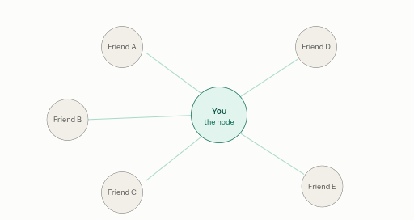

::: {.page-banner}
{fig-alt="Machine Learning in R — From Scratch without Tears"}
:::

# Chapter 16: Graph Neural Networks (GNNs)

> **Level**: Advanced | **Estimated Time**: 6–8 hours | **Prerequisites**: Chapter 11 (Neural Networks), Chapter 13 (PCA)

---

## 16.1 Overview

CNNs exploit the **grid structure** of images; RNNs exploit **sequential structure**. But many real-world datasets are **graphs**:

- Social networks (nodes = users, edges = friendships)
- Molecular graphs (nodes = atoms, edges = bonds)
- Citation networks (nodes = papers, edges = citations)
- Knowledge graphs (entities connected by relations)

Standard neural networks can't handle graphs directly because:
- Graphs have **variable size** — different numbers of nodes and edges
- There is **no canonical ordering** of neighbours
- Relationships between nodes carry information

**GNNs** learn by **message passing**: each node iteratively aggregates information from its neighbourhood, building up richer representations over multiple rounds.

---

### The core idea

Most machine learning works on data shaped like a table (rows and columns) or a grid (like the pixels of an image). But a lot of the world isn't shaped that way — it's shaped like a **network**: things connected to other things. Friends connected to friends. Roads connecting cities. Atoms bonded into molecules.

A **Graph Neural Network** is a type of neural network built specifically to learn from this connected, network-shaped data.

The vocabulary is just two words:
- **Nodes** — the "things" (a person, a city, an atom)
- **Edges** — the "connections" between them (a friendship, a road, a chemical bond)

### The one trick that makes it work: "you are who your neighbors are"

Here's the whole secret of a GNN in one sentence: **each node updates what it knows by gathering information from its neighbors, and it does this over several rounds.**

This is called **message passing**. Picture a rumor spreading through a group of friends. In round one, you only know what your direct friends tell you. In round two, your friends have now heard from *their* friends, so when they update you, you're indirectly learning about people two steps away. After a few rounds, information has rippled across the whole network — but each node still pays most attention to its own local neighborhood.

That's it. Stack a few rounds of "gather from neighbors and update," and the network learns rich patterns about both each node *and* its position in the larger structure.

Let me show the message-passing idea visually:



Each round, "You" pulls in a little signal from every friend you're connected to. Do this once and you know your immediate circle; do it a few times and information from friends-of-friends reaches you too.

### A real-world example: catching fraud with a credit card

Imagine a bank trying to spot fraudulent transactions. The old approach looks at each transaction in isolation — amount, time, location — and asks "does this one look suspicious?" A fraudster who knows the rules can make each individual transaction look perfectly normal.

Now model it as a **graph** instead:
- **Nodes** = credit cards, merchants, devices, and bank accounts
- **Edges** = "this card paid at this merchant," "this device was used by this account"

A GNN learns each card's profile not just from its own transactions, but from the company it keeps. A brand-new card might look innocent on its own — but the GNN sees it's connected to a device that's *also* linked to five other cards that were all recently flagged. That guilt-by-association pattern is invisible when you look at transactions one at a time, but it lights up clearly in the network. The suspicious node inherits a warning signal from its shady neighborhood. This is exactly how companies like PayPal and many banks now catch fraud rings.

### Where else this shows up

The same "learn from your neighbors" trick powers a lot of things you use:
- **Recommendations** — Pinterest and Amazon model users and items as a giant graph; if people similar to you liked something, that signal flows to you.
- **Drug discovery** — a molecule *is* a graph (atoms = nodes, bonds = edges), so GNNs predict whether a new compound might be toxic or effective.
- **Maps** — Google Maps uses GNNs on the road network (intersections = nodes, roads = edges) to improve arrival-time estimates.

A Graph Neural Network is a neural network that learns about connected things by letting each thing repeatedly absorb information from its neighbors — which makes it the natural tool whenever the *relationships* between your data points matter as much as the data points themselves.

## 16.2 Theory

### 16.2.1 Graph Basics

A graph $G = (V, E)$ consists of:
- $V$ — set of $N$ nodes, each with feature vector $\mathbf{x}_v \in \mathbb{R}^d$
- $E$ — set of edges; represented as adjacency matrix $\mathbf{A} \in \{0,1\}^{N \times N}$
- $\mathcal{N}(v)$ — neighbourhood of node $v$ (nodes connected by an edge)

### 16.2.2 Message Passing Framework

Each GNN layer updates node embeddings via three steps:

$$\text{MESSAGE:} \quad \mathbf{m}_{uv} = \phi(\mathbf{h}_v, \mathbf{h}_u) \quad \text{for each neighbour } u \text{ of } v$$

$$\text{AGGREGATE:} \quad \mathbf{a}_v = \rho\!\left(\{\mathbf{m}_{uv} : u \in \mathcal{N}(v)\}\right) \quad \leftarrow \text{permutation-invariant (sum/mean/max)}$$

$$\text{UPDATE:} \quad \mathbf{h}'_v = \psi(\mathbf{h}_v, \mathbf{a}_v)$$

Where $\phi, \rho, \psi$ are learnable functions. After $K$ layers, each node has a representation informed by its $K$-hop neighbourhood.

### 16.2.3 Graph Convolutional Network (GCN)

The GCN layer (Kipf & Welling, 2017) simplifies to:

$$\mathbf{H}' = \sigma\!\left(\tilde{\mathbf{D}}^{-1/2} \tilde{\mathbf{A}} \tilde{\mathbf{D}}^{-1/2} \mathbf{H} \mathbf{W}\right)$$

Where:
- $\tilde{\mathbf{A}} = \mathbf{A} + \mathbf{I}$ — adjacency with self-loops added
- $\tilde{\mathbf{D}}$ — degree matrix of $\tilde{\mathbf{A}}$ (diagonal)
- $\mathbf{H}$ — node feature matrix ($N \times d$)
- $\mathbf{W}$ — learnable weight matrix ($d \times d'$)
- $\sigma$ — activation (ReLU)

The normalisation $\tilde{\mathbf{D}}^{-1/2} \tilde{\mathbf{A}} \tilde{\mathbf{D}}^{-1/2}$ prevents exploding/vanishing from high-degree nodes.

For a single node $v$, the update simplifies to:

$$\mathbf{h}'_v = \sigma\!\left( \mathbf{W}^\top \cdot \frac{1}{\sqrt{\deg(v)}} \sum_{u \in \mathcal{N}(v) \cup \{v\}} \frac{1}{\sqrt{\deg(u)}} \mathbf{h}_u \right)$$

### 16.2.4 Graph SAGE (Sample and Aggregate)

Instead of using the full neighbourhood, GraphSAGE samples a fixed number of neighbours and concatenates the aggregated neighbourhood with the node's own embedding:

$$\mathbf{a}_v = \text{AGGREGATE}\!\left(\{\mathbf{h}_u : u \in \text{sample}(\mathcal{N}(v))\}\right)$$

$$\mathbf{h}'_v = \sigma(\mathbf{W} \cdot \text{concat}(\mathbf{h}_v, \mathbf{a}_v))$$

Allows inductive learning (generalise to unseen nodes).

---

## 17.3 Algorithm

```
GCN Forward Pass:
─────────────────
Input: node features X (N×d), adjacency A (N×N), weights W (d×d')

1. A_tilde = A + I_N          (add self-loops)
2. Compute D_tilde_vv = sum_j A_tilde_vj  (degree of each node in A_tilde)
3. For each node v:
     h'_v = sigma( sum_u A_tilde[v,u] / sqrt(D_tilde[v,v] * D_tilde[u,u]) * h_u * W )

Stack L layers for L-hop neighbourhood aggregation.
Final node embeddings → node classification / link prediction / graph pooling
```

---

## 17.4 From-Scratch R

Steps (From-Scratch GCN/GraphSAGE R Demo)

1. Define utility math functions: ReLU/sigmoid/softmax, matrix/vector multiplication, Xavier weight initialization.
2. Build a simple `Graph` reference class to hold node features and adjacency data.
3. Implement the GCN layer:
   - Add self-loops to adjacency.
   - Compute the normalized neighbor aggregation for each node.
   - Apply a linear transformation (weights + bias), then activation.
4. Implement the GraphSAGE (sample & aggregate) layer:
   - For each node, sample neighbors (or use all), aggregate their features (mean).
   - Concatenate node's features with its neighbors' aggregate.
   - Apply linear transformation and nonlinearity, normalize the output.
5. Create a toy "Karate Club" graph, set up basic features and labels.
6. Instantiate and run GCN and GraphSAGE layers on the graph to demonstrate:
   - Print prediction/classification from GCN (accuracy untrained).
   - Print GraphSAGE node embeddings for inspection.

```{r}
# ==== Simple Math Functions for Neural Networks ====

relu_v <- function(v) {
  # Apply ReLU to each element of a vector (or matrix): returns v if positive, else 0.
  pmax(v, 0.0)
}

sigmoid <- function(x) {
  # Squashes any number into the range (0, 1). Used for probabilities.
  # The clip to [-500, 500] avoids overflow errors.
  1.0 / (1.0 + exp(-pmax(pmin(x, 500), -500)))
}

xavier <- function(rows, cols, seed = 0) {
  # Randomly makes a matrix for the network's starting weights.
  # Keeps things 'not too big, not too small' to help learning.
  set.seed(seed)
  limit <- sqrt(6.0 / (rows + cols))
  matrix(runif(rows * cols, -limit, limit), nrow = rows, ncol = cols)
}

softmax <- function(v) {
  # Makes a vector of numbers "behave like probabilities" (all positive, add to 1)
  m <- max(v)
  e <- exp(v - m)  # Subtract max(v) for stability
  e / sum(e)
}

# ==== Graph Data Structure ====

# Think of a graph as a group of dots (nodes) and lines (edges).
# Each node can have some numbers as its 'features'.
Graph <- setRefClass(
  "Graph",
  fields = list(N = "numeric", D = "numeric", adj = "matrix", features = "matrix"),
  methods = list(
    initialize = function(num_nodes = 1, feature_dim = 1, ...) {
      N <<- num_nodes       # How many dots
      D <<- feature_dim     # How many features per dot
      adj <<- matrix(0, nrow = num_nodes, ncol = num_nodes)          # Who's connected to who
      features <<- matrix(0.0, nrow = num_nodes, ncol = feature_dim) # The dot features
      callSuper(...)
    },
    add_edge = function(u, v) {
      # Draw a line between dot u and dot v. u, v are 0-indexed (Python-style node ids).
      adj[u + 1, v + 1] <<- 1
      adj[v + 1, u + 1] <<- 1
    },
    degree = function(v) {
      # How many lines come out of dot v? (v is 0-indexed)
      sum(adj[v + 1, ])
    }
  )
)

# ==== GCN (Graph Convolutional Network) Layer ====

# This is the building block for GCN. It updates every node's features
# based on its neighbors and itself, making use of a little math magic.
GCNLayer <- setRefClass(
  "GCNLayer",
  fields = list(W = "matrix", b = "numeric"),
  methods = list(
    initialize = function(in_dim = 1, out_dim = 1, seed = 42, ...) {
      # Matrix of learnable 'weights' to decide how to mix inputs.
      W <<- xavier(out_dim, in_dim, seed)   # Each output feature gets its own weights
      b <<- rep(0.0, out_dim)               # Bias: just shifts things a bit
      callSuper(...)
    },
    forward = function(H, adj, activate = TRUE) {
      # H: matrix of node features (one row per node)
      # adj: who's connected to who (the adjacency matrix)
      # Returns: new node features (per node)
      N <- nrow(H)  # How many nodes

      # Add self-loops: every node is 'friends with itself' now
      A_tilde <- adj + diag(N)

      # Degree of each node (for normalizing, so things don't blow up)
      D_tilde <- rowSums(A_tilde)

      # For each node: Add up the features of its neighbors (including itself),
      # but divide (normalize) smartly so each neighbor doesn't count "too much"
      H_agg <- matrix(0.0, nrow = N, ncol = ncol(H))
      for (v in 1:N) {
        agg <- rep(0.0, ncol(H))
        for (u in 1:N) {
          if (A_tilde[v, u] > 0) {
            # Normalization trick
            norm <- 1.0 / sqrt(D_tilde[v] * D_tilde[u])
            agg <- agg + norm * H[u, ]
          }
        }
        H_agg[v, ] <- agg
      }

      # Linear transformation: Mix the features together and add bias
      H_out <- sweep(H_agg %*% base::t(W), 2, b, "+")
      if (activate) H_out <- relu_v(H_out)  # Squash negative numbers to 0

      H_out
    }
  )
)

# ==== A Two-Layer GCN for Node Classification ====

# Stacks two GCN layers.
# First layer makes "hidden" features, second layer predicts categories for each node.
GCN <- setRefClass(
  "GCN",
  fields = list(layer1 = "ANY", layer2 = "ANY"),
  methods = list(
    initialize = function(in_dim = 1, hidden_dim = 1, num_classes = 1, seed = 42, ...) {
      layer1 <<- GCNLayer$new(in_dim, hidden_dim, seed)          # First 'thinking' layer
      layer2 <<- GCNLayer$new(hidden_dim, num_classes, seed + 1) # Second: output categories
      callSuper(...)
    },
    forward = function(H, adj) {
      # Layer 1: Actually learns "new features"
      H1 <- layer1$forward(H, adj, activate = TRUE)
      # Layer 2: Gives raw scores for each node's possible category (called logits)
      H2 <- layer2$forward(H1, adj, activate = FALSE)
      # Softmax turns them into probabilities (like "80% this node is blue")
      base::t(apply(H2, 1, softmax))
    },
    predict = function(H, adj) {
      # Run full forward pass, then pick the most likely class for each node (0-indexed)
      probs <- forward(H, adj)
      apply(probs, 1, which.max) - 1
    }
  )
)

# ==== GraphSAGE Layer (Aggregation by Sampling Neighbors) ====

# This is another way to update each node: by looking at a random sample
# of the neighbors so we don't need the whole giant graph at once.
# Also, stacks the node's own features with its neighbors before mixing.
GraphSAGELayer <- setRefClass(
  "GraphSAGELayer",
  fields = list(W = "matrix", b = "numeric"),
  methods = list(
    initialize = function(in_dim = 1, out_dim = 1, seed = 42, ...) {
      # Twice as many weights, since we'll combine self and neighbors.
      W <<- xavier(out_dim, 2 * in_dim, seed)
      b <<- rep(0.0, out_dim)
      callSuper(...)
    },
    forward = function(H, adj, sample_size = NULL, activate = TRUE) {
      N <- nrow(H)          # How many nodes?
      in_dim <- ncol(H)     # Number of features per node
      H_out <- matrix(0.0, nrow = N, ncol = length(b))

      for (v in 1:N) {
        # Who's connected to v?
        neighbours <- which(adj[v, ] == 1)

        # If too many neighbors, pick a random sample (save time, GraphSAGE idea)
        if (!is.null(sample_size) && length(neighbours) > sample_size) {
          neighbours <- sample(neighbours, sample_size)
        }

        if (length(neighbours) > 0) {
          # For each feature, compute the mean of the neighbors' features
          agg <- colMeans(H[neighbours, , drop = FALSE])
        } else {
          agg <- rep(0.0, in_dim)  # No neighbors? Zero vector.
        }

        # Stick together our own features with the aggregated neighbors
        combined <- c(H[v, ], agg)  # Just a long vector, e.g. [a,b,c,...,x]

        # Mix with weights and add bias, just like before
        out <- as.numeric(W %*% combined) + b
        if (activate) out <- relu_v(out)  # Remove negatives

        # Make the output vector length = 1 (keeps scale in check)
        norm <- sqrt(sum(out^2)) + 1e-9
        H_out[v, ] <- out / norm
      }

      H_out
    }
  )
)

# ==== Build a Tiny Karate Club Graph for Demo ====

# Builds a toy version of the famous Karate Club graph.
# 8 nodes, 2 groups (like "red" team and "blue" team), with a bridge between them.
# Each node gets features indicating which group it's in, plus a little noise.
build_karate_mini <- function() {
  g <- Graph$new(num_nodes = 8, feature_dim = 4)   # 8 nodes, 4 features each

  # Edges for group 0 (the first four)
  for (e in list(c(0, 1), c(0, 2), c(0, 3), c(1, 2), c(2, 3))) g$add_edge(e[1], e[2])

  # Edges for group 1 (last four)
  for (e in list(c(4, 5), c(4, 6), c(4, 7), c(5, 6), c(6, 7))) g$add_edge(e[1], e[2])

  # Connect groups (make the bridge)
  g$add_edge(3, 4)

  # Give first group [1, 0, random noise, random noise]
  set.seed(42)
  for (i in 1:4) g$features[i, ] <- c(1.0, 0.0, rnorm(1, 0, 0.1), rnorm(1, 0, 0.1))
  # And second group [0, 1, random noise, random noise]
  for (i in 5:8) g$features[i, ] <- c(0.0, 1.0, rnorm(1, 0, 0.1), rnorm(1, 0, 0.1))

  labels <- c(rep(0, 4), rep(1, 4))  # 0 for group 0, 1 for group 1
  list(g = g, labels = labels)
}

# ==== Run the Demo ====
km <- build_karate_mini()
g <- km$g; labels <- km$labels

cat("=== GCN Node Classification Demo ===\n")
cat(sprintf("Graph: %d nodes, %d edges\n", g$N, sum(g$adj) / 2))

# Make a 2-layer GCN, first making 8 hidden features per node, then 2 classes
gcn <- GCN$new(in_dim = 4, hidden_dim = 8, num_classes = 2, seed = 7)
preds <- gcn$predict(g$features, g$adj)

cat("\nNode labels (ground truth):", labels, "\n")
cat("GCN predictions (untrained):", preds, "\n")
acc <- mean(preds == labels)
cat(sprintf("Accuracy (random init, no training): %.2f\n", acc))

cat("\n=== GraphSAGE Demo ===\n")
sage <- GraphSAGELayer$new(4, 8, seed = 99)
H_out <- sage$forward(g$features, g$adj)
cat("GraphSAGE embeddings (8-dim, first 2 nodes):\n")
cat("  Node 0:", round(H_out[1, ], 3), "\n")
cat("  Node 4:", round(H_out[5, ], 3), "\n")
```

---

## 17.5 Link Prediction

A common task for Graph Neural Networks (GNNs) is link prediction: given a pair of nodes $(u, v)$, predict whether an edge exists between them.

The general approach is to first use a GNN to compute node embeddings $\mathbf{h}_u$ and $\mathbf{h}_v$ for each node in the graph.

To predict the existence or likelihood of an edge, these embeddings are combined to produce an edge "score". The combination can be as follows:

**(1) Dot Product:** Take the dot product of the two embeddings and pass it through a sigmoid function to map the result to a probability between 0 and 1:

$$\text{score}(u, v) = \sigma(\mathbf{h}_u \cdot \mathbf{h}_v)$$

where $\sigma(\cdot)$ is the sigmoid activation.

This approach assumes that similar embeddings (i.e., those with a large dot product) are more likely to be connected.

**(2) Concatenation + MLP:** A more flexible approach is to concatenate the two embeddings and feed them into a multilayer perceptron (MLP), followed by a sigmoid function:

$$\text{score}(u, v) = \sigma(\text{MLP}(\text{concat}(\mathbf{h}_u, \mathbf{h}_v)))$$

This allows the model to learn more complex relationships between node pairs.

In practice, the choice between dot product and MLP-based scoring depends on the problem's complexity and the amount of training data available.

```{r}
# This function computes the link prediction score between two node embeddings.
link_prediction_score <- function(h_u, h_v) {
  # Computes a dot-product based link prediction score between node embeddings h_u and h_v,
  # followed by a sigmoid activation to map the score to [0, 1].
  dot <- sum(h_u * h_v)   # Compute the dot product of embeddings
  sigmoid(dot)            # Sigmoid maps result to probability
}

# Example usage: use GraphSAGE node embeddings to compute link prediction scores
# Compare two cases: nodes from the same community, and nodes from different communities
score_same <- link_prediction_score(H_out[1, ], H_out[2, ])  # same community (nodes 0-1)
score_diff <- link_prediction_score(H_out[1, ], H_out[6, ])  # diff community (nodes 0-5)

cat("\nLink Prediction Scores:\n")
cat(sprintf("  Nodes 0-1 (same community):  %.3f\n", score_same))
cat(sprintf("  Nodes 0-5 (diff community):  %.3f\n", score_diff))
```

---

## 17.6 Graph Pooling

For **graph-level** tasks—such as predicting the properties of an entire molecule or classifying the category of a social network—Graph Neural Networks (GNNs) must produce a single embedding vector that summarizes the entire graph.

This is achieved by applying a **pooling** operation to the individual node embeddings, which aggregates information from all nodes into one vector. The most common pooling methods are:

1. **Global Mean Pooling:**
   This method computes the average of all node embeddings. Suppose there are $N$ nodes in a graph and each node $v$ has an embedding vector $\mathbf{h}_v$. The global mean pooling combines them as:

   $$
   \text{Global mean pooling:} \quad \mathbf{h}_G = \frac{1}{N} \sum_{v=1}^N \mathbf{h}_v
   $$

   Here, $\mathbf{h}_G$ is the graph-level embedding. This approach treats all nodes equally and works well when each node contributes similarly to the graph property.

2. **Global Max Pooling:**
   Instead of averaging, global max pooling takes the largest value (across all nodes) for each dimension of the embedding. For embedding dimension $k$, it is:

   $$
   \text{Global max pooling:} \quad h_{G,k} = \max_{v} h_{v,k}
   $$

   This pooling method helps to capture the most salient or strongest features from any node in the graph. It can highlight rare but important node features.

3. **Hierarchical Pooling:**
   More complex pooling methods, such as those used in **DiffPool** and similar frameworks, perform hierarchical pooling. Rather than aggregating all node embeddings at once, they cluster the nodes iteratively into "supernodes" and aggregate embeddings at each level. This creates a hierarchy of coarser graphs, capturing both local and global structure, and can produce a more informative graph embedding, especially for large or complex graphs.

In summary, graph pooling transforms a variable-size set of node embeddings into a single fixed-size vector, enabling GNNs to handle tasks where a prediction is required for a whole graph rather than individual nodes.

```{r}
# Computes the global mean pooling of node embeddings.
# Aggregates all node embeddings by averaging each embedding dimension across all nodes.
global_mean_pool <- function(node_embeddings) {
  # node_embeddings: matrix (num_nodes x embedding_dim)
  # Returns: a single graph-level embedding vector (length embedding_dim)
  colMeans(node_embeddings)
}

# Compute a graph embedding by averaging all node embeddings (global mean pooling)
graph_embedding <- global_mean_pool(H_out)

# Display the resulting graph embedding, rounding values for readability
cat("\nGraph embedding (mean pool, 8-dim):", round(graph_embedding, 3), "\n")
```

---

## Part B: Fit and validate a from-scratch GNN on real soil data

Part A showed GCN and GraphSAGE on a toy karate-club graph. Now we do the real thing: **predict soil organic carbon (SOC)** at Great Plains sample locations with a **spatial k-nearest-neighbour graph** and a GCN written in base R (no PyTorch, TensorFlow, or scikit-learn).

| Role | Columns |
|------|---------|
| **Target** | `SOC` |
| **Predictors** | `DEM` (elevation), `MAP` (mean annual precipitation), `MAT` (mean annual temperature), `NDVI` (greenness), `NLCD` (land cover class) |
| **Coordinates** | `Latitude`, `Longitude` — used only to **draw edges**, not as model features |

**Why a graph?** Nearby soils tend to be similar (Tobler's first law of geography). Connecting each sample to its $k$ nearest neighbours lets the GCN mix a site's own environment with what its neighbours see.

**Protocol (transductive node regression).** We build **one** graph over all 467 sites. Every node's features are visible, but **SOC labels are used only on the training nodes**. Validation chooses the epoch; the test set is the honest final score.

```{r}
# ── Load Great Plains soil samples ──
PATH <- "../Data/gp_soil_data.csv"
if (!file.exists(PATH)) PATH <- "Data/gp_soil_data.csv"

df <- read.csv(PATH, stringsAsFactors = FALSE)
cat(sprintf("Loaded %s\n", PATH))
cat(sprintf("%d sites  |  %d states  |  SOC %.2f-%.2f\n",
            nrow(df), length(unique(df$STATE)), min(df$SOC), max(df$SOC)))
cat("\nNumeric predictors + target:\n")
print(round(t(sapply(df[, c("DEM", "MAP", "MAT", "NDVI", "SOC")], summary)), 3))
cat("\nNLCD land-cover counts:\n")
print(table(df$NLCD))
head(df)
```

### Features, split, and a spatial $k$-NN graph

1. **Numeric covariates** `DEM`, `MAP`, `MAT`, `NDVI` are standardised with **training-set** mean and standard deviation (no leakage from val/test).
2. **NLCD** is categorical (Forest, Herbaceous, Planted/Cultivated, Shrubland), so we one-hot encode it.
3. **Edges** come from geography: haversine distance on lat/lon, then each site is linked to its $k=8$ nearest neighbours and the graph is made undirected.
4. **GCN normalisation** (Kipf & Welling): $\hat{A} = \tilde{D}^{-1/2}(\,A+I\,)\tilde{D}^{-1/2}$ so high-degree nodes do not dominate.

A linear model on the same features is the baseline. If the GNN is doing its job, neighbour mixing should beat (or at least match) that baseline on validation/test.

```{r, fig.width=8.5, fig.height=5.5}
# This code prepares the data for a graph-based neural network.
# It covers 4 main steps:
# 1. Splitting the samples into train/val/test
# 2. Encoding site features as numbers for the model
# 3. Building a graph by linking each site to its nearest neighbours (using latitude/longitude)
# 4. Plotting the resulting graph for visualization

# Step 1: Define which columns to use and set random seed
NUM_COLS <- c("DEM", "MAP", "MAT", "NDVI")   # numeric input features: elevation, precipitation, temperature, greenness
TARGET <- "SOC"                              # what we want to predict: Soil Organic Carbon (SOC)
K_NEIGHBORS <- 8                             # each node will connect to its 8 nearest neighbors
SEED <- 42                                   # random seed so the results are reproducible

# Step 2: Split samples into train, val, and test sets
set.seed(SEED)
N <- nrow(df)                                # Total number of sites
perm <- sample(N)                            # Random order of sites
n_tr <- floor(0.70 * N)                      # 70% for training
n_va <- floor(0.15 * N)                      # 15% validation
tr <- perm[1:n_tr]; va <- perm[(n_tr + 1):(n_tr + n_va)]; te <- perm[(n_tr + n_va + 1):N]
cat(sprintf("Split  train=%d  val=%d  test=%d\n", length(tr), length(va), length(te)))

# Step 3: One-hot encode the NLCD land-cover class (turn category into dummy variables)
nlcd_classes <- sort(unique(df$NLCD))                         # unique land cover classes
nlcd_index <- setNames(seq_along(nlcd_classes) - 1, nlcd_classes)
nlcd_oh <- matrix(0, nrow = N, ncol = length(nlcd_classes))
for (i in 1:N) nlcd_oh[i, nlcd_index[[df$NLCD[i]]] + 1] <- 1  # one-hot encode

# Step 4: Standardize (normalize) numeric features, but using only train set stats!
X_num <- as.matrix(df[, NUM_COLS]); storage.mode(X_num) <- "double"  # numeric feature values
mu <- colMeans(X_num[tr, , drop = FALSE])                      # mean per feature (train only)
pop_sd <- function(x) sqrt(mean((x - mean(x))^2))              # population std (matches numpy default)
sd_ <- apply(X_num[tr, , drop = FALSE], 2, pop_sd)             # std per feature (train only)
sd_[sd_ < 1e-12] <- 1.0                                        # prevent division by zero
X <- cbind(sweep(sweep(X_num, 2, mu, "-"), 2, sd_, "/"), nlcd_oh)  # scaled numeric + dummies

# Step 5: Standardize target variable (y = SOC), using only train set
y <- df[[TARGET]]
y_mu <- mean(y[tr]); y_sd <- pop_sd(y[tr])
if (y_sd <= 1e-12) y_sd <- 1.0
y_z <- (y - y_mu) / y_sd                                       # standardized SOC

# Step 6: Take site coordinates for the graph
lat <- df$Latitude
lon <- df$Longitude

# Step 7: Define "haversine" distance for all pairs of sites (distance on a sphere, in km)
haversine_km <- function(lat, lon) {
  # Compute all-pairs great-circle distance (km) based on latitude/longitude.
  R <- 6371.0
  latr <- lat * pi / 180; lonr <- lon * pi / 180
  dlat <- outer(latr, latr, "-")
  dlon <- outer(lonr, lonr, "-")
  a <- sin(dlat / 2)^2 + outer(cos(latr), cos(latr)) * sin(dlon / 2)^2
  2 * R * asin(sqrt(pmin(pmax(a, 0), 1)))
}

# Step 8: Build a k-nearest neighbors adjacency matrix using haversine distances
knn_adj <- function(lat, lon, k) {
  dist <- haversine_km(lat, lon)          # all pairwise distances
  diag(dist) <- Inf                       # don't count each site as its own neighbor!
  n <- length(lat)
  A <- matrix(0, n, n)
  for (i in 1:n) A[i, order(dist[i, ])[1:k]] <- 1.0   # k nearest neighbors
  A <- pmax(A, base::t(A))                # make the graph undirected
  diag(A) <- 0.0
  A
}

# Step 9: Normalize the adjacency matrix suitable for a Graph Neural Network
normalize_adj <- function(A) {
  # Normalized adjacency matrix: D^(-1/2) (A + I) D^(-1/2) following Kipf & Welling.
  A_tilde <- A + diag(nrow(A))            # add self-connections (the +I)
  deg <- rowSums(A_tilde)                 # degree of each node (site)
  dinv <- 1.0 / sqrt(deg)                 # inverse sqrt degree
  sweep(sweep(A_tilde, 1, dinv, "*"), 2, dinv, "*")  # normalize
}

# Step 10: Actually construct the adjacency matrix (A) and its normalized version (Ahat)
A <- knn_adj(lat, lon, K_NEIGHBORS)
Ahat <- normalize_adj(A)
n_edges <- sum(A) %/% 2                                # number of undirected edges
cat(sprintf("Graph: %d nodes, %d undirected edges, k=%d\n", N, n_edges, K_NEIGHBORS))
cat(sprintf("Feature matrix X: %d x %d  (4 numeric + %d NLCD dummies)\n",
            nrow(X), ncol(X), length(nlcd_classes)))
cat("NLCD columns:", nlcd_classes, "\n")

# Step 11: Plot the sites and their connection skeleton on a map for visualization
edges_idx <- which(upper.tri(A) & A == 1, arr.ind = TRUE)
plot(lon, lat, type = "n", xlab = "Longitude", ylab = "Latitude",
     main = "Great Plains soil sites — k-NN graph (colour = SOC)", asp = 1)
segments(lon[edges_idx[, 1]], lat[edges_idx[, 1]], lon[edges_idx[, 2]], lat[edges_idx[, 2]],
         col = "grey75", lwd = 0.4)                    # thin gray lines for each edge
soc_pal <- colorRampPalette(c("#FFFFD4", "#FE9929", "#993404"))(100)
soc_bin <- as.integer(cut(y, breaks = 100, include.lowest = TRUE))
points(lon, lat, pch = 21, bg = soc_pal[soc_bin], col = "black", cex = 1.0, lwd = 0.3)  # colour = SOC
legend("topright", legend = c(sprintf("SOC %.0f", min(y)), sprintf("SOC %.0f", max(y))),
       pt.bg = soc_pal[c(1, 100)], pch = 21, bty = "n", cex = 0.8)
```

### From-scratch GCN regressor

Two GCN layers in a row tend to **oversmooth** a small spatial graph (every node starts looking like the regional average). We therefore use:

1. **One GCN layer** — the same normalised neighbourhood mix as §16.2.3, then ReLU:
   $$\mathbf{H} = \mathrm{ReLU}\!\left(\hat{A}\, \mathbf{X}\, \mathbf{W}_1 + \mathbf{b}_1\right)$$
2. **Skip-concat** — keep the original node features so the model can still fall back to a linear map of DEM/MAP/MAT/NDVI/NLCD:
   $$\hat{y} = \big[\,\mathbf{H}\,\|\,\mathbf{X}\,\big]\,\mathbf{W}_2 + \mathbf{b}_2$$

Loss is mean squared error on **training nodes only** (in standardised SOC units). We report RMSE / MAE / $R^2$ after converting predictions back to the original SOC scale.

Adam and a closed-form **OLS baseline** (same features, no graph) are also written by hand. We reuse the same `field()`-reflection Adam step introduced in Chapter 15 (`adam_step()`), rather than a separate generic optimiser class keyed by arbitrary parameter objects — R's reference-class fields already give us the "look up a parameter by name, update it in place" behaviour the Python `Adam` class builds from a plain dict.

```{r}
# ── Base-R GCN regressor, Adam, metrics, OLS baseline ──

# --- Adam optimiser step (same pattern as Chapter 15's from-scratch LSTM/GRU) ---
adam_step <- function(obj, grads, lr = 0.01, b1 = 0.9, b2 = 0.999, eps = 1e-8) {
  obj$t <- obj$t + 1  # Counts the number of optimization steps
  for (p in obj$params) {
    g <- grads[[p]]
    obj$m[[p]] <- b1 * obj$m[[p]] + (1 - b1) * g          # First moment
    obj$v[[p]] <- b2 * obj$v[[p]] + (1 - b2) * (g * g)    # Second moment
    mh <- obj$m[[p]] / (1 - b1^obj$t)                     # Bias correction
    vh <- obj$v[[p]] / (1 - b2^obj$t)
    obj$field(p, obj$field(p) - lr * mh / (sqrt(vh) + eps))  # Parameter update
  }
}

# --- GCN Regressor ---
# Implements a simple GCN regressor from scratch:
# - 1 GCN layer (mixing neighbors using normalized adjacency)
# - ReLU activation
# - Skip-connection (concatenate original features)
# - Linear layer to 1 output per node (SOC value)
GCNRegressor <- setRefClass(
  "GCNRegressor",
  fields = list(W1 = "matrix", b1 = "numeric", W2 = "matrix", b2 = "numeric",
                hidden = "numeric", X = "matrix", Ahat = "matrix",
                Z1 = "matrix", H = "matrix", cat_ = "matrix",
                dW1 = "matrix", db1 = "numeric", dW2 = "matrix", db2 = "numeric",
                params = "character", m = "list", v = "list", t = "numeric"),
  methods = list(
    initialize = function(in_dim = 1, hidden = 32, seed = 0, ...) {
      # Random initialization for reproducibility
      set.seed(seed)
      W1 <<- matrix(rnorm(in_dim * hidden, 0.0, sqrt(2.0 / in_dim)), nrow = in_dim, ncol = hidden)
      b1 <<- rep(0.0, hidden)
      W2 <<- matrix(rnorm((hidden + in_dim) * 1, 0.0, sqrt(2.0 / (hidden + in_dim))),
                     nrow = hidden + in_dim, ncol = 1)
      b2 <<- 0.0
      hidden <<- hidden
      params <<- c("W1", "b1", "W2", "b2")
      m <<- setNames(lapply(params, function(p) { z <- field(p); z[] <- 0; z }), params)
      v <<- setNames(lapply(params, function(p) { z <- field(p); z[] <- 0; z }), params)
      t <<- 0
      callSuper(...)
    },
    forward = function(Xin, Ahat_in) {
      # Store these for backward pass
      X <<- Xin; Ahat <<- Ahat_in
      # GCN layer: propagate neighbor information via normalized adjacency matrix
      Z1 <<- sweep((Ahat %*% X) %*% W1, 2, b1, "+")   # Pre-nonlinearity
      H <<- pmax(Z1, 0.0)                              # ReLU activation
      # Concatenate the GCN and the original features
      cat_ <<- cbind(H, X)                             # skip connection
      as.numeric(cat_ %*% W2 + b2)                      # Final outputs for all nodes
    },
    backward = function(dY, wd = 1e-4) {
      # dY: gradient on outputs (length N)
      gy <- matrix(dY, ncol = 1)
      # Backprop into second (linear) layer
      dW2 <<- base::t(cat_) %*% gy + wd * W2      # gradient + weight decay
      db2 <<- sum(gy)
      # Backprop through ReLU, only for hidden nodes
      dH <- (gy %*% base::t(W2))[, 1:hidden, drop = FALSE]
      dZ <- dH * (Z1 > 0)                          # gradient through ReLU
      # Backprop through first (GCN) layer
      dW1 <<- base::t(Ahat %*% X) %*% dZ + wd * W1  # includes weight decay
      db1 <<- colSums(dZ)
      # No return, grads stored as fields
    },
    step = function(lr = 1e-3, beta1 = 0.9, beta2 = 0.999, eps = 1e-8) {
      # Get all parameters and their associated gradients, update via Adam
      adam_step(.self, list(W1 = dW1, b1 = db1, W2 = dW2, b2 = db2), lr, beta1, beta2, eps)
    },
    snapshot = function() {
      # Returns a copy of all parameters so we can later restore them
      setNames(lapply(params, function(p) field(p)), params)
    },
    restore = function(snap) {
      # Restore parameters from a 'snapshot' (copy all params)
      for (p in names(snap)) field(p, snap[[p]])
    }
  )
)

# --- Metrics and Baselines ---

# Computes regression metrics (RMSE, MAE, R2)
# pred: predictions for all nodes; y: ground truth for all nodes
# mask: index vector selecting which nodes to score (e.g. train or test split)
regression_metrics <- function(pred, y, mask) {
  e <- pred[mask] - y[mask]
  rmse <- sqrt(mean(e^2))
  mae <- mean(abs(e))
  ss_res <- sum(e^2)
  ss_tot <- sum((y[mask] - mean(y[mask]))^2)
  r2 <- if (ss_tot > 0) 1.0 - ss_res / ss_tot else 0.0
  list(RMSE = rmse, MAE = mae, R2 = r2)
}

# Closed-form Ordinary Least Squares predictor for baseline.
# Trains on X_tr, y_tr, predicts on X_all. Adds intercept column to features automatically.
# The design matrix here is rank-deficient (an intercept column PLUS all NLCD one-hot dummies
# sum to the same constant column) -- exactly the classic "dummy variable trap". NumPy's
# np.linalg.lstsq copes via an SVD-based pseudo-inverse (minimum-norm solution); R's qr.solve()
# instead errors out on a singular matrix, so we reproduce lstsq's SVD approach by hand.
ols_predict <- function(X_tr, y_tr, X_all) {
  Xb <- cbind(1, X_tr)                     # prepend ones for intercept
  s <- svd(Xb)
  tol <- max(dim(Xb)) * s$d[1] * .Machine$double.eps
  d_inv <- ifelse(s$d > tol, 1 / s$d, 0)   # pseudo-inverse: zero out near-zero singular values
  beta <- s$v %*% (d_inv * (base::t(s$u) %*% y_tr))  # minimum-norm least-squares solution
  as.numeric(cbind(1, X_all) %*% beta)     # predict for all
}

# --- Model Training Loop ---
# Settings: hidden units, epochs, learning rate, weight decay
HIDDEN <- 32; EPOCHS <- 250; LR <- 5e-3; WD <- 1e-4

# Initialize GCN model
model <- GCNRegressor$new(in_dim = ncol(X), hidden = HIDDEN, seed = 0)
history <- list(train_rmse = c(), val_rmse = c())
best_val <- Inf; best_ep <- 0; best_snap <- NULL  # track best validation so we can restore later

for (ep in 1:EPOCHS) {
  # Forward pass: predict standardized SOC for ALL samples (train/val/test)
  yhat_z <- model$forward(X, Ahat)
  # Loss: MSE over only training nodes — this is transductive semi-supervised!
  err <- yhat_z[tr] - y_z[tr]
  loss <- mean(err^2)

  # Backward pass: gradient is zero except for training split (mask)
  dY <- rep(0.0, length(yhat_z))
  dY[tr] <- 2.0 * err / length(tr)   # d(MSE)/d yhat, train only!
  model$backward(dY, wd = WD)
  model$step(lr = LR)                # Adam step

  # Metrics: convert back to 'real' SOC units before tracking
  pred <- yhat_z * y_sd + y_mu
  tr_m <- regression_metrics(pred, y, tr)
  va_m <- regression_metrics(pred, y, va)
  history$train_rmse <- c(history$train_rmse, tr_m$RMSE)
  history$val_rmse <- c(history$val_rmse, va_m$RMSE)

  # Save best validation model so far (early stopping)
  if (va_m$RMSE < best_val) {
    best_val <- va_m$RMSE; best_ep <- ep; best_snap <- model$snapshot()
  }
  # Occasionally print progress
  if (ep %in% c(1, 25, 50, 100, 175, 250)) {
    cat(sprintf("epoch %3d  loss=%.4f  train RMSE=%.3f  val RMSE=%.3f  val R2=%.3f\n",
                ep, loss, tr_m$RMSE, va_m$RMSE, va_m$R2))
  }
}

# Restore best model based on validation RMSE
model$restore(best_snap)
pred <- model$forward(X, Ahat) * y_sd + y_mu   # final predictions
# Ordinary Least Squares baseline and mean baseline
ols_pred <- ols_predict(X[tr, , drop = FALSE], y[tr], X)
mean_pred <- rep(mean(y[tr]), length(y))

# Print a table comparing final performance on train/val/test
n_params_g <- sum(sapply(model$params, function(p) length(model$field(p))))
cat(sprintf("\nBest validation RMSE at epoch %d  (%d GCN parameters)\n", best_ep, n_params_g))
cat(sprintf("%-20s%-8s%8s%8s%8s\n", "Model", "Split", "RMSE", "MAE", "R2"))
cat(strrep("-", 52), "\n")
model_list <- list(list(name = "Mean baseline", phat = mean_pred),
                    list(name = "OLS (no graph)", phat = ols_pred),
                    list(name = "GCN (from scratch)", phat = pred))
split_list <- list(list(name = "train", mask = tr), list(name = "val", mask = va), list(name = "test", mask = te))
# Test GCN, OLS, and mean-baseline on all splits (train/val/test)
for (ms in model_list) {
  for (sp in split_list) {
    m <- regression_metrics(ms$phat, y, sp$mask)
    cat(sprintf("%-20s%-8s%8.3f%8.3f%8.3f\n", ms$name, sp$name, m$RMSE, m$MAE, m$R2))
  }
}
```

```{r, fig.width=14.5, fig.height=4.2}
# ── Learning curve, predicted vs observed, residual map ──
par(mfrow = c(1, 3), mar = c(4, 4, 3, 4))

plot(history$train_rmse, type = "l", col = "steelblue", xlab = "Epoch", ylab = "RMSE (SOC units)",
     main = "GCN learning curve", ylim = range(c(history$train_rmse, history$val_rmse)))
lines(history$val_rmse, col = "tomato")
abline(v = best_ep, col = "grey40", lty = 2)
legend("topright", legend = c("train", "val", sprintf("best ep %d", best_ep)),
       col = c("steelblue", "tomato", "grey40"), lty = c(1, 1, 2), cex = 0.8, bty = "n")

plot(y[va], pred[va], pch = 1, col = "steelblue", xlab = "Observed SOC", ylab = "Predicted SOC",
     main = "GCN: predicted vs observed", asp = 1,
     xlim = range(y), ylim = range(y))
points(y[te], pred[te], pch = 0, col = "tomato")
abline(a = 0, b = 1, lty = 2)
legend("topleft", legend = c("val", "test"), pch = c(1, 0), col = c("steelblue", "tomato"), cex = 0.8, bty = "n")

resid <- pred - y
cap <- quantile(abs(resid), 0.95)
resid_col_pal <- colorRampPalette(c("#2166AC", "#F7F7F7", "#B2182B"))(100)
resid_bin <- as.integer(cut(pmin(pmax(resid, -cap), cap), breaks = seq(-cap, cap, length.out = 101),
                             include.lowest = TRUE))
plot(lon, lat, pch = 21, bg = resid_col_pal[resid_bin], col = "black", cex = 1.0, lwd = 0.3,
     xlab = "Longitude", ylab = "Latitude", main = "GCN residuals (all nodes)", asp = 1)
legend("topright", legend = c(sprintf("%.1f", -cap), "0", sprintf("+%.1f", cap)),
       pt.bg = resid_col_pal[c(1, 50, 100)], pch = 21, bty = "n", cex = 0.7, title = "pred - obs")
par(mfrow = c(1, 1))

cat("Takeaway: OLS already captures DEM/MAP/MAT/NDVI/NLCD. The GCN adds a",
    "spatial smoothness prior through A-hat, so it should match or beat OLS on",
    "val/test without using lat/lon as features.\n")
```

### What Part B teaches

* A **soil map is a graph**: sites are nodes, geographic nearness is the edge set, environmental covariates are node features, SOC is a node label.
* **Transductive GCN regression** uses the full $\hat{A}$ at every step but the MSE is masked to training nodes — the same idea as semi-supervised GCN classification, just with a scalar output.
* **Skip-concat** (`[H ‖ X]`) keeps the original covariates so one GCN layer can *add* neighbour context instead of washing it out (oversmoothing).
* Always compare against a **linear baseline** on the same features. On this 467-point Great Plains set the environmental signal (especially NDVI and MAP) is strong; the graph is a modest spatial regulariser, not magic.

**Try it yourself.** (1) Change `K_NEIGHBORS` to 4 and 16 — too few edges isolate sites, too many oversmooth. (2) Drop the skip-concat and train a two-layer GCN; watch validation RMSE. (3) Hold out a whole state as the test set (spatial block) instead of a random split.

---

## 17.8 GNN Variants

| Model | Year | Key Innovation |
|-------|------|---------------|
| GCN | 2017 | Spectral convolution simplified to neighbourhood avg |
| GraphSAGE | 2017 | Inductive, sample-based, concat self + nbr |
| GAT | 2018 | Attention weights on each edge |
| GIN | 2019 | Maximally expressive (Weisfeiler-Lehman test) |
| PNA | 2020 | Multiple aggregators + degree scalers |
| GraphTransformer | 2021 | Transformer attention over graphs |

---

## 17.9 Applications

| Domain | Task | GNN |
|--------|------|-----|
| Drug discovery | Molecular property prediction | MPNN / GIN |
| Social network | Fake news detection | GAT |
| Recommendation | User-item interactions | GraphSAGE |
| Traffic | Speed prediction | Spatio-temporal GNN |
| Knowledge graph | Link prediction | TransE / RotatE |
| Protein folding | Structure prediction | Equivariant GNN |

---

## 17.10 Exercises

1. Implement a Graph Attention (GAT) layer where each edge has a learned attention weight $\alpha_{uv} = \text{softmax}(\text{LeakyReLU}(\mathbf{a}^\top [\mathbf{W}\mathbf{h}_v \| \mathbf{W}\mathbf{h}_u]))$.
2. Add a simple training loop to the GCN with cross-entropy loss and gradient descent (finite differences or manual backprop).
3. Implement the Weisfeiler-Lehman graph isomorphism test and relate it to GIN's sum aggregation.
4. Build a 3-layer GCN and visualise the node embeddings after each layer on the mini Karate Club graph.
5. Implement global max pooling and concatenate it with mean pooling for a richer graph embedding.

---

##  Summary

| Concept | Key Idea |
|---------|---------|
| Message passing | Nodes aggregate info from neighbours iteratively |
| GCN | Normalised neighbourhood average × learned weight |
| GraphSAGE | Sample neighbours, concat self + aggregated |
| GAT | Attention weights per edge, focus on important neighbours |
| Link prediction | Dot product of node embeddings → edge probability |
| Graph pooling | Aggregate all node embeddings → graph-level representation |

---

**← Previous:** [Chapter 15: LSTM](chapter-15-lstm.qmd)
**→ Next:** [Chapter 17: Natural Language Processing](chapter-17-nlp.qmd)
