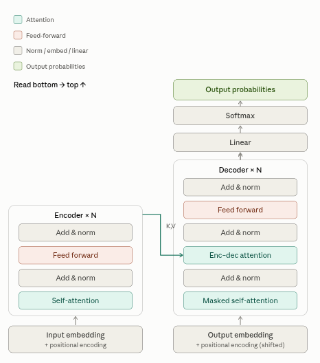

::: {.page-banner}
{fig-alt="Machine Learning in R — From Scratch without Tears"}
:::

# Chapter 17: Natural Language Processing (NLP)

> **Level**: Advanced | **Estimated Time**: 8–10 hours | **Prerequisites**: Chapter 11 (Neural Networks), Chapter 15 (LSTM)

---

## 17.1 Oerview

Natural Language Processing (NLP) is a branch of artificial intelligence that helps computers understand, interpret, and generate human language — the way people actually write and speak.

Here's the core idea. Computers naturally work with numbers, not words. When you type a sentence like "I loved this movie," the computer doesn't automatically know what it means, whether it's positive or negative, or what "it" refers to. NLP is the set of techniques that bridges that gap, turning messy human language into something a machine can process and act on.

You already use NLP every day, probably without noticing:

- **Autocomplete and predictive text** on your phone suggesting the next word
- **Spam filters** in email deciding what's junk
- **Voice assistants** like Siri or Alexa understanding your spoken requests
- **Google Translate** converting text between languages
- **Chatbots** (including me) reading your question and writing a reply
- **Search engines** figuring out what you actually mean when you type a query

Why is this hard? Human language is genuinely messy and full of ambiguity. Consider the sentence "I saw the man with the telescope." Did you use a telescope to see him, or did the man have a telescope? A human uses context to guess; a computer has to be taught how. Language also has sarcasm, slang, typos, words with multiple meanings ("bank" as in river vs. money), and the same idea can be phrased a hundred different ways. All of this makes NLP a challenging field.

At a high level, NLP usually works in a few steps. First it **breaks text into pieces** (splitting a sentence into individual words or "tokens"). Then it **cleans and standardizes** those pieces (lowercasing, removing filler words, reducing "running" to "run"). Next it **converts words into numbers** — since models only understand math, words get represented as numerical vectors that capture meaning. Finally, a **model uses those numbers** to do a task: classify the text, answer a question, translate it, and so on.

Some common things NLP is used for include: **sentiment analysis** (is this review happy or angry?), **translation**, **summarization** (condensing a long article), **named entity recognition** (pulling out names, dates, and places from text), **question answering**, and **text generation** (writing new text, which is what large language models do).

A quick note on how the field has evolved: early NLP relied on hand-written rules and grammar, which was rigid and broke easily. Then came statistical and machine-learning methods that learned patterns from data. Today, the field is dominated by **deep learning** and especially **transformer models** (the technology behind tools like ChatGPT and me), which learn language from enormous amounts of text and handle context remarkably well.

Given your background in data science and health analytics, if you'd like, I can go a level deeper — for example, walking through tokenization and word embeddings with actual code, or showing how a simple sentiment classifier works end to end. Want me to put together a beginner-friendly notebook on any of these?

Language is discrete, variable-length, and context-dependent. The key challenges:

1. **Representing text**: convert words to numbers without losing meaning
2. **Capturing context**:  "bank" means different things in "river bank" vs "bank account"
3. **Handling variable length**: sentences have different numbers of words
4. **Long-range dependencies**: a pronoun might refer to a noun 50 words back

This chapter builds the NLP stack from scratch: tokenisation → bag-of-words → TF-IDF → word2vec → attention → the Transformer architecture.

---

## 17.2 Text Preprocessing

Text preprocessing is a crucial step in any NLP pipeline. The goal is to transform raw, messy text into a clean, consistent format that can be analyzed or used as input to models. The typical steps in text preprocessing include:

1. **Text Cleaning:** Remove unwanted characters, HTML tags, punctuation, or non-ASCII symbols. This step may also involve fixing encoding issues or expanding contractions (e.g., "can't" → "cannot").
2. **Lowercasing:** Convert all characters to lowercase so that "The" and "the" are treated as the same word.
3. **Tokenization:** Split the text into smaller units, typically words or subwords. Tokenization determines how models "see" text.
4. **Removing stopwords:** Remove common, uninformative words like "the", "and", "is", which often don't contribute much meaning.
5. **Stemming/Lemmatization:** Convert words to their root form (e.g., "running", "ran", "runs" → "run"). Stemming is a crude cut, while lemmatization is linguistically informed.
6. **Handling rare words / Out-of-vocabulary terms:** Replace or flag words not present in your vocabulary, often with a special token like `<UNK>`.
7. **Padding or truncating sequences:** For models expecting fixed-length input, add padding tokens or truncate sentences to a certain length.

Effective text preprocessing improves the performance of downstream NLP tasks by reducing noise and standardizing input.

### 17.2.1 Tokenisation

**Tokenisation** is the process of splitting a piece of text into smaller units called *tokens*. These tokens are usually words, but could also be subwords, characters, or even sentences, depending on the use case.

Tokenisation is the very first step in nearly all NLP workflows, because models and algorithms need a way to break down raw text into parts they can analyze or represent as numbers.

For example, the sentence
`"Time flies like an arrow; fruit flies like a banana."`
could be tokenised (using a simple word splitter) into:

```
["time", "flies", "like", "an", "arrow", "fruit", "flies", "like", "a", "banana"]
```

Good tokenisation is important because it:
- Determines how meaning and context are captured
- Affects the vocabulary size for your model
- Impacts downstream model performance

There are many ways to tokenise text, from simple regular expressions to sophisticated algorithms that handle punctuation, contractions ("don't" → ["do", "n't"]), or even rare words (subword tokenisation, such as in BPE or WordPiece).

In the next code cell, we'll implement a simple word-level tokeniser in R.

```{r}
# "Tokenise" means splitting up a sentence into individual words
tokenise <- function(text, lower = TRUE) {
  # Split a sentence into words.
  # - text: The sentence/string you want to split up.
  # - lower: If True, make everything lowercase (so "Dog" and "dog" count as the same).
  # Example: "Hello, world!" -> c("hello", "world")
  if (lower) text <- tolower(text)
  # This weird pattern just finds the words:
  # [a-z0-9']+ means: any sequence of letters, numbers or apostrophes
  # So "dog's" becomes "dog's" as one token (kept together, matching the Python regex)
  m <- gregexpr("[a-z0-9']+", text)
  regmatches(text, m)[[1]]  # Returns a vector like c("the", "cat", "sat")
}

# "Vocabulary" here means: a lookup of all the unique words we've seen, with each one getting its own number.
build_vocab <- function(corpus, min_freq = 1, max_size = NULL) {
  # Create a vector of all unique words (the vocabulary) and assign each one a number (an index).
  # - corpus: a list of character vectors, where each inner vector is the tokens of a sentence
  #   Example: list(c("the","cat"), c("the","dog"))
  # - min_freq: ignore words that appear less than this many times
  # - max_size: don't include more than this many words (most common first)
  # Returns:
  #   - word2idx: named integer vector ("cat" -> 4), 0-indexed to mirror the Python dict
  #   - idx2word: character vector (index 4 [R position 5] gives you "cat")

  # Count up all the words in all the sentences
  freq <- sort(table(unlist(corpus)), decreasing = TRUE)
  if (!is.null(max_size)) freq <- freq[seq_len(min(max_size, length(freq)))]
  # Get the most common words, and filter out rare ones
  vocab_words <- names(freq)[freq >= min_freq]

  # Some special tokens computers need for padding, unknown words, etc.
  specials <- c("<PAD>", "<UNK>", "<BOS>", "<EOS>")
  vocab_words <- c(specials, vocab_words)   # special stuff goes at the start

  # Give each word a unique number: "the" -> 4, "cat" -> 5, etc. (0-indexed)
  word2idx <- setNames(seq_along(vocab_words) - 1, vocab_words)
  idx2word <- vocab_words                    # the opposite: index -> word
  list(word2idx = word2idx, idx2word = idx2word)
}

# Small helper used throughout this chapter: look up a token's index, falling back to <UNK>.
get_idx <- function(tok, word2idx) {
  if (tok %in% names(word2idx)) word2idx[[tok]] else word2idx[["<UNK>"]]
}

# DEMO: Let's see how it works!
sentences <- c(
  "the cat sat on the mat",
  "the dog sat on the log",
  "cats and dogs are great pets"
)
# Turn each sentence into a vector of words
corpus <- lapply(sentences, tokenise)
# Make the vocabulary from all the sentences above
vb <- build_vocab(corpus, min_freq = 1)
word2idx <- vb$word2idx; idx2word <- vb$idx2word

cat("=== Tokenisation & Vocabulary ===\n")
cat(sprintf("Corpus sentences: %d\n", length(corpus)))          # Should be 3
cat(sprintf("Vocabulary size:  %d\n", length(word2idx)))        # How many unique words (plus special tokens)
cat("Sample tokens:   ", corpus[[1]], "\n")                     # Tokens from the first sentence
cat("Encoded:         ", sapply(corpus[[1]], get_idx, word2idx = word2idx), "\n")  # The numbers for each word
```

### 17.2.2 Byte-Pair Encoding (BPE)

BPE is a way to split words into smaller pieces (subwords) so computers can better understand text.
Imagine you start by cutting every word into single letters. Then, you look for the two letters that are next to each other the most, and combine them into a new "chunk".
You repeat this process, merging the most common pairs into bigger and bigger chunks.
This gives the computer a smart way to handle new words it has never seen, because it can break them into familiar pieces.
BPE is used by models like GPT-2 and RoBERTa to help turn text into numbers.

```{r}
learn_bpe <- function(corpus_str, num_merges = 20) {
  # What does BPE (Byte Pair Encoding) do?
  # - It chops words into letters.
  # - It finds the pair of letters that sticks together most often.
  # - It glues that pair into a new "chunk" (imagine 'th' or 'an' becoming a single piece).
  # - Repeats: keeps gluing the most frequent pairs, making longer pieces as it goes.
  # - Result: Common letter groups (and word bits) are joined together, so the computer can better
  #   handle new or rare words.
  #
  # Returns:
  #   - vocab: the new "vocabulary" made of glued sequences, as a named list (name = glued sequence,
  #     value = count)
  #   - merges: the rules for what pairs it glued together (in which order), each a 2-element vector

  # 1. Make every word into single letters separated by spaces, with an end mark </w>
  words <- strsplit(tolower(corpus_str), "\\s+")[[1]]
  vocab <- list()
  for (word in words) {
    # E.g. "cat" turns into "c a t </w>"
    letter_seq <- paste(c(strsplit(word, "")[[1]], "</w>"), collapse = " ")
    vocab[[letter_seq]] <- (if (is.null(vocab[[letter_seq]])) 0 else vocab[[letter_seq]]) + 1
  }

  merges <- list()  # We'll store all our "glue this pair!" steps here
  for (step in 1:num_merges) {
    # 2. Look at all pairs of symbols that are next to each other in the vocab.
    # We key each pair by a separator character that can never appear in a token, and keep
    # the actual two symbols alongside it -- this matters once a symbol itself becomes a
    # multi-character glued chunk (e.g. "th"), since we can no longer split the key apart
    # by character to recover the two original pieces.
    pair_counts <- list()
    pair_lookup <- list()
    for (w in names(vocab)) {
      freq <- vocab[[w]]
      symbols <- strsplit(w, " ")[[1]]      # Turns "c a t </w>" -> c("c","a","t","</w>")
      if (length(symbols) < 2) next
      for (i in 1:(length(symbols) - 1)) {
        pair_key <- paste(symbols[i], symbols[i + 1], sep = "␟")
        pair_counts[[pair_key]] <- (if (is.null(pair_counts[[pair_key]])) 0 else pair_counts[[pair_key]]) + freq
        pair_lookup[[pair_key]] <- c(symbols[i], symbols[i + 1])
      }
    }

    if (length(pair_counts) == 0) break  # No more pairs to merge

    # 3. Find the most frequent pair to glue together
    best_key <- names(pair_counts)[which.max(unlist(pair_counts))]
    best_pair <- pair_lookup[[best_key]]
    merges[[step]] <- best_pair  # Remember what we glued!

    # 4. Actually glue the pair, replace everywhere in vocab
    bigram <- paste(best_pair, collapse = " ")       # e.g. "t h"
    replacement <- paste(best_pair, collapse = "")   # e.g. "th"
    new_vocab <- list()
    for (w in names(vocab)) {
      # Replace all bigrams in the word with their merged version (glued up string)
      # E.g. "t h e </w>" -> "th e </w>"
      new_w <- gsub(bigram, replacement, w, fixed = TRUE)
      new_vocab[[new_w]] <- (if (is.null(new_vocab[[new_w]])) 0 else new_vocab[[new_w]]) + vocab[[w]]
    }
    vocab <- new_vocab  # Update for the next loop!
  }

  list(vocab = vocab, merges = merges)
}

# Example for dummies:
text <- "the cat sat on the mat the dog sat on the log"
bpe_out <- learn_bpe(text, num_merges = 10)
cat("\n=== BPE (10 merges) ===\n")
cat("First 5 merge rules (these are the pairs joined together):\n")
for (m in bpe_out$merges[1:5]) cat("  ", paste(m, collapse = " + "), "\n")
cat("What does some of the final 'words' look like after all this merging?\n")
print(head(bpe_out$vocab, 5))
```

---

## 17.3 Bag of Words and TF-IDF
This section introduces two fundamental ways of representing documents as numeric vectors:
- **Bag of Words (BoW)** simply counts how often each word appears in each document, creating a vector of word frequencies.
- **TF-IDF (Term Frequency-Inverse Document Frequency)** weighs word counts by how unique or informative they are, so frequent words that appear in many documents are downweighted, and rare, distinctive words are upweighted.

### 17.3.1 Bag of Words

The Bag of Words (BoW) model is a simple and widely used method to represent text data numerically.

How it works:
- For a given collection of documents, we first build a vocabulary containing every unique word seen across all documents.
- Each document is then represented as a vector whose length is equal to the size of the vocabulary.
- The value at each position in the vector corresponds to the number of times the associated word (from the vocabulary) occurs in that document.
- The ordering of words in the original document is not preserved—BoW only cares about word counts.

For example, if our vocabulary is ['cat', 'dog', 'sat'], and a document is "cat sat cat", then its BoW vector is [2, 0, 1], meaning 'cat' appears 2 times, 'dog' 0 times, and 'sat' 1 time.

This representation allows us to compare documents using their word frequencies, enabling basic text analysis and feeding data into machine learning models.

```{r}
# -- Bag of Words for Dummies --

bag_of_words <- function(tokens, word2idx) {
  # Make a "bag" (vector) with one slot for every word in the vocabulary
  V <- length(word2idx)
  vec <- rep(0, V)  # Start with everything at zero
  for (tok in tokens) {
    # For each token, find its index in our vocab (0-indexed, so +1 for R's vector)
    idx <- get_idx(tok, word2idx)
    vec[idx + 1] <- vec[idx + 1] + 1  # Add one every time we see a word
  }
  vec  # Return the word-count vector
}

# Now, make a bag-of-words vector for every sentence in our small dataset!
bows <- lapply(corpus, function(s) bag_of_words(s, word2idx))

cat("\n=== Bag of Words ===\n")
cat("BoW vector for sentence 0 (non-zero entries):\n")
for (i in seq_along(bows[[1]])) {
  if (bows[[1]][i] > 0) cat(sprintf("  '%s': %d\n", idx2word[i], bows[[1]][i]))  # only words that appear!
}
```

### 17.3.2 TF-IDF

Suppose you want to figure out which words in a document are truly "important"—not just common words like "the", but words that are especially meaningful for that specific document. That's what TF-IDF helps with!

**TF-IDF** stands for **Term Frequency-Inverse Document Frequency**. It ranks words higher if they are common in one document but rare across the collection.

The TF-IDF score for a word *w* in document *d*, out of *N* documents, is:

$$
\text{TF-IDF}(w, d) = \text{TF}(w, d) \times \text{IDF}(w)
$$

Where:
- **Term Frequency (TF):**

  $$
  \text{TF}(w, d) = \frac{\text{Number of times word } w \text{ appears in } d}{\text{Total number of words in } d}
  $$
  For example, if "cat" appears 3 times in a 10-word sentence:
  $$
  \text{TF}(\text{cat}, d) = \frac{3}{10} = 0.3
  $$

- **Inverse Document Frequency (IDF):**

  $$
  \text{IDF}(w) = \log \left( \frac{N + 1}{n_w + 1}\right) + 1
  $$
  Where:
  - $N$ = Total number of documents
  - $n_w$ = Number of documents containing word $w$
  This means: If a word appears in many documents, its IDF shrinks; if it shows up in only a few, its IDF grows.

- **TF-IDF Score:** Multiply TF and IDF! A word gets a high TF-IDF if it appears often in a specific document (high TF), but not in many documents overall (high IDF).

In short, TF-IDF highlights words that are:
- Frequent in this one document
- Infrequent in the rest of the collection

This makes TF-IDF great for finding keywords and summarizing what each document is truly *about*.

```{r}
# === TF-IDF Calculation ===

tfidf <- function(corpus_tokens, word2idx) {
  # Makes a TF-IDF matrix for a set of documents.
  # (TF-IDF tells you which words are important in which document.)
  #
  # Inputs:
  #   corpus_tokens: list of token vectors; one vector per document.
  #   word2idx: named vector mapping each word in the vocabulary to a 0-indexed column number.
  #
  # Output:
  #   - matrix: a list of vectors. Each element is a document; each entry is a word's
  #     TF-IDF importance.
  #   - idf: vector where idf[i] is the IDF score for word i (1-indexed).
  V <- length(word2idx)               # How many words in our vocabulary?
  N <- length(corpus_tokens)          # How many documents?

  # STEP 1: Figure out how many documents each word appears in ("document frequency").
  df <- rep(0, V)                     # df[i] counts docs containing word i
  for (tokens in corpus_tokens) {     # For every document...
    seen <- c()                       # Track which words we've already counted for this doc!
    for (tok in tokens) {             # For every word in the doc...
      idx <- get_idx(tok, word2idx)   # Get that word's column in TF-IDF.
      if (!(idx %in% seen)) {         # Don't double-count words in the same document!
        df[idx + 1] <- df[idx + 1] + 1
        seen <- c(seen, idx)
      }
    }
  }

  # STEP 2: Compute IDF ("rarity") for each word. High IDF = rare word.
  idf <- log((N + 1) / (df + 1)) + 1

  # STEP 3: For each document, compute TF ("word frequency") and then the TF-IDF vector:
  matrix_ <- vector("list", N)
  for (d in seq_len(N)) {
    tokens <- corpus_tokens[[d]]
    total <- length(tokens)           # Total number of words in this doc
    tf <- rep(0.0, V)                 # tf[i] is frequency of word i in this doc
    for (tok in tokens) {
      idx <- get_idx(tok, word2idx)
      tf[idx + 1] <- tf[idx + 1] + 1.0 / total  # Add 1/length for each occurrence
    }
    # Now multiply TF by IDF for each word, to get each word's final score in this doc:
    row <- tf * idf
    # Finally: Normalize the whole vector (so longer docs don't dominate):
    norm <- sqrt(sum(row^2)) + 1e-9
    matrix_[[d]] <- row / norm
  }

  list(matrix = matrix_, idf = idf)
}

# Actually use it:
tfo <- tfidf(corpus, word2idx)
tfidf_matrix <- tfo$matrix; idf_vec <- tfo$idf

# === Cosine Similarity, for Dummies ===
# This tells us how "similar" two documents are (1 = same, 0 = nothing in common).
cosine_sim <- function(a, b) {
  dot <- sum(a * b)          # Multiply each matching word's score together and add up (dot product)
  na <- sqrt(sum(a^2))       # Length of document a in this "word space"
  nb <- sqrt(sum(b^2))       # Length of document b in this "word space"
  dot / (na * nb + 1e-9)     # Cosine of the angle between their "word importance" vectors
}

cat("\n=== TF-IDF Cosine Similarities ===\n")
cat(sprintf("  Doc0 vs Doc1 (both about sitting): %.3f\n", cosine_sim(tfidf_matrix[[1]], tfidf_matrix[[2]])))
cat(sprintf("  Doc0 vs Doc2 (different topic):    %.3f\n", cosine_sim(tfidf_matrix[[1]], tfidf_matrix[[3]])))
```

---

## 17.4 Word Embeddings (Word2Vec Skip-gram)

**TF-IDF** just counts how important each word is, treating every word as totally separate.
**Word2Vec** is way cooler: it gives each word a list of numbers ("embedding") so that *similar words have similar coordinates*. Even "word math" works:

```
king - man + woman ≈ queen
```

### But how does it actually work? (Math for dummies)

Imagine you slide a window over your text. For every word (the "center" word, call it **w**), you try to guess the words near it ("context" words, call them **c**).

The model wants to make the **center vector** (**v_w**) and **context vector** (**u_c**) "line up" (big dot product) if they appear together and *not* line up for random words.

So, for every place where a center word sees a context word, we want to **give a high score to real pairs, and low score to fake pairs**.

The math:

$$
\text{Maximize:} \quad \sum_{(w,c)} \log P(c \mid w)
$$

Where $P(c \mid w)$ is:
$$
P(c \mid w) = \frac{
     \exp(\mathbf{v}_w \cdot \mathbf{u}_c)
  }{
     \sum_{\text{all words }v} \exp(\mathbf{v}_w \cdot \mathbf{u}_v)
  }
$$

In plain English:
- "Make the dot product for *correct* context words big"
- "Try not to give high dot products to *random* other words"

(**v_w** = center-word vector, **u_c** = context-word vector.)

**The denominator is huge!** It sums over all words. That's slow.

**Negative Sampling Trick:**
Instead of checking *every* possible word for the denominator, just sample a few "negative" words (ones that shouldn't be there), and make sure their dot products stay low.

```{r}
# This class learns to turn each word into a list of numbers (embeddings)
# so that similar words are close together, and "word math" works.
#
# Skip-gram with negative sampling (from scratch, for dummies!)
# - Each word gets two sets of numbers: one for "center", one for "context".
# - For each (center, context) real pair, make their numbers similar.
# - For random (center, NOT context) "negative" pairs, make their numbers NOT similar.
# - Uses simple math: dot products and the sigmoid function.
Word2Vec <- setRefClass(
  "Word2Vec",
  fields = list(Vn = "numeric", D = "numeric", W_in = "matrix", W_out = "matrix"),
  methods = list(
    initialize = function(vocab_size = 1, embed_dim = 16, seed = 42, ...) {
      # Random number generator for reproducibility
      set.seed(seed)
      scale <- 0.01
      Vn <<- vocab_size  # how many words in vocab
      D <<- embed_dim    # how many numbers per word

      # These are the "center word" vectors -- each word gets one row
      W_in <<- matrix(rnorm(vocab_size * embed_dim, 0, scale), nrow = vocab_size, ncol = embed_dim)
      # These are the "context word" vectors -- each word gets one row
      W_out <<- matrix(rnorm(vocab_size * embed_dim, 0, scale), nrow = vocab_size, ncol = embed_dim)
      callSuper(...)
    },
    dot_ = function(a, b) sum(a * b),  # Multiplies two vectors and adds up the results
    sigmoid_ = function(x) 1.0 / (1.0 + exp(-pmax(pmin(x, 30), -30))),  # squashes into 0..1
    train_pair = function(center_idx, pos_idx, neg_indices, lr = 0.025) {
      # Does one learning update for:
      # - center_idx = the "anchor" word (0-indexed)
      # - pos_idx = a REAL context word found nearby (0-indexed)
      # - neg_indices = a bunch of RANDOM (shouldn't be context!) words (0-indexed)
      #
      # 1. Make center and positive context get a HIGH dot product
      # 2. Make center and negatives get a LOW dot product
      # 3. Adjust all their numbers a little so this happens next time
      ci <- center_idx + 1; pI <- pos_idx + 1   # convert 0-indexed ids to R's 1-indexed rows
      v_c <- W_in[ci, ]    # "center word" vector
      u_p <- W_out[pI, ]   # "context word" vector

      # --- Positive pair ---
      score_pos <- sigmoid_(dot_(v_c, u_p))   # How "similar"?
      grad_pos <- score_pos - 1.0              # How much to tweak? (want closer to 1)

      # Move context vector closer to center if they appeared together
      W_out[pI, ] <<- W_out[pI, ] - lr * grad_pos * v_c

      # Accumulate change for center vector (to update after negatives too)
      grad_center <- grad_pos * u_p

      # --- Negative pairs ---
      for (neg_idx in neg_indices) {
        ni <- neg_idx + 1
        u_n <- W_out[ni, ]                       # a not-actually-nearby word
        score_neg <- sigmoid_(dot_(v_c, u_n))    # similarity (want it LOW)
        # Move negative word's context vector AWAY from center
        W_out[ni, ] <<- W_out[ni, ] - lr * score_neg * v_c
        grad_center <- grad_center + score_neg * u_n
      }

      # Update center word's vector using all the gradients from above
      W_in[ci, ] <<- W_in[ci, ] - lr * grad_center
    },
    get_embedding = function(word_idx) W_in[word_idx + 1, ],  # numbers for word #word_idx
    most_similar = function(word_idx, idx2word, top_k = 3) {
      # For the given word, look for other words whose embeddings are most "similar"
      # (highest cosine similarity)
      target <- W_in[word_idx + 1, ]
      idxs <- setdiff(0:(Vn - 1), word_idx)  # skip self
      scores <- sapply(idxs, function(i) {
        vi <- W_in[i + 1, ]
        dot <- dot_(target, vi)
        norm_t <- sqrt(dot_(target, target)) + 1e-9
        norm_i <- sqrt(dot_(vi, vi)) + 1e-9
        dot / (norm_t * norm_i)
      })
      ord <- order(scores, decreasing = TRUE)[1:top_k]
      # Return top_k similar words and similarity scores
      Map(function(i, s) list(word = idx2word[idxs[i] + 1], score = s), ord, scores[ord])
    }
  )
)

# This function makes pairs for training:
# For every word (the center), grab some neighbor words (context) and also sample some
# negative (random) words.
generate_skipgram_pairs <- function(corpus, word2idx, window = 2, neg_k = 5, seed = 42) {
  set.seed(seed)
  pairs <- list()
  V <- length(word2idx)
  for (sentence in corpus) {
    ids <- sapply(sentence, get_idx, word2idx = word2idx)  # convert each word to its integer
    n <- length(ids)
    for (i in seq_along(ids)) {
      center <- ids[i]
      # Grab window-size words to the left and right for positives
      window_idx <- max(1, i - window):min(n, i + window)
      context <- ids[setdiff(window_idx, i)]
      for (pos in context) {
        # Random negatives, not the special tokens (0-indexed range [4, V-1])
        negs <- sample(4:(V - 1), neg_k, replace = TRUE)
        pairs[[length(pairs) + 1]] <- list(center = center, pos = pos, negs = negs)
      }
    }
  }
  pairs
}

# === Now let's train the embeddings! (for dummies) ===

# Repeat our tiny toy text many times so we have enough data
bigger_corpus <- rep(corpus, 50)  # repeat for more signal
pairs <- generate_skipgram_pairs(bigger_corpus, word2idx, window = 2, neg_k = 5)

# Make a Word2Vec model (choose how big the number-list for each word is, here 8)
model_w2v <- Word2Vec$new(vocab_size = length(word2idx), embed_dim = 8, seed = 0)

# Shuffle the training pairs (normal in machine learning)
set.seed(42)
pairs <- pairs[sample(length(pairs))]

cat("\n=== Word2Vec Skip-gram ===\n")
cat(sprintf("Training on %d (center, context, negatives) pairs...\n", length(pairs)))

# Main training loop: for each pair, do a learning step!
for (p in pairs) model_w2v$train_pair(p$center, p$pos, p$negs, lr = 0.05)

# Let's see which words are most similar to "cat" (according to the learned word numbers!)
target <- "cat"
if (target %in% names(word2idx)) {
  similar <- model_w2v$most_similar(word2idx[[target]], idx2word, top_k = 3)
  cat(sprintf("Words most similar to '%s': ", target))
  cat(paste(sprintf("(%s, %.3f)", sapply(similar, `[[`, "word"), sapply(similar, `[[`, "score")), collapse = ", "), "\n")
}
```

---

## 17.5 Attention Mechanism

Imagine you are reading a sentence and, for each word, you want to "pay attention" to other words that might help you understand it.

**Attention** is a special calculator that helps a neural network decide how much each word should look at every other word.

### Scaled Dot-Product Attention (Simple Math Version)

Think of the attention calculation in 3 simple steps:

1. **Find out who's important:**
   - For each word, make three "versions" of it — called **Q** (query), **K** (key), and **V** (value).
   - Q: "What am I looking for?"
   - K: "What do I have to offer?"
   - V: "What information do I give you if you pick me?"

2. **Score how well they match:**
   - For every position, match its **Q** with every other position's **K** (using dot product, which is just multiplying and adding up each part).
   - This says how much the model thinks they go together.
   - The formula is:
     $$
     \text{score}_{ij} = Q_i \cdot K_j = \sum_{k=1}^{d_k} Q_{i,k} \times K_{j,k}
     $$
   - Divide everything by $\sqrt{d_k}$ (the square root of the vector size). This keeps numbers nicely balanced so nothing explodes or shrinks too much.

3. **Turn scores into attention weights:**
   - Big scores mean you "pay more attention" there!
   - But scores can be anything—so use `softmax`, which turns numbers into probabilities that add up to 1:
     $$
     \text{AttentionWeights}_{ij} = \frac{\exp\left(\text{score}_{ij} / \sqrt{d_k}\right)}{\sum_{j}\exp\left(\text{score}_{ij} / \sqrt{d_k}\right)}
     $$

4. **Mix the information:**
   - For each word, take a *weighted sum* of all the **V** vectors (using the attention weights from above).
   - This gives us a new "output" for each word that blends together information from all the other words.

5. **Full formula:**
   $$
   \text{Attention}(Q, K, V) = \text{softmax}\!\left(\frac{Q K^\top}{\sqrt{d_k}}\right) V
   $$

So:
- For each word, we ask "who should I pay attention to?"
- We use math (dot products and softmax) to decide how much attention to pay!
- We blend together the information from every word's **V**.

---

## 17.6 The Transformer

The Transformer (Vaswani et al., 2017) is a groundbreaking neural network architecture for NLP
tasks (like translation or summarisation). Unlike RNNs (which read inputs one step at a time),
Transformers process the entire input at once, using a mechanism called **multi-head self-attention**.

Let's break down the core ideas (for dummies!) with simple math:

### Multi-Head Attention (What is it? Why do we use it?)

- Suppose your sentence is a row of tokens (e.g. "the cat sat").
- For each token, the model asks: "To predict the next word, which other words should I pay
  attention to?".
- But instead of doing this once, **multi-head attention** repeats it several times (h times):
  each "head" learns to focus on different patterns! (E.g. one head might focus on subject-verb,
  another on nearby words, etc.)

#### The math "recipe" for Multi-Head Attention:

1. Project queries (Q), keys (K), and values (V) using learned matrices for each head:
   - For head i:
       - $\mathbf{Q}_i = \mathbf{Q} \mathbf{W}_i^Q$
       - $\mathbf{K}_i = \mathbf{K} \mathbf{W}_i^K$
       - $\mathbf{V}_i = \mathbf{V} \mathbf{W}_i^V$
   - Here, $\mathbf{W}_i^Q$, $\mathbf{W}_i^K$, and $\mathbf{W}_i^V$ are learned (trainable) matrices.

2. Compute attention for each head using Scaled Dot-Product Attention:
   - $\text{Attention}(\mathbf{Q}_i, \mathbf{K}_i, \mathbf{V}_i)$
   - (See earlier section for what this does: it lets each word "look" at every other word and
     take a weighted average of their value vectors.)

3. Concatenate the outputs of all heads (e.g. just stick all their outputs together in a big vector).

4. Pass the concatenated result through one more learned matrix, $\mathbf{W}_O$, to mix
   everything together.

    $$
    \text{MultiHead}(\mathbf{Q},\mathbf{K},\mathbf{V}) = \text{Concat}(\text{head}_1, \ldots, \text{head}_h)\, \mathbf{W}_O
    $$

    where
    $$
    \text{head}_i = \text{Attention}(\mathbf{Q}\mathbf{W}^Q_i,\; \mathbf{K}\mathbf{W}^K_i,\; \mathbf{V}\mathbf{W}^V_i)
    $$

- Why use multiple heads? It helps the model capture many different kinds of relationships—some
  heads might look for grammar, others for meaning!



```{r}
scaled_dot_product_attention <- function(Q, K, V, mask = NULL) {
  # Scaled Dot-Product Attention explained for beginners:
  #
  # - Q: "Queries" = What each word is currently looking for.
  # - K: "Keys"    = What each word has to offer.
  # - V: "Values"  = The information each word wants to share.
  # - mask: (optional) logical matrix; TRUE hides that position (like ignoring padding or
  #   future words).
  #
  # Step-by-step:
  # 1. For every query position, see how much it "matches" every key (dot product).
  # 2. Scale these scores down (to keep numbers manageable).
  # 3. If there is a mask, set scores we want to ignore to a very negative number (so softmax
  #    makes their "attention" almost zero).
  # 4. Use "softmax" to turn the scores for each word into probabilities that add up to 1.
  # 5. For each word, take a "weighted sum" of the value vectors, using the attention weights.
  # 6. Return the blended information (output), and the attention weights.
  #
  # Q: (num_queries, d_k); K: (num_keys, d_k); V: (num_keys, d_v)
  # Output: (num_queries, d_v), attention weights (num_queries, num_keys)
  d_k <- ncol(Q)             # Size of each Q/K vector
  scale <- sqrt(d_k)         # Divide scores by sqrt(d_k) to keep things stable

  # 1. Calculate attention "scores" (how much each query likes each key)
  scores <- (Q %*% base::t(K)) / scale

  # 2. (Optional) Use mask to ignore certain positions
  if (!is.null(mask)) scores[mask] <- -1e9  # Very low score means "no attention"

  # 3. Softmax: turn scores for each query into probabilities over the keys
  softmax_row <- function(row) {
    m <- max(row); e <- exp(row - m); e / sum(e)  # subtract max for numerical stability
  }
  weights <- t(apply(scores, 1, softmax_row))  # each row of 'scores' becomes attention weights

  # 4. Use attention weights to blend the value vectors (weighted sum)
  output <- weights %*% V

  # Return the final output and the attention weights (so we can see what was attended to)
  list(output = output, weights = weights)
}

# DEMO FOR DUMMIES: 3 "words", identity attention
# - Each word is a 4-element vector: [1,0,0,0], [0,1,0,0], [0,0,1,0]
Q <- rbind(c(1.0, 0.0, 0.0, 0.0),
           c(0.0, 1.0, 0.0, 0.0),
           c(0.0, 0.0, 1.0, 0.0))
K <- Q  # In self-attention, Q = K = V (words attend to each other)
V <- Q

attn <- scaled_dot_product_attention(Q, K, V)
cat("\n=== Scaled Dot-Product Attention ===\n")
cat("Attention weights (each row sums to 1):\n")
for (i in 1:nrow(attn$weights)) {
  cat(sprintf("  Token %d: %s\n", i - 1, paste(round(attn$weights[i, ], 3), collapse = ", ")))
}
```

### Positional Encoding (Because Transformers can't "count" by themselves)

Positional Encoding is a technique used in Transformers to give the model information about the order of tokens in a sequence.
Since Transformers process all positions in parallel and do not have built-in sense of position (unlike RNNs), positional encoding
adds unique patterns (created using sine and cosine functions) to each input position. This helps the model distinguish between,
for example, the first word and the third word in a sentence, allowing it to understand word order and sequence structure.

- Transformers have **no recurrence** (they process all words at once), so they don't know the order
  of the words.
- To give the model a clue about *where* each word is in the sequence, we add "positional
  encodings" to the input vectors.

For a word at position `pos` and dimension `i` of its vector:

  - If `i` is even (0, 2, 4, ...):   $\text{PE}(\text{pos}, 2i) = \sin\left(\frac{\text{pos}}{10000^{2i/d_{\text{model}}}}\right)$
  - If `i` is odd  (1, 3, 5, ...):  $\text{PE}(\text{pos}, 2i+1) = \cos\left(\frac{\text{pos}}{10000^{2i/d_{\text{model}}}}\right)$

- This creates a unique vector for every position, and lets the model "know" the order of the words.
- The code for this is just applying sine/cosine functions at different frequencies (see next code cell).

```{r}
positional_encoding <- function(seq_len, d_model) {
  # Make a matrix called 'PE' that tells the model where each word is in a sentence.
  # It fills each position with unique numbers using math 'waves' (sine and cosine).
  # This way, the model can tell the order of words!
  #
  # How it works:
  # - For every position (like the 1st, 2nd... word), we make a row of numbers.
  # - For every slot in that row, we use either sin or cos (depending if it's an even or
  #   odd slot) to create a wavy number.
  # - The frequency of the wave changes for each slot, so each position ends up being unique.
  #
  # In simple words: Turns position (like '3rd word') into a smart, wiggly set of numbers so
  # the model knows where a word is.
  #
  # Arguments:
  # - seq_len: How many positions (words) in the sentence
  # - d_model: How big you want each position's set of numbers to be
  #
  # Returns: a matrix (seq_len x d_model) of position encodings
  PE <- matrix(0, nrow = seq_len, ncol = d_model)
  for (pos in 0:(seq_len - 1)) {         # For each word position
    for (i in 0:(d_model - 1)) {         # For each number slot in the position
      # Make a different frequency for each slot so every row is special
      angle <- pos / (10000 ^ (2 * (i %/% 2) / d_model))
      PE[pos + 1, i + 1] <- if (i %% 2 == 0) sin(angle) else cos(angle)  # even: sine, odd: cosine
    }
  }
  PE
}

# Let's see what it looks like for 5 positions, each with 8 numbers:
pe <- positional_encoding(5, 8)
cat("\n=== Positional Encoding (5 positions, 8-dim) ===\n")
for (pos in 1:5) cat(sprintf("  pos %d: %s\n", pos - 1, paste(round(pe[pos, ], 3), collapse = ", ")))
```

### Transformer Encoder Block

The Transformer Encoder Block is a core building block of the Transformer model.
It processes a sequence of input vectors (such as word embeddings), enabling the model to understand relationships and context between all positions in the sequence.

Key steps in an Encoder Block:
1. **Self-Attention**: Every word "looks at" every other word in the sequence (including itself) to gather context.
2. **Add & Normalize**: The attention output is added back to the input (residual connection) and then normalized (LayerNorm) to stabilize learning.
3. **Feed-Forward Network**: Each position is independently passed through a small neural network (usually two linear layers with a ReLU activation in between).
4. **Add & Normalize Again**: The feed-forward output is added back to the previous result and normalized again.

Each of these steps helps the model build a rich representation of the sequence, capturing both meaning and positional information.

```{r}
# === LAYER NORM (makes numbers more "normal" so the model learns better) ===
layer_norm <- function(x, eps = 1e-6) {
  # This function squashes numbers so they have mean=0 and variance=1.
  # Why do this? Helps neural networks be stable and learn better.
  # Very simply: subtract the average, then divide by how much numbers differ from the average.
  # x: a vector of numbers; eps: a tiny number to avoid dividing by zero
  mean_x <- mean(x)                        # Compute the average of all numbers
  var_x <- mean((x - mean_x)^2)            # Variance = how much numbers wiggle around mean
  (x - mean_x) / sqrt(var_x + eps)         # Make them all have same scale
}

# === FEED-FORWARD NETWORK (tiny brain: squish/expand vector, with a "kick" in the middle) ===
feed_forward <- function(x, W1, b1, W2, b2) {
  # Tiny two-layer neural network.
  # First layer: squishes input vector into 'hidden' vector, using weights W1 and bias b1.
  # Uses ReLU (if number < 0, set to 0) to keep only positive stuff.
  # Second layer: squishes hidden vector back to output size, using W2 and b2.
  hidden <- pmax(0.0, as.numeric(W1 %*% x) + b1)  # squish (input -> hidden), then ReLU
  as.numeric(W2 %*% hidden) + b2                   # squish (hidden -> output)
}

# === TRANSFORMER ENCODER LAYER (the heart of the Transformer) ===
# This class is ONE block of a Transformer.
# It takes a matrix of vectors ("tokens" = words or pieces of sentence),
# and lets them "talk to each other" (attention),
# then cleans up the result (layer norm and feed-forward).
#
# Major steps:
#   - Self-Attention: each word looks at every other word and grabs info
#   - Add & Normalize: add original + new info together, clean up
#   - Feed-forward: a little neural net for each word, for more magic
#   - Add & Normalize again: add more & clean up again
TransformerEncoderLayer <- setRefClass(
  "TransformerEncoderLayer",
  fields = list(W_Q = "matrix", W_K = "matrix", W_V = "matrix",
                W1 = "matrix", b1 = "numeric", W2 = "matrix", b2 = "numeric"),
  methods = list(
    initialize = function(d_model = 8, d_ff = 16, seed = 42, ...) {
      # d_model: size of each token's vector ('width' of data at each step)
      # d_ff: size of intermediate hidden layer in feed-forward
      # seed: makes the random numbers repeatable
      set.seed(seed)
      scale <- sqrt(2.0 / (d_model + d_ff))

      # Self-attention weights for Query, Key, Value (just random numbers)
      W_Q <<- matrix(rnorm(d_model * d_model, 0, scale), nrow = d_model, ncol = d_model)
      W_K <<- matrix(rnorm(d_model * d_model, 0, scale), nrow = d_model, ncol = d_model)
      W_V <<- matrix(rnorm(d_model * d_model, 0, scale), nrow = d_model, ncol = d_model)

      # Feed-forward weights
      W1 <<- matrix(rnorm(d_ff * d_model, 0, scale), nrow = d_ff, ncol = d_model)
      b1 <<- rep(0.0, d_ff)
      W2 <<- matrix(rnorm(d_model * d_ff, 0, scale), nrow = d_model, ncol = d_ff)
      b2 <<- rep(0.0, d_model)
      callSuper(...)
    },
    project_ = function(H, W) {
      # Squish a whole batch of words (vectors) by multiplying with weights.
      # H: matrix of token vectors (rows = tokens); W: weight matrix
      H %*% base::t(W)
    },
    forward = function(H, mask = NULL) {
      # Run one step of the encoder block.
      # H: matrix of token vectors (rows = sentence length, cols = d_model)
      # mask: (optional) tells you which words you should ignore
      #
      # Steps:
      #  1. Make queries, keys, values for self-attention
      #  2. Compute attention (every word looks at every other word)
      #  3. Add the attention output back to original ("residual") and normalize it
      #  4. Feed-forward network for each token
      #  5. Add result back in, and normalize again
      # Returns: new matrix of token vectors, all same size

      # Get queries, keys, values: help each token "ask" for info, "tell" about itself, "send" info
      Q <- project_(H, W_Q)
      K <- project_(H, W_K)
      V <- project_(H, W_V)

      # Step 1: Self-attention!
      attn <- scaled_dot_product_attention(Q, K, V, mask)

      # Step 2: Add attention output to input, then layer-normalize (row by row = per token)
      H2 <- H + attn$output
      H2 <- t(apply(H2, 1, layer_norm))

      # Step 3: Feed-forward network (for each token): gives extra reasoning power
      ffn_out <- t(apply(H2, 1, function(h) feed_forward(h, W1, b1, W2, b2)))

      # Step 4: Add FFN output to result, and normalize again
      H3 <- H2 + ffn_out
      H3 <- t(apply(H3, 1, layer_norm))

      H3  # Final result: a new set of vectors for each token
    }
  )
)

# ==== DEMO TIME: Let's see it work ====

d_model <- 8; d_ff <- 16; seq_len <- 4  # Choose tiny numbers so it's fast

set.seed(0)
# Make up a tiny batch of token vectors (what would come from embeddings)
tokens <- matrix(rnorm(seq_len * d_model), nrow = seq_len, ncol = d_model)

# Add a bit of position info so the model knows word order
pe2 <- positional_encoding(seq_len, d_model)
tokens <- tokens + pe2

# Create our transformer encoder layer!
encoder <- TransformerEncoderLayer$new(d_model = d_model, d_ff = d_ff, seed = 7)

# Pass the tokens through the encoder
out <- encoder$forward(tokens)

cat("\n=== Transformer Encoder Layer ===\n")
cat(sprintf("Input shape:  %d x %d   # %d tokens, each with %d numbers\n", seq_len, d_model, seq_len, d_model))
cat(sprintf("Output shape: %d x %d   # Should be the same size as input\n", nrow(out), ncol(out)))
cat("First token output:", round(out[1, ], 3), "\n")
```

---

## 17.7 Classic NLP Tasks

### Text Classification (Naive + TF-IDF)
This section demonstrates how to classify text documents using a simple method
that combines the "naive" nearest-centroid approach with TF-IDF vectorization.
Each document is converted into a TF-IDF vector. For each class, we compute
a centroid vector (the average of all training documents' vectors in that class).
A new (test) document is converted to a TF-IDF vector as well, and classified
to the class whose centroid is the most similar (by cosine similarity).
This method is a classic, interpretable baseline for text classification tasks.

```{r}
# This function does super simple text classification with TF-IDF.
# Think of it like this: It finds which class (category) of text your document is most similar
# to by averaging the "important words" for each category.
classify_tfidf <- function(train_docs, train_labels, test_doc, word2idx) {
  # This is a dumb-friendly explanation of what's happening:
  # 1. For each class (example: 'positive' or 'negative'),
  #    - Collect all the documents labeled with that class.
  #    - Turn each document into a TF-IDF vector (which words are important in it).
  #    - Average all the vectors for that class, so you get a "typical" vector for each class.
  # 2. Turn the test document into a TF-IDF vector too.
  # 3. Find out which class "centroid" (average vector) is closest to your test doc's vector
  #    (using cosine similarity).
  # 4. Return that class as the answer.

  classes <- unique(train_labels)  # Get unique classes (categories) in our dataset
  centroids <- list()
  for (cls in classes) {
    # Grab all documents with this label
    cls_docs <- train_docs[train_labels == cls]
    # Convert those documents to TF-IDF vectors
    mat <- tfidf(lapply(cls_docs, tokenise), word2idx)$matrix
    # Average all the vectors for this class to make the centroid
    centroids[[cls]] <- Reduce(`+`, mat) / length(mat)
  }

  # Turn the test doc into a TF-IDF vector
  test_vec <- tfidf(list(tokenise(test_doc)), word2idx)$matrix[[1]]
  # Check which class centroid is most like the test doc (cosine similarity = 1 is super similar)
  sims <- sapply(classes, function(c) cosine_sim(test_vec, centroids[[c]]))
  classes[which.max(sims)]
}

# Demo time, for dummies:
# Here's a tiny pretend dataset of movie reviews (positive and negative)
train_data <- list(
  list(text = "the film was amazing and wonderful", label = "positive"),
  list(text = "great movie loved every minute", label = "positive"),
  list(text = "terrible film waste of time", label = "negative"),
  list(text = "boring and awful not recommended", label = "negative")
)

# Split data into texts and labels
train_docs <- sapply(train_data, function(d) d$text)
train_labels <- sapply(train_data, function(d) d$label)
# Build vocabulary - what words exist in the dataset
all_corpus <- lapply(train_docs, tokenise)
vb2 <- build_vocab(all_corpus, min_freq = 1)
w2i <- vb2$word2idx

# Example review to classify
test_doc <- "loved it great film"
# Run the classifier!
pred <- classify_tfidf(train_docs, train_labels, test_doc, w2i)

cat("\n=== Text Classification ===\n")
cat(sprintf("Test document: '%s'\n", test_doc))
cat(sprintf("Predicted class: %s\n", pred))
```

---

## Exercises

1. Implement **multi-head attention** by splitting the d_model dimension into h heads, running attention in parallel, and concatenating outputs.
2. Add a **causal mask** to the `scaled_dot_product_attention` function to prevent position i from attending to positions j > i (needed for autoregressive generation).
3. Implement **byte-pair encoding** decode (reverse the merges to reconstruct the original text).
4. Train the Word2Vec model on a larger corpus (e.g., the first 1000 sentences from Project Gutenberg) and use PCA (Chapter 10) to visualise the embeddings in 2D.
5. Build a character-level Transformer (encoder only) for text classification using the `TransformerEncoderLayer`.

---

## Summary

| Concept | Key Idea |
|---------|---------|
| Tokenisation | Split text; subword (BPE) handles OOV words |
| TF-IDF | Frequency-weighted term importance |
| Word2Vec | Dense embeddings; semantic similarity = cosine distance |
| Attention | Dynamic weighted sum of values based on query-key match |
| Transformer | Stack of attention + FFN blocks; no recurrence needed |
| Positional encoding | Sinusoidal signals inject position info |

---

**← Previous:** [Chapter 16: Graph Neural Networks](chapter-16-gnn.qmd)
**→ Next:** [Chapter 18: Generative Models](chapter-18-generative-models.qmd)
