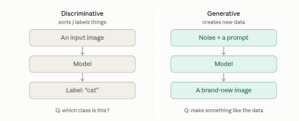
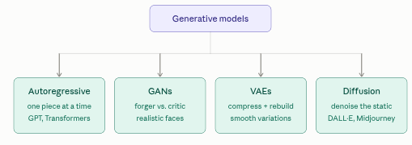
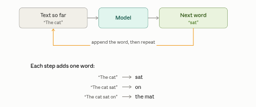
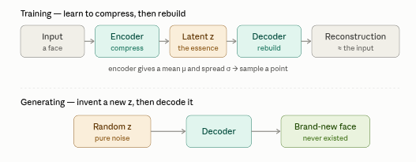
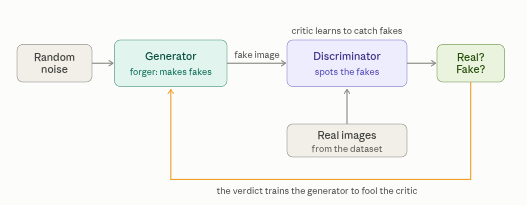
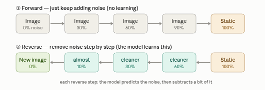

::: {.page-banner}
{fig-alt="Machine Learning in R — From Scratch without Tears"}
:::

# Chapter 18: Generative Models

> **Level**: Advanced | **Estimated Time**: 8–10 hours | **Prerequisites**: Chapter 11 (Neural Networks), Chapter 15 (LSTM)

---

## 18.1 Overview

A generative model is a model that learns to create new data that looks like the data it was trained on. That's the whole idea in one sentence. Train it on millions of cat photos and it can produce a brand-new cat that never existed. Train it on text and it can write new sentences — which is exactly what the Transformer you've been studying does.

The easiest way to "get it" is by contrast with the models you already know. A CNN classifier is discriminative: you show it a photo and it tells you "cat" or "dog." It only learns the boundary between categories - just enough to tell them apart. A generative model learns something much harder: what cats actually look like, deeply enough to draw one. Discriminative models sort; generative models create. The technical way to say it: a generative model learns the underlying *distribution* of the data — the hidden statistical recipe for what makes a cat a cat, or what makes a sentence sound like English. Once it has that recipe, it can sample from it to produce endless new examples. A discriminative model never bothers with the full recipe; it just learns where to draw the line.

There are a few main families of generative models, and they differ mainly in *how* they learn that recipe:



Autoregressive models (like GPT and the Transformer decoder you just mapped) generate one piece at a time, each new token conditioned on everything before it — great for text. GANs (generative adversarial networks) pit two networks against each other: one forges images, the other tries to spot fakes, and they push each other to get better, famous for photorealistic faces. VAEs (variational autoencoders) squeeze data down into a compact "essence" and learn to rebuild it, so you can tweak that essence to generate variations. Diffusion models (behind Stable Diffusion, DALL·E, Midjourney) start from pure noise and repeatedly "denoise" it into a clean image, learning to reverse a gradual corruption process — currently the state of the art for images and video.

The thread connecting all of them to your curriculum: they don't memorize and replay training examples, they learn the *pattern* well enough to improvise new ones.

Here's the family tree — all four types branching from the same parent idea, with what makes each one tick and a familiar example.



Autoregressive builds output sequentially, predicting the next piece from all the previous ones, the same word-by-word logic as the Transformer decoder you mapped, which is why LLMs live in this branch. GANs learn through competition: a generator forges samples while a discriminator tries to catch the fakes, and the arms race drives both toward realism. VAEs learn by squeezing data into a small "essence" and rebuilding it, giving you a smooth space you can nudge to create controlled variations. Diffusion learns to reverse a noising process, it practices removing static step by step until it can conjure a clean image straight out of random noise.

A rough sense of trade-offs: autoregressive models are the champions for text; diffusion currently leads for image and video quality; GANs are fast to sample but famously tricky to train (they can collapse); and VAEs are stable and give you that controllable latent space, though their raw outputs tend to be a bit blurrier than the others.

All previous chapters learn **discriminative** models: given x, predict y. **Generative** models learn the data distribution P(x) itself, enabling:

- **Synthesis**: generate new images, text, audio
- **Compression**: encode data into compact latent representations
- **Anomaly detection**: low P(x) → the sample is unusual
- **Data augmentation**: generate additional training samples
- **Representation learning**: learn meaningful structure from unlabelled data

This chapter covers the main paradigms:

| Model         | Core Idea                            | Strengths                            |
|--------------|--------------------------------------|--------------------------------------|
| **Autoregressive** | Predict next piece from all previous | Excellent for text, flexible sampling |
| **VAE**           | Encode to latent distribution, decode | Smooth latent space, fast sampling    |
| **GAN**           | Generator vs discriminator game      | Sharp images, creative outputs        |
| **Diffusion**     | Iteratively denoise from noise       | State-of-the-art quality (2020+)      |

---

## 18.2 Autoregressive Model

An autoregressive model generates output one piece at a time, where each new piece is predicted from everything that came before it. That's it. The name unpacks nicely: "auto" means self, "regressive" means predicting from past values,  so it's a model that predicts the next value from its own previous values.

You already use one every day: phone autocomplete. You type "I'll be there in five," and it suggests "minutes." It looked at the words so far and guessed the next one. An autoregressive model does that repeatedly — guess a word, add it to the sentence, then guess the next word using the now-longer sentence, and keep going. This is exactly what the Transformer decoder you mapped earlier does.

Here's the loop that defines it.



The amber loop is the heart of it - the model's own output becomes part of its next input. That feedback is what "autoregressive" literally means, and it's why these models can generate text of any length: they just keep running the loop until they decide to stop (by predicting a special end-of-sequence token).

A few things worth knowing that follow from this design.

It generates left to right, one token at a time. It can't jump ahead or revise — once "sat" is committed, the model moves on and predicts the next word conditioned on it. This is also why, during training, the decoder's self-attention is masked (the point you saw earlier): to learn to predict word 5 the model must only be allowed to see words 1 through 4, never the answer.

The prediction step is the linear + softmax you already walked through: at each loop, the model produces a probability distribution over the whole vocabulary and picks from it — greedily taking the top word, or sampling for more variety (that "temperature" setting you may have seen is just how adventurous the sampling is).

The main downside is speed. Because each word depends on the previous one, generation is inherently sequential — a 500-word answer means 500 passes through the model, one after another. That's the opposite of the encoder, which processes all input words in parallel, and it's why generating long text feels slower than analyzing it.

Autoregression isn't limited to text, either. The same "predict the next element given all previous ones" recipe works for music (next note), code (next token), and even images (next pixel or patch) — any data you can lay out as a sequence.

### 18.2.1 Theory

Think of a sequence—like a sentence, a melody, or a list of numbers. An autoregressive model makes its predictions one piece at a time, using everything it has seen so far.

Suppose your sequence is:
$$
x_1,\, x_2,\, x_3,\, \ldots,\, x_T
$$

Instead of predicting the whole sequence at once, the model builds it step-by-step, like this:
$$
P(x_1, x_2, \ldots, x_T) = P(x_1) \cdot P(x_2 \mid x_1) \cdot P(x_3 \mid x_1, x_2) \cdots P(x_T \mid x_1, x_2, ..., x_{T-1})
$$

- First, predict $x_1$ (the start).
- Next, predict $x_2$, using the value of $x_1$.
- Then predict $x_3$, using $x_1$ and $x_2$.
- And so on, always looking at **all the previous stuff** to decide on the next one.

This mathy way of multiplying conditional probabilities is called the "chain rule" in probability, but really, it's just breaking a big task ("make the whole sequence") into little, easier tasks ("guess the next thing, given everything so far").

**Example:**

For text: "The cat sat on the __" — the model looks at ["The", "cat", "sat", "on", "the"] and tries to guess the next word (could be "mat").

**How does the model actually pick?**
It gives a probability (a "score") to every possible next word (or note, or pixel...) and either chooses the most likely, or samples one randomly for creativity.

That's it! The beauty of autoregressive models is in this stepwise, left-to-right (or forward-through-time) guessing—where each prediction depends on everything that's already been generated.

Let's explain the theory behind autoregressive models with a bit of math, but keep it super simple—"math for dummies" style! This is why autoregressive models are great for generating sequences, like:
- Sentences, jokes, poems (next word)
- Music (next note)
- Code (next token)
- Even images, if you turn them into sequences of tiny bits!

### 18.2.2 From-Scratch Autoregressive Model

```{r}
# ========================================================================================
# Character-level Autoregressive Language Model
# ========================================================================================
#
# This code builds a very basic language model in base R (no deep learning frameworks!).
# It learns how to spell "naturey" words (river, forest, etc), one letter at a time.
# At its heart, it just tries to guess "what's the next letter, based on the last few letters?"
#
# Big idea: If you give it a few letters, it predicts what letter should come next, and repeats
# until it thinks the word is finished.
#
# Step by step, EASY EXPLANATION is in comments!

set.seed(42)  # Make randomness repeatable (so you get the same result each run)

# ---------------------------------------------------
# 0. DATA: A list of words about nature, for the model to learn from.
# The model will see only the order of letters in words, NOT their meaning.
# ---------------------------------------------------
CORPUS <- strsplit(
  "river forest meadow harbor canyon valley island glacier prairie summit
maple willow cedar birch spruce cypress juniper alder poplar hazel
falcon heron osprey raven sparrow finch swallow kestrel plover curlew
otter beaver badger marten weasel ermine bison caribou lynx cougar
amber slate ochre indigo crimson russet umber saffron cobalt teal
lantern compass anchor beacon ember cinder pebble boulder cavern hollow", "\\s+")[[1]]
CORPUS <- CORPUS[CORPUS != ""]

# Make a vocabulary: Figure out all unique letters used
chars <- sort(unique(strsplit(paste(CORPUS, collapse = ""), "")[[1]]))
chars <- c(".", chars)                            # Add '.' as a special START/END marker
stoi <- setNames(seq_along(chars) - 1, chars)      # letter -> number (0-indexed)
itos <- chars                                       # number -> letter (itos[i+1] for 0-indexed i)
VOCAB <- length(chars)                              # Number of unique letters (plus special marker)

BLOCK <- 3        # How many previous letters do we look at? (the "context window" size)
EMB   <- 12       # How big is each letter's encoded vector? (think: each letter gets a secret code)
HIDDEN <- 96      # How many neurons ("thinking units") in our hidden layer?

# --------------------------------------------------------
# 1. Turn WORDS into training examples:
#    Given the last 3 letters (BLOCK), what letter comes next?
# Example: For "river" the samples are:
#   "..." -> r
#   "..r" -> i
#   ".ri" -> v
#   "riv" -> e
#   "ive" -> r
#   "ver" -> .   # End of word
# --------------------------------------------------------
build_dataset <- function(words) {
  X <- list(); Y <- c()
  for (w in words) {
    context <- rep(stoi[["."]], BLOCK)  # Start with BLOCK dots ("start of word")
    for (ch in c(strsplit(w, "")[[1]], ".")) {  # add '.' as end marker
      X[[length(X) + 1]] <- context     # What letters did we see so far?
      Y <- c(Y, stoi[[ch]])             # What's the next letter?
      context <- c(context[-1], stoi[[ch]])  # Slide window forward by one letter
    }
  }
  list(X = do.call(rbind, X), Y = Y)
}

ds <- build_dataset(CORPUS)
X <- ds$X; Y <- ds$Y
N <- nrow(X)
cat(sprintf("vocab size : %d\n", VOCAB))  # How many unique characters?
cat(sprintf("examples   : %d\n", N))      # How many training samples?

# --------------------------------------------------------
# 2. Model parameters ("brain cells"):
#    These are just R matrices/vectors! The model "learns" these numbers.
#    - C_: For each letter, a unique secret code (embedding)
#    - W1, b1: Weights and biases for hidden layer (first brain layer)
#    - W2, b2: Weights and biases for output, one score per letter
# --------------------------------------------------------
C_ <- matrix(rnorm(VOCAB * EMB), nrow = VOCAB, ncol = EMB)                       # Random codes for letters
W1 <- matrix(rnorm(BLOCK * EMB * HIDDEN), nrow = BLOCK * EMB, ncol = HIDDEN) * (1.0 / sqrt(BLOCK * EMB))
b1 <- rep(0.0, HIDDEN)
W2 <- matrix(rnorm(HIDDEN * VOCAB), nrow = HIDDEN, ncol = VOCAB) * (1.0 / sqrt(HIDDEN))
b2 <- rep(0.0, VOCAB)

# --------------------------------------------------------
# Helper: Softmax turns model's raw scores into probabilities (all add to 1), row by row.
# It makes bigger numbers more likely, but never >1 or <0.
# --------------------------------------------------------
softmax_rows <- function(logits) {
  z <- sweep(logits, 1, apply(logits, 1, max), "-")  # Trick to avoid math overflow
  e <- exp(z)
  sweep(e, 1, rowSums(e), "/")
}

# --------------------------------------------------------
# 3. Making a guess (forward pass):
#    - Look up secret code for each letter in context
#    - Flatten context into one big vector per sample
#    - Pass through hidden layer (tanh squishes outputs between -1 and 1)
#    - Compute scores for each possible next letter
#    - Turn scores into probabilities
#    - Compute "loss" = how bad the predictions were (lower is better)
#    - Also, keep information we'll need to fix mistakes (backprop)
# --------------------------------------------------------
forward_lm <- function(Xb, Yb) {
  batch <- nrow(Xb)
  # emb_flat: (batch, BLOCK*EMB) -- get letter codes, block by block, and concatenate them
  emb_flat <- matrix(0, nrow = batch, ncol = BLOCK * EMB)
  for (j in 1:BLOCK) emb_flat[, ((j - 1) * EMB + 1):(j * EMB)] <- C_[Xb[, j] + 1, ]
  hpre <- sweep(emb_flat %*% W1, 2, b1, "+")   # hidden pre-activation (math trick)
  h <- tanh(hpre)                              # hidden layer after squish
  logits <- sweep(h %*% W2, 2, b2, "+")        # output scores for each letter
  probs <- softmax_rows(logits)                # turn scores to probabilities
  loss <- -mean(log(probs[cbind(1:batch, Yb + 1)] + 1e-12))  # Low loss = good prediction
  list(loss = loss, cache = list(Xb = Xb, Yb = Yb, emb_flat = emb_flat, h = h, probs = probs))
}

# --------------------------------------------------------
# 4. Learning from mistakes (backward pass):
#    - For each parameter, figure out how to tweak it to do better next time.
#    - Uses plain calculus (chain rule), all written out by hand!
# --------------------------------------------------------
backward_lm <- function(cache) {
  Xb <- cache$Xb; Yb <- cache$Yb; emb_flat <- cache$emb_flat; h <- cache$h; probs <- cache$probs
  n <- nrow(Xb)

  # Tweak scores so correct letter gets higher, wrong ones get lower
  dlogits <- probs
  dlogits[cbind(1:n, Yb + 1)] <- dlogits[cbind(1:n, Yb + 1)] - 1.0
  dlogits <- dlogits / n

  dW2 <- base::t(h) %*% dlogits                # Adjust output weights
  db2 <- colSums(dlogits)

  dh <- dlogits %*% base::t(W2)                # Pass error to hidden layer
  dhpre <- (1.0 - h^2) * dh                    # Derivative of tanh squish

  dW1 <- base::t(emb_flat) %*% dhpre           # Adjust hidden layer weights
  db1 <- colSums(dhpre)

  dflat <- dhpre %*% base::t(W1)               # Pass error to previous layer (batch, BLOCK*EMB)

  # Each input character's code (embedding) gets tweaked. `rowsum()` does the scatter-add
  # efficiently (equivalent to numpy's `np.add.at`): for each block position, sum the
  # gradient contributions that land on the same vocabulary index.
  dC <- matrix(0, nrow = VOCAB, ncol = EMB)
  for (j in 1:BLOCK) {
    d_block <- dflat[, ((j - 1) * EMB + 1):(j * EMB), drop = FALSE]
    ids <- Xb[, j] + 1
    agg <- rowsum(d_block, group = ids)
    dC[as.integer(rownames(agg)), ] <- dC[as.integer(rownames(agg)), ] + agg
  }

  list(dC = dC, dW1 = dW1, db1 = db1, dW2 = dW2, db2 = db2)
}

# --------------------------------------------------------
# 5. TRAINING: The model improves itself over and over
#    - Randomly pick a batch of examples
#    - See how bad the guesses are (forward), and nudge all the brain cells (backward)
#    - Lower the learning rate near end (trains slow and careful to finish)
# --------------------------------------------------------
STEPS <- 20000
BATCH <- 64
LR <- 0.10

for (step in 1:STEPS) {
  idx <- sample(N, BATCH, replace = TRUE)         # Pick random training examples
  res <- forward_lm(X[idx, , drop = FALSE], Y[idx])  # Make guesses and measure loss
  grads <- backward_lm(res$cache)                 # Figure out how to improve
  lr <- if (step < STEPS * 0.75) LR else LR * 0.1 # Slow down at the end
  C_ <- C_ - lr * grads$dC                        # Actually update ("learn") the weights
  W1 <- W1 - lr * grads$dW1
  b1 <- b1 - lr * grads$db1
  W2 <- W2 - lr * grads$dW2
  b2 <- b2 - lr * grads$db2
  if (step %% 2000 == 0 || step == 1) {
    full <- forward_lm(X, Y)
    cat(sprintf("step %5d | batch loss %.3f | full loss %.3f\n", step, res$loss, full$loss))
  }
}

# --------------------------------------------------------
# 6. GENERATE! Now the fun part: let the model make up new words
#    - Start with an empty context
#    - Predict one letter at a time
#    - Whenever model says '.', we stop (word is complete)
#    - The higher the 'temperature', the more "creative" the words
# --------------------------------------------------------
generate_word <- function(max_len = 20, temperature = 1.0) {
  context <- rep(stoi[["."]], BLOCK)  # Start with '...' as empty beginning
  out <- c()
  for (i in 1:max_len) {
    emb_flat <- matrix(0, nrow = 1, ncol = BLOCK * EMB)
    for (j in 1:BLOCK) emb_flat[1, ((j - 1) * EMB + 1):(j * EMB)] <- C_[context[j] + 1, ]
    h <- tanh(emb_flat %*% W1 + matrix(b1, nrow = 1))
    logits <- (h %*% W2 + matrix(b2, nrow = 1)) / temperature  # Lower temp = safer, higher = wilder
    probs <- as.numeric(softmax_rows(logits))
    nxt <- sample(0:(VOCAB - 1), 1, prob = probs)  # Pick next letter based on probabilities
    if (nxt == stoi[["."]]) break                  # Model thinks word is done
    out <- c(out, itos[nxt + 1])
    context <- c(context[-1], nxt)                 # Slide window: forget oldest, add new
  }
  paste(out, collapse = "")
}

cat("\nnew words the model dreamed up (none are in the training set):\n")
train_set <- unique(CORPUS)
for (i in 1:18) {
  w <- generate_word(temperature = 0.9)
  tag <- if (nchar(w) > 0 && !(w %in% train_set)) "" else "  (seen / empty)"
  cat(sprintf("  %s%s\n", w, tag))
}
```

---

## 18.3 Variational Autoencoders (VAE)

A VAE is a generative model that learns to compress data down to its essence and then rebuild it — and because it learns that "essence space" in a smooth, organized way, you can wander around in it to create brand-new things. It's the "compress + rebuild" branch from the family tree.

Start with the plain version, an autoencoder. Imagine a machine with a narrow waist. You feed in a face photo; the first half (the encoder) squeezes it down through that narrow waist into a tiny handful of numbers — far too few to store the pixels, so the model is forced to keep only what matters (hair color, face shape, expression). The second half (the decoder) takes those few numbers and tries to reconstruct the original photo. Train it to make the output match the input, and that narrow waist becomes a compact summary of "what this image essentially is." Those few numbers are called the latent code.

The "variational" twist is what makes it generative rather than just a compressor. Instead of encoding each input to a single fixed point, a VAE encodes it to a little fuzzy cloud — a mean (where it sits) and a spread (how much wiggle room). During training it samples a point from that cloud. This forces the latent space to be smooth and continuous: nearby points decode to similar-but-different faces, with no empty gaps. And that's the payoff — once the space is smooth, you can pick a random point you've never seen, hand it to the decoder alone, and get a plausible new face.



Notice the decoder appears in both rows — that's the key insight. After training, you throw away the encoder and keep only the decoder. Generation is just the bottom row: sample a random latent code and decode it. The encoder's whole job was to teach the decoder what a well-organized latent space looks like.

Under the hood, a VAE is trained with two competing goals, and the balance between them is what makes it work. The first is reconstruction loss: the output must look like the input (otherwise the essence it learned is useless). The second is a regularization term (the KL divergence) that pulls all those little clouds toward a standard bell curve centered at zero. That second term is what packs the latent space tightly with no holes — so that when you later sample a random point, it lands somewhere the decoder actually knows how to handle. Without it, random samples would fall into dead zones and produce garbage.

One honest trade-off, tying back to the family tree: because a VAE averages over that fuzzy cloud, its outputs tend to be a little blurry compared to a GAN's crisp forgeries or a diffusion model's sharp images. What you get in exchange is stability (it trains reliably, unlike GANs) and a genuinely meaningful latent space — you can often find a direction that means "add glasses" or "make older" and slide along it. That controllability is why VAEs remain popular, and why they show up as a component inside modern systems (Stable Diffusion, for instance, runs its diffusion process inside a VAE's compressed latent space rather than on raw pixels).

### 18.3.1 Theory

Let's explain Variational Autoencoders (VAEs) like you're five, but still use the math!

Imagine you have an image (let's call it "x") and you want to squish it down to a code ("z") and then unsquish it back to look like the original image. That's what an **autoencoder** does:
- The **encoder** E turns x into z (E: x → z).
- The **decoder** D reverses it and tries to get back x (D: z → x̂, where x̂ ≈ x).

Problem: In a standard autoencoder, the "z" space (the codes) is messy and random. If you try to make a new z and decode it, you usually get garbage! VAEs fix that.

A **VAE** (Variational Autoencoder) makes the encoder spit out not just a single z, but a whole *cloud* (distribution) of possible z's for the same x. Instead of just z, we get a bell curve (a normal/Gaussian distribution), described by:
- a mean (where the center of the cloud is, μ)
- a variance (how wide the cloud is, σ²)

$$\text{Encoder:} \quad q_\phi(\mathbf{z} \mid \mathbf{x}) = \mathcal{N}(\boldsymbol{\mu}(\mathbf{x}),\; \boldsymbol{\sigma}^2(\mathbf{x}))$$
- This means: For each input x, our encoder spits out a mean μ(x) and a variance σ²(x).
- To get a z, pick a random point from this bell curve.

$$\text{Decoder:} \quad p_\theta(\mathbf{x} \mid \mathbf{z})$$
- This means: The decoder takes a random z and tries to reconstruct x from it.

But how do we train this? With a special formula called the ELBO ("Evidence Lower Bound"), which encourages two things:
1. **Reconstruction**: The decoder's output x̂ should be close to the real x.
2. **Regularisation**: The z's should look like a standard normal cloud (centered at zero, not too squished or stretched -- i.e., like N(0, I)), so we can sample new z's later and generate new images.

The mathy cost function is:

$$\mathcal{L}(\theta, \phi;\, \mathbf{x}) = \mathbb{E}\!\left[\log p_\theta(\mathbf{x} \mid \mathbf{z})\right] - \mathrm{KL}\!\left(q_\phi(\mathbf{z} \mid \mathbf{x})\, \|\, p(\mathbf{z})\right)$$

...or in plain language:
- The first term is the **reconstruction loss**: did we recover x?
- The second term is a **penalty** (KL divergence) if our chosen z's (the clouds) wander too far from a simple, standard normal cloud.

**Reparameterization trick:** There's a little math trick to make this all work smoothly. Instead of just picking z from the cloud (which messes up gradient calculations), we do:

$$\mathbf{z} = \boldsymbol{\mu} + \boldsymbol{\sigma} \odot \boldsymbol{\varepsilon}, \quad \text{where}~ \boldsymbol{\varepsilon} \sim \mathcal{N}(0, \mathbf{I})$$

This means: take the mean, add a bit of noise (the epsilon, drawn from a standard normal), and scale that noise by σ. Now, the only randomness is in ε, so the rest is easy for the network to learn!

### 18.3.2 KL Divergence (Gaussian) — Simple Explanation

Imagine you have two bell curves (Gaussians). One is "special" — it's the standard normal (mean 0, variance 1). The other, made by your network, has any mean (μ) and variance (σ²) it wants.
The KL divergence is just a way to measure: "How different is your curve (q) from the perfect, standard normal curve (p)?"

Why do we care? In a VAE, we want the encoded "clouds" (z's) to look as much like the standard normal as possible, so we can generate new samples later that look real.

For our case:
- q = N(μ, σ²): your network's curve (can have any center μ and width σ²)
- p = N(0, 1): the perfect standard normal curve (centered at 0, width 1)

The formula for "how different" is:

$$\text{KL}(q \| p) = \frac{1}{2} \sum_j \left(\sigma_j^2 + \mu_j^2 - 1 - \log \sigma_j^2\right)$$

That's just:
- Add up, for each direction j, how much the width (σ²) and off-centered-ness (μ²) of your curve differ from normal, with a penalty if σ² gets too small or too big.
- If μ = 0 and σ² = 1, the KL divergence is zero, meaning your curve matches the standard normal perfectly!

### 18.3.3 From-Scratch VAE

```{r}
# ================================================================================
#   A From-Scratch Variational Autoencoder
# ================================================================================
#
# This code builds and trains a *Variational Autoencoder* (VAE) without any
# deep learning libraries. It's pure base R! We'll guide you through
# exactly what each chunk does, assuming you're a total beginner.
#
# What does this thing do? It learns a "compressed code" for very simple images:
# each image is just a blurry dot somewhere on an 8x8 grid. The network figures
# out how to represent each image using just two numbers (the dot's position!)
# and can then invent new dots as well.
#
# --------------------------------------------------------------------------------
# HIGH-LEVEL OVERVIEW:
# --------------------------------------------------------------------------------
# 1. Make a synthetic dataset of 8x8 images: each one is just a soft blob placed
#    somewhere randomly.
# 2. Build a neural network with:
#     - an encoder (takes the 64 numbers, outputs two latent numbers)
#     - a decoder (takes two numbers, reconstructs 64 numbers for the image)
#     - "reparameterization trick" for training (don't worry, we'll explain)
#     - reconstruction and regularization costs ("KL loss" term)
#     - manual backpropagation (yes, we type out every gradient)
#     - Adam optimizer from scratch (helps training go smoothly)
# 3. Train!
# 4. Show:
#     - original images
#     - reconstructed images (through the VAE bottleneck)
#     - generated images (from random codes)

set.seed(0)  # We'll use this random seed for reproducibility

# ------------------------------------------------------------------------------
# 0. MAKE SYNTHETIC DATA
# ------------------------------------------------------------------------------
# Each image = 8x8 = 64 pixels, holding a single blurry blob
IMG <- 8
Dd <- IMG * IMG  # image flattened to 64 values
Nn <- 3000       # number of images in our tiny dataset

# Generate an 8x8 grid with a blurry dot centered at (cx, cy).
# We index pixels the same way numpy's row-major reshape would (row/y outer, col/x inner)
# so the flattened vector layout matches the Python source exactly.
make_blob <- function(cx, cy, sigma = 1.1) {
  idx <- 0:(IMG * IMG - 1)
  y <- idx %/% IMG; x <- idx %% IMG
  exp(-((x - cx)^2 + (y - cy)^2) / (2 * sigma^2))  # flatten to vector
}

cx_vals <- runif(Nn, 1.5, 6.5); cy_vals <- runif(Nn, 1.5, 6.5)
data_mat <- t(sapply(1:Nn, function(i) make_blob(cx_vals[i], cy_vals[i])))
cat(sprintf("dataset: %d images of %dx%d = %d pixels each\n", nrow(data_mat), IMG, IMG, Dd))

# ------------------------------------------------------------------------------
# 1. INITIALIZE NETWORK PARAMETERS
# ------------------------------------------------------------------------------
H <- 64  # size of the hidden (middle) layer
L <- 2   # size of the latent code ("z") - should be 2 for dot positions!

# Handy function to init weights randomly with a given scaling
randm <- function(nr, nc, scale) matrix(rnorm(nr * nc), nrow = nr, ncol = nc) * scale

# P holds all the weights and biases, separated out into encoder and decoder
P <- list(
  # Encoder: goes from D=64 input to H=64 hidden, then to L=2 mean/logvar:
  W1 = randm(Dd, H, 1 / sqrt(Dd)),  b1 = rep(0.0, H),
  Wmu = randm(H, L, 1 / sqrt(H)),   bmu = rep(0.0, L),
  Wlv = randm(H, L, 0.01),          blv = rep(0.0, L),  # Start with low variance

  # Decoder: from latent L=2 code to H=64 hidden, then to 64 pixels
  W3 = randm(L, H, 1 / sqrt(L)),    b3 = rep(0.0, H),
  W4 = randm(H, Dd, 1 / sqrt(H)),   b4 = rep(0.0, Dd)
)

# Squash numbers into (0, 1): good for outputting pixel values!
vae_sigmoid <- function(x) 1.0 / (1.0 + exp(-pmin(pmax(x, -30), 30)))

# ------------------------------------------------------------------------------
# 2. FORWARD PASS (ENCODING, SAMPLING, DECODING)
# ------------------------------------------------------------------------------
vae_forward <- function(x) {
  # Do a full pass: Encode to mean/variance, sample "z" (our compressed code),
  # decode to reconstruct image, and return the loss and details for gradients.
  # x: batch of images (batch x 64)

  # --- Encoding ---
  he_pre <- sweep(x %*% P$W1, 2, P$b1, "+")
  he <- tanh(he_pre)                                            # non-linearity
  mu <- sweep(he %*% P$Wmu, 2, P$bmu, "+")                      # mean for each image's z
  logvar <- pmin(pmax(sweep(he %*% P$Wlv, 2, P$blv, "+"), -8), 8)  # log(variance)

  # --- Reparameterization trick ---
  # Instead of sampling z ~ N(mu, sigma^2), we write z = mu + std * eps
  std <- exp(0.5 * logvar)
  eps <- matrix(rnorm(length(mu)), nrow = nrow(mu), ncol = ncol(mu))
  z <- mu + std * eps                                           # random code for each image

  # --- Decoding ---
  hd_pre <- sweep(z %*% P$W3, 2, P$b3, "+")
  hd <- tanh(hd_pre)
  logits <- sweep(hd %*% P$W4, 2, P$b4, "+")
  xhat <- vae_sigmoid(logits)                                   # predicted image

  # --- Loss calculation ---
  B <- nrow(x)
  # For numerical stability, clamp the outputs (pixel predictions)
  xc <- pmin(pmax(xhat, 1e-7), 1 - 1e-7)
  # "Reconstruction loss": how close is output to true input?
  recon <- -sum(x * log(xc) + (1 - x) * log(1 - xc)) / B

  # "KL loss": regularize so the cloud of z codes looks like standard normal
  kl <- -0.5 * sum(1 + logvar - mu^2 - exp(logvar)) / B

  loss <- recon + kl

  # We'll need lots of these values for computing derivatives, so save them
  cache <- list(x = x, he = he, mu = mu, logvar = logvar, std = std, eps = eps,
                z = z, hd = hd, xhat = xhat, B = B)
  list(loss = loss, recon = recon, kl = kl, cache = cache)
}

# ------------------------------------------------------------------------------
# 3. BACKWARD PASS (GRADIENT CALCULATION)
# ------------------------------------------------------------------------------
vae_backward <- function(cache) {
  # Calculate the gradients of the loss with respect to every network parameter.
  # All math is done by-hand. This is what autograd (PyTorch/TensorFlow) does
  # automatically for you, but here you see it spelled out.
  x <- cache$x; he <- cache$he; mu <- cache$mu; logvar <- cache$logvar; std <- cache$std
  eps <- cache$eps; z <- cache$z; hd <- cache$hd; xhat <- cache$xhat; B <- cache$B
  g <- list()

  # Loss wrt output (see derivation in BCE + sigmoid)
  dlogits <- (xhat - x) / B  # (B, D)
  g$W4 <- base::t(hd) %*% dlogits
  g$b4 <- colSums(dlogits)

  # Backprop through decoder tanh
  dhd <- dlogits %*% base::t(P$W4)
  dhd_pre <- (1 - hd^2) * dhd
  g$W3 <- base::t(z) %*% dhd_pre
  g$b3 <- colSums(dhd_pre)

  dz <- dhd_pre %*% base::t(P$W3)  # Derivative wrt codes "z"

  # KL divergence contributions
  dmu_kl <- mu / B
  dlogvar_kl <- 0.5 * (exp(logvar) - 1) / B

  # Chain rule back through reparameterization
  dmu <- dz + dmu_kl
  dstd <- dz * eps
  dlogvar <- dstd * std * 0.5 + dlogvar_kl  # std = exp(0.5*logvar)

  g$Wmu <- base::t(he) %*% dmu;      g$bmu <- colSums(dmu)
  g$Wlv <- base::t(he) %*% dlogvar;  g$blv <- colSums(dlogvar)

  dhe <- dmu %*% base::t(P$Wmu) + dlogvar %*% base::t(P$Wlv)
  dhe_pre <- (1 - he^2) * dhe
  g$W1 <- base::t(x) %*% dhe_pre
  g$b1 <- colSums(dhe_pre)
  g
}

# ------------------------------------------------------------------------------
# 4. ADAM OPTIMIZER (from scratch)
# ------------------------------------------------------------------------------
# Adam is a smart way to adjust each parameter's learning rate on-the-fly
m_vae <- lapply(P, function(v) v * 0)
v_vae <- lapply(P, function(v) v * 0)
B1 <- 0.9; B2 <- 0.999; EPSA <- 1e-8

# Perform one Adam optimizer update. This method is widely used in deep learning
# because it helps networks train way faster and more reliably than plain SGD.
adam_step_vae <- function(grads, lr, t) {
  for (k in names(P)) {
    m_vae[[k]] <<- B1 * m_vae[[k]] + (1 - B1) * grads[[k]]
    v_vae[[k]] <<- B2 * v_vae[[k]] + (1 - B2) * grads[[k]]^2
    mhat <- m_vae[[k]] / (1 - B1^t)
    vhat <- v_vae[[k]] / (1 - B2^t)
    P[[k]] <<- P[[k]] - lr * mhat / (sqrt(vhat) + EPSA)
  }
}

# ------------------------------------------------------------------------------
# 5. TRAINING LOOP
# ------------------------------------------------------------------------------
STEPS <- 6000
BATCH <- 128
LR <- 2e-3

for (t in 1:STEPS) {
  # Choose a random mini-batch of images
  idx <- sample(Nn, BATCH, replace = TRUE)
  res <- vae_forward(data_mat[idx, , drop = FALSE])  # run a forward pass
  grads <- vae_backward(res$cache)                    # get all gradients
  adam_step_vae(grads, LR, t)                         # update all parameters

  # Print progress every 1000 steps (and the very first)
  if (t %% 1000 == 0 || t == 1) {
    cat(sprintf("step %5d | loss %6.2f | recon %6.2f | KL %5.2f\n", t, res$loss, res$recon, res$kl))
  }
}

# ------------------------------------------------------------------------------
# 6. VIEWING OUTPUTS (ASCII ART)
# ------------------------------------------------------------------------------
# Let's look at how well the VAE is working!
RAMP <- strsplit(" .:-=+*#%@", "")[[1]]
show_imgs <- function(imgs, label) {
  cat(sprintf("\n%s\n", label))
  rows <- rep("", IMG)
  for (i in 1:nrow(imgs)) {
    pic <- matrix(imgs[i, ], nrow = IMG, ncol = IMG, byrow = TRUE)
    for (r in 1:IMG) {
      # Each character roughly corresponds to how light the pixel is.
      line <- paste(sapply(pic[r, ], function(p) {
        RAMP[min(as.integer(p * (length(RAMP) - 1) + 0.5) + 1, length(RAMP))]
      }), collapse = "")
      rows[r] <- paste0(rows[r], line, "   ")
    }
  }
  cat(paste(rows, collapse = "\n"), "\n")
}

vae_reconstruct <- function(x) {
  # Feed input 'x' through the encoder, but instead of sampling random z,
  # just use the mean for a smoother output (like using best guess)
  he <- tanh(sweep(x %*% P$W1, 2, P$b1, "+"))
  mu <- sweep(he %*% P$Wmu, 2, P$bmu, "+")
  hd <- tanh(sweep(mu %*% P$W3, 2, P$b3, "+"))
  vae_sigmoid(sweep(hd %*% P$W4, 2, P$b4, "+"))
}

vae_generate <- function(n) {
  # Let the decoder invent NEW images by feeding it random 'z' codes.
  # This demonstrates true generation: these are not seen in training!
  z <- matrix(rnorm(n * L), nrow = n, ncol = L)
  hd <- tanh(sweep(z %*% P$W3, 2, P$b3, "+"))
  vae_sigmoid(sweep(hd %*% P$W4, 2, P$b4, "+"))
}

# ------------------------------------------------------------------------------
# 7. INSPECT RESULTS
# ------------------------------------------------------------------------------
sample_idx <- sample(Nn, 5)
show_imgs(data_mat[sample_idx, , drop = FALSE], "ORIGINALS")                    # real images from data
show_imgs(vae_reconstruct(data_mat[sample_idx, , drop = FALSE]), "RECONSTRUCTIONS")  # VAE's best guess
show_imgs(vae_generate(5), "GENERATED FROM RANDOM z (never seen in training)")  # novel
```

---

## 18.4 Generative Adversarial Networks (GAN)

GANs generate realistic data by making two neural networks compete against each other — a forger and a detective locked in an endless duel. It's the "forger vs. critic" branch from the family tree, and it's probably the most intuitive of the four once you see the setup.

Here's the story. One network, the generator, is a counterfeiter: it takes random noise and tries to produce fake images convincing enough to pass as real. The other network, the discriminator, is the detective: it's shown a mix of real images (from the training set) and the generator's fakes, and its only job is to call each one "real" or "fake." They train together in opposition. Every time the detective gets better at spotting fakes, the forger is pushed to make better fakes; every time the forger improves, the detective has to sharpen up too. That arms race is the whole engine — "adversarial" literally means they're working against each other.



The amber feedback arrow is the crux. The discriminator's verdict is the training signal for both players, but they read it in opposite directions. The discriminator uses it to get better at catching fakes (it's rewarded for correct calls). The generator uses the very same verdict in reverse — it's rewarded whenever it fools the discriminator, so it adjusts to produce whatever the detective just failed to catch. They share one scoreboard and want opposite outcomes.

A useful analogy: a forger and an art authenticator who train each other. Early on the forger's fakes are crude and the authenticator spots them instantly. But each caught fake teaches the forger what gave it away, so the next batch is subtler, which forces the authenticator to notice finer details, and so on. After thousands of rounds the forgeries are good enough to fool experts. At that point you keep the generator and throw the discriminator away — the detective was just the training partner.

Two things that follow from this design, tying back to the family tree.

GANs produce exceptionally sharp, realistic outputs. Unlike a VAE, which averages over a fuzzy latent cloud and comes out slightly blurry, a GAN is only ever rewarded for looking convincingly real — so it commits to crisp details. This is why GANs powered the famous photorealistic-face generators.

But they're notoriously hard to train, because it's a balancing act, not a downhill walk. If the discriminator gets too good too fast, the generator gets no useful signal and stalls. A common failure is mode collapse, where the generator discovers one image that reliably fools the critic and just produces that one thing over and over, ignoring the variety in the data. Keeping the two players evenly matched is the central practical challenge — which is a big part of why diffusion models, which train against a stable fixed objective, have overtaken GANs for many image tasks.

### 18.4.1 Theory

What does a GAN really do, with "math for dummies"?

A GAN (Generative Adversarial Network, Goodfellow et al., 2014) is like a game between two players:

- **Generator (G)**: tries to make fake stuff (like images), starting from random noise z.
- **Discriminator (D)**: tries to tell if something is real (from the data) or fake (from G).

Both are neural networks learning at the same time. Here's the basic "game" they play:

- D looks at real things (from the dataset) and wants to say "real" (output 1).
- D looks at fake things from G and wants to say "fake" (output 0).
- G's goal is to fool D — to make fake things so good that D thinks they're real (D outputs 1 for G's fakes).

Written with some simple math symbols (don't worry—explanation below!):

$$\min_G \max_D \; \text{Value}(G, D) = \text{average}_{\text{real data}}\left[\log D(\text{real})\right] + \text{average}_{\text{fake data}}\left[\log(1 - D(\text{fake}))\right]$$

What does this mean in plain words?

- D wants to make $\log D(\text{real})$ big (so D(real) is close to 1, calling real things "real").
- D wants to make $\log(1 - D(\text{fake}))$ big (so D(fake) is close to 0, calling fakes "fake").
- G tries to make D mess up on fakes, so D(fake) is close to 1 (tricking D).

So D is trying to win (make real/fake distinction), while G is trying to beat D (make fakes too good to spot).

At perfect balance (called Nash equilibrium), G makes perfect fakes, so D can't tell the difference — so D just guesses (0.5 for everything).

**One more trick (for practical training):** Instead of G trying to make D wrong by minimizing $\log(1 - D(\text{fake}))$ (which is hard when D is strong), it's easier/more stable for G to maximize $\log D(\text{fake})$ — that is, directly push D to call fakes "real". This is called the **non-saturating GAN loss**.

### 19.4.2 Training Loop

```
For each iteration:
  1. Sample real batch x ~ p_data
  2. Sample noise z ~ p_z, generate fake = G(z)
  3. Train D:
       loss_D = -[log D(x) + log(1 - D(G(z)))]
       Update D weights (maximise → gradient ascent)
  4. Train G:
       loss_G = -log D(G(z))
       Update G weights (gradient descent)
```

### 18.4.3 From-Scratch GAN

```{r}
# ================================================================================
#  A From-Scratch GAN
# ================================================================================
#
# This code builds a GAN from the ground up, using ONLY base R (no ML libraries!).
# We'll explain each key piece like you're totally new to deep learning.
#
# The idea: Two mini neural networks "battle" each other:
#   - The Generator ("the forger"): tries to make fake images that look real.
#   - The Discriminator ("the cop"): tries to tell real and fake images apart.
#
# Let's walk through it, step by step!

set.seed(3)  # Random seed, for reproducibility

# ------------------------------------------------------------------------------
# 0. Our "pictures": each image is 8x8 pixels, showing a fuzzy dot ("blob") somewhere
#    in the image. We generate 3000 random blobs as our "real" dataset.
# ------------------------------------------------------------------------------
IMG <- 8        # image height and width (8x8)
Dd <- IMG * IMG # total pixels per image
Nn <- 3000      # number of images

# (make_blob is the same helper used for the VAE above -- build an 8x8 "blob"
# centered at (cx,cy), like a smudged dot.)

# Make the dataset: random centers for each blob
cx_vals <- runif(Nn, 1.5, 6.5); cy_vals <- runif(Nn, 1.5, 6.5)
data_gan <- t(sapply(1:Nn, function(i) make_blob(cx_vals[i], cy_vals[i])))
cat(sprintf("dataset: %d images of %dx%d = %d pixels\n", Nn, IMG, IMG, Dd))

# ------------------------------------------------------------------------------
# 1. Network sizes and magic numbers:
#     - Z: Generator input size ("seed" noise vector)
#     - H: Hidden neurons in each layer
#     - ALPHA: Slope for 'leaky' ReLU (lets negative values through a bit)
#     - Two sets of weights: one for Generator, one for Discriminator
# ------------------------------------------------------------------------------
Z <- 16      # Length of input noise vector for Generator
H <- 128     # How many 'neurons' are hidden inside each network
ALPHA <- 0.2 # For leaky-ReLU activation: how steep is the negative side?

# Generator network: input=z, output=image
G <- list(
  W1 = randm(Z, H, 1 / sqrt(Z)),   # noise -> hidden
  b1 = rep(0.0, H),
  W2 = randm(H, Dd, 1 / sqrt(H)),  # hidden -> image
  b2 = rep(0.0, Dd)
)
# Discriminator ("cop") network: input=image, output=real/fake score
Dsc <- list(
  W1 = randm(Dd, H, 1 / sqrt(Dd)),  # image -> hidden
  b1 = rep(0.0, H),
  W2 = randm(H, 1, 1 / sqrt(H)),    # hidden -> score
  b2 = 0.0
)

# "Leaky ReLU" activation: just a fancier squish function for neurons.
leaky <- function(x) ifelse(x > 0, x, ALPHA * x)
# Derivative (needed for backpropagation)
dleaky <- function(x) ifelse(x > 0, 1.0, ALPHA)
# Squish REAL values into [0,1]; used to turn numbers into probabilities.
gan_sigmoid <- function(x) 1.0 / (1.0 + exp(-pmin(pmax(x, -30), 30)))

# ------------------------------------------------------------------------------
# 2. Forward pass for both Generator and Discriminator:
#    (push numbers through their network, keep all middle steps for learning)
# ------------------------------------------------------------------------------
gen_forward <- function(params, z) {
  # Generator: take noise and turn it into a pretend image
  hpre <- sweep(z %*% params$W1, 2, params$b1, "+")   # Input through first layer
  h <- leaky(hpre)                                     # Activation
  logit <- sweep(h %*% params$W2, 2, params$b2, "+")   # Through second layer
  x <- gan_sigmoid(logit)                              # Squish to [0,1]: looks like an "image"
  list(x = x, cache = list(z = z, hpre = hpre, h = h, logit = logit, x = x))  # fake image + steps
}

disc_forward <- function(params, x) {
  # Discriminator: take image and make a "real or fake?" guess (0-1)
  hpre <- sweep(x %*% params$W1, 2, params$b1, "+")
  h <- leaky(hpre)
  logit <- sweep(h %*% params$W2, 2, params$b2, "+")
  p <- gan_sigmoid(logit)
  list(p = p, cache = list(x = x, hpre = hpre, h = h, logit = logit, p = p))  # probability + steps
}

# ------------------------------------------------------------------------------
# 3. Discriminator "learning": Back-propagate errors by hand, return gradients!
#    Also gives the generator the info it needs to improve next time.
# ------------------------------------------------------------------------------
disc_backward <- function(params, cache, y) {
  # cache: what we kept from forward pass; y: 1 (real) or 0 (fake)
  x <- cache$x; hpre <- cache$hpre; h <- cache$h; p <- cache$p
  B <- nrow(x)                              # Batch size
  dlogit <- (p - y) / B                     # How much was the prediction off?
  g <- list()
  g$W2 <- base::t(h) %*% dlogit             # Gradients for 2nd layer weights
  g$b2 <- colSums(dlogit)
  dh <- dlogit %*% base::t(params$W2)
  dhpre <- dh * dleaky(hpre)                # Chain rule for leaky ReLU
  g$W1 <- base::t(x) %*% dhpre              # Gradients for 1st layer weights
  g$b1 <- colSums(dhpre)
  dx <- dhpre %*% base::t(params$W1)        # Give generator feedback for its fakes
  list(g = g, dx = dx)
}

# ------------------------------------------------------------------------------
# 4. Generator "learning":
#    Use feedback from Discriminator (how much the "cop" was fooled),
#    and push back to improve its fake images.
# ------------------------------------------------------------------------------
gen_backward <- function(params, cache, dx) {
  z <- cache$z; hpre <- cache$hpre; h <- cache$h; x <- cache$x
  dlogit <- dx * x * (1 - x)                # How much did the output change?
  g <- list()
  g$W2 <- base::t(h) %*% dlogit
  g$b2 <- colSums(dlogit)
  dh <- dlogit %*% base::t(params$W2)
  dhpre <- dh * dleaky(hpre)
  g$W1 <- base::t(z) %*% dhpre
  g$b1 <- colSums(dhpre)
  g
}

# ------------------------------------------------------------------------------
# 5. The Adam optimizer ("teacher" for learning steps):
#    Tweaks network parameters a bit smarter than basic gradient descent.
#    This reference class owns a live copy of one network's parameters (`P`), so
#    calling `$step()` updates them in place -- the R analogue of Python mutating
#    a dict of numpy arrays.
# ------------------------------------------------------------------------------
AdamOpt <- setRefClass(
  "AdamOpt",
  fields = list(P = "list", m = "list", v = "list", t = "numeric", lr = "numeric"),
  methods = list(
    initialize = function(params = list(), lr = 1e-3, ...) {
      P <<- params
      m <<- lapply(params, function(x) x * 0)
      v <<- lapply(params, function(x) x * 0)
      t <<- 0
      lr <<- lr
      callSuper(...)
    },
    step = function(grads, b1 = 0.5, b2 = 0.999, eps = 1e-8) {
      t <<- t + 1
      for (k in names(P)) {
        m[[k]] <<- b1 * m[[k]] + (1 - b1) * grads[[k]]
        v[[k]] <<- b2 * v[[k]] + (1 - b2) * grads[[k]]^2
        mh <- m[[k]] / (1 - b1^t)  # bias correction
        vh <- v[[k]] / (1 - b2^t)
        P[[k]] <<- P[[k]] - lr * mh / (sqrt(vh) + eps)  # update params
      }
    }
  )
)

# Make optimizer objects for both networks
opt_G <- AdamOpt$new(params = G, lr = 2e-4)
opt_D <- AdamOpt$new(params = Dsc, lr = 2e-4)

# ------------------------------------------------------------------------------
# 6. The main training loop: Everyone "practices" over and over!
# ------------------------------------------------------------------------------
STEPS <- 8000
BATCH <- 128

for (t in 1:STEPS) {
  # ---- Step 1: Train the Discriminator ----
  # The "cop" sees some real images (should score 1) and some fake images (should score 0)
  real <- data_gan[sample(Nn, BATCH, replace = TRUE), , drop = FALSE]  # Pick some real blobs
  z <- matrix(rnorm(BATCH * Z), nrow = BATCH, ncol = Z)                 # Noise for the generator
  fake <- gen_forward(opt_G$P, z)$x                                     # Generator turns noise to fakes

  d_real <- disc_forward(opt_D$P, real)   # Discriminator on real blobs
  d_fake <- disc_forward(opt_D$P, fake)   # Discriminator on fake blobs

  bR <- disc_backward(opt_D$P, d_real$cache, y = 0.9)  # Real: label = 1 (0.9 for stability)
  bF <- disc_backward(opt_D$P, d_fake$cache, y = 0.0)  # Fake: label = 0
  # Add up both gradients (real and fake) and update the "cop"
  combined_grad <- setNames(lapply(names(opt_D$P), function(k) bR$g[[k]] + bF$g[[k]]), names(opt_D$P))
  opt_D$step(combined_grad)

  # ---- Step 2: Train the Generator ----
  # The "forger" tries to make things that fool the "cop" into thinking they're real!
  z2 <- matrix(rnorm(BATCH * Z), nrow = BATCH, ncol = Z)
  fg2 <- gen_forward(opt_G$P, z2)
  d_g <- disc_forward(opt_D$P, fg2$x)
  bD <- disc_backward(opt_D$P, d_g$cache, y = 1.0)   # Pretend all fakes are "real"
  opt_G$step(gen_backward(opt_G$P, fg2$cache, bD$dx))  # Update the forger

  # Print progress sometimes: see how good the "cop" is at detecting real and fake
  if (t %% 1000 == 0 || t == 1) {
    cat(sprintf("step %5d | D(real) %.2f | D(fake) %.2f\n", t, mean(d_real$p), mean(d_fake$p)))
  }
}

# ------------------------------------------------------------------------------
# 7. Show off how good our "forger" is by printing pictures!
# ------------------------------------------------------------------------------
# First, show real blobs from the dataset
show_imgs(data_gan[sample(Nn, 6), , drop = FALSE], "REAL blobs (from the dataset)")
# Then, show our generator's fake blobs made from random noise
gen_final <- gen_forward(opt_G$P, matrix(rnorm(6 * Z), nrow = 6, ncol = Z))$x
show_imgs(gen_final, "FAKE blobs (drawn by the generator from random noise)")
```

---

## 18.5 Diffusion Models

Diffusion models (Ho et al., 2020 — DDPM) are the foundation of Stable Diffusion, DALL-E 2, and Imagen.

### 18.5.1 Theory

A diffusion model generates images by learning to undo noise. That sounds odd, so here's the whole idea in one move: if you can teach a model to turn a slightly noisy image into a slightly cleaner one, you can start from pure random static and repeat that cleanup over and over until a real image emerges. It's the "denoise from static" branch of the family tree, and it's currently the state of the art behind DALL·E, Stable Diffusion, and Midjourney.

There are two processes, and the trick is that one is trivial and the other is learned.

The forward process is destruction, and it needs no intelligence at all. Take a clean training image and add a little random noise. Then add a little more. Keep going for many steps and eventually the image is indistinguishable from TV static. This is easy — you're just corrupting data on purpose, and you know exactly how much noise you added at each step.

The reverse process is creation, and this is the only part the model learns. It's trained to look at a noisy image and predict the noise that was added — so it can subtract that noise and step back toward a cleaner version. Do that repeatedly, starting from pure static, and you walk backwards along the chain until you arrive at a brand-new clean image.



The two rows are the same chain walked in opposite directions: top row builds static out of an image, bottom row builds an image out of static.

Here's the part that makes it click — how you actually train it, which is surprisingly simple. You don't need to run the whole chain. For each training image you just: pick a random noise level, add that much noise to the image (you know exactly what noise you added), and ask the model to look at the result and guess the noise. The loss is simply how wrong its guess was. That's it — the model is a noise predictor, trained on nothing more complicated than "here's a noisy image, tell me what noise is in it." No adversarial balancing act like a GAN, no reconstruction-plus-KL juggling like a VAE — one stable, straightforward objective. That stability is a big reason diffusion overtook GANs.

Generation then reuses that one skill over and over. Start with pure random static. Ask the model "what noise is in this?" and remove a small step's worth. Ask again on the slightly cleaner result, remove another step. Repeat for many steps, and a coherent image gradually condenses out of the noise — like a photo developing.

A few threads that connect this back to everything else we've covered:

Why take many small steps instead of one big denoise? Removing all the noise in a single leap is too hard to predict accurately; breaking it into dozens or hundreds of gentle steps makes each one an easy problem, and the small errors get corrected along the way. This is also the main downside — sampling is slow because it's inherently sequential, much like the autoregressive models earlier (a lot of active research is on cutting the step count down).

How do you steer it toward "a cat wearing a hat"? A text prompt is fed in as a condition at every denoising step (often via the cross-attention you saw in the Transformer), so the noise prediction is nudged toward images that match the words. That's the bridge between the Transformer half of our conversation and the generative half.

And the latent-space tie-in from the VAE: running diffusion directly on millions of pixels is expensive, so systems like Stable Diffusion first use a VAE to compress the image into a small latent code, run the whole noising/denoising process in that compact space, and only decode back to pixels at the very end. Every family-tree box ends up working together.

### 18.5.2 Theory

Let's break down what a diffusion model does with super simple language and show the key equation.

**Forward Process: Making Data Noisy**

Imagine you have a clean image (call it x₀). At each step, you add a little random "snow" (noise) to it, again and again, until it just looks like static.

The recipe for how to add noise at step t looks like this:

$$\mathbf{x}_t = \sqrt{\bar{\alpha}_t} \cdot \mathbf{x}_0 + \sqrt{1-\bar{\alpha}_t} \cdot \boldsymbol{\varepsilon}$$

- $\mathbf{x}_t$ is your noisy picture after t steps
- $\mathbf{x}_0$ is your nice clean image
- $\boldsymbol{\varepsilon}$ is just random noise (think static from your TV)
- $\bar{\alpha}_t$ is a number between 1 and 0 that shrinks as t goes up (it tells you how much of the original picture is left)

If you keep adding more noise (increase t), the image loses "itself" and becomes just noise.

**Reverse Process: Removing Noise (Generating an Image)**

Now the magic part! If you can teach a computer to look at a noisy picture and tell you "what the noise is", you can slowly subtract that noise, step by step, until you get something nice again—like making a photo appear out of static.

A neural network guesses the noise for each step:

$$\boldsymbol{\varepsilon}_\theta(\mathbf{x}_t, t)$$

When you train it, you give it noisy images and ask it to predict the noise you added. You train it by minimizing this simple loss:

$$\mathcal{L} = \text{average} \left[\text{difference between real noise and guessed noise}^2\right]$$

Or, as an equation:

$$\mathcal{L} = \mathbb{E}\left[\left\|\boldsymbol{\varepsilon} - \boldsymbol{\varepsilon}_\theta(\mathbf{x}_t, t)\right\|^2\right]$$

**Sampling (Making Images)**

To make a new image:
1. Start with pure noise.
2. At each step, predict what the noise is, subtract a little bit, and repeat.

The update at every step looks (roughly) like:

$$\mathbf{x}_{t-1} = \text{a cleaned version of } \mathbf{x}_t \text{ using the noise prediction}$$

(The exact formula is complex, but the idea is: each time, you make the noisy image a bit less noisy, and after many steps, you get something meaningful!)

So: add noise little by little to destroy an image (forward), then learn to remove it bit by bit until you create an image from randomness (reverse)! That's diffusion in a nutshell.

### 18.5.3 From Scratch Diffusion Model

```{r}
# ============================================================================
# A Step-by-Step Simple Diffusion Model
# ============================================================================
#
# This code makes and trains a diffusion model -- think of it as AI "undoing" noise
# to draw blobs -- from scratch, using just base R math! No deep learning libraries.

set.seed(7)  # Random number generator with a fixed seed (makes results repeatable!)

# -----------------------------------------------------------------------------
# STEP 0: Make simple data -- blurry "blobs" in an 8x8 grid.
# We want the model to learn to create these! The blobs are just blurry "dots"
# in random spots on a tiny 8x8 image. We put them in a range of [-1, 1].
# -----------------------------------------------------------------------------
IMG <- 8              # Our mini "images" are 8x8 pixels
Dd <- IMG * IMG        # Total pixels = 64
Nn <- 3000             # 3000 blobs for training

# Create N random blobs (same make_blob helper as before)
cx_vals <- runif(Nn, 1.5, 6.5); cy_vals <- runif(Nn, 1.5, 6.5)
data_diff <- t(sapply(1:Nn, function(i) make_blob(cx_vals[i], cy_vals[i])))
# Make values range from -1 to +1 instead of 0 to 1
data_diff <- data_diff * 2 - 1
cat(sprintf("dataset: %d images of %dx%d = %d pixels\n", Nn, IMG, IMG, Dd))

# -----------------------------------------------------------------------------
# STEP 1: The noise schedule -- how much noise to add at each step.
# Think of "beta" as how much new noise we add every tick.
# We'll do this for T=200 steps. At start: low noise; at end: nearly all noise.
# -----------------------------------------------------------------------------
Tt <- 200
beta <- seq(1e-4, 0.02, length.out = Tt)
alpha <- 1.0 - beta
abar <- cumprod(alpha)        # "abar" is how much of the original image survives
sqrt_ab <- sqrt(abar)
sqrt_1mab <- sqrt(1 - abar)

# -----------------------------------------------------------------------------
# STEP 2: Add information about "what time step is this?"
# The network needs to know "how noisy" an image is. We encode t into a vector,
# using sines and cosines (classic neural net trick).
# -----------------------------------------------------------------------------
TE <- 16   # How big our time encoding vector is
freqs_ <- 1.0 / (10000 ^ (seq(0, TE - 2, by = 2) / TE))
time_embed <- function(t) {
  # t: integer vector of (0-indexed) timesteps, length n
  ang <- outer(t, freqs_)
  cbind(sin(ang), cos(ang))
}

# -----------------------------------------------------------------------------
# STEP 3: Our tiny artificial neural net ("MLP")—all by hand!
# It takes in [image pixels + time encoding], runs it through two hidden layers,
# and predicts where the noise is.
# -----------------------------------------------------------------------------
H <- 128                # Size of "hidden" layers
DIN <- Dd + TE          # Input = image pixels + time embedding

Pd <- list(
  W1 = randm(DIN, H, 1 / sqrt(DIN)), b1 = rep(0.0, H),
  W2 = randm(H, H, 1 / sqrt(H)),     b2 = rep(0.0, H),
  W3 = randm(H, Dd, 1 / sqrt(H)),    b3 = rep(0.0, Dd)
)

net_forward <- function(params, x, t) {
  # Forward pass: predict noise in x at time t
  inp <- cbind(x, time_embed(t))
  h1 <- tanh(sweep(inp %*% params$W1, 2, params$b1, "+"))
  h2 <- tanh(sweep(h1 %*% params$W2, 2, params$b2, "+"))
  out <- sweep(h2 %*% params$W3, 2, params$b3, "+")  # Output: predicted noise for each pixel
  list(out = out, cache = list(inp = inp, h1 = h1, h2 = h2))  # + values for backward pass
}

net_backward <- function(params, cache, dout) {
  # Manually compute gradients for our little network (no torch/autograd!)
  inp <- cache$inp; h1 <- cache$h1; h2 <- cache$h2
  g <- list()
  g$W3 <- base::t(h2) %*% dout;  g$b3 <- colSums(dout)
  dh2 <- (dout %*% base::t(params$W3)) * (1 - h2^2)
  g$W2 <- base::t(h1) %*% dh2;   g$b2 <- colSums(dh2)
  dh1 <- (dh2 %*% base::t(params$W2)) * (1 - h1^2)
  g$W1 <- base::t(inp) %*% dh1;  g$b1 <- colSums(dh1)
  g
}

# -----------------------------------------------------------------------------
# STEP 4: ADAM optimizer -- keeps the learning smooth and steady! (reuses the
# same AdamOpt reference class defined for the GAN above.)
# -----------------------------------------------------------------------------
opt_diff <- AdamOpt$new(params = Pd, lr = 2e-3)

# -----------------------------------------------------------------------------
# STEP 5: Training. Here's where the magic happens!
# We force our network to learn what noise "looks like" at any stage of blurring.
# For each batch, we:
#   - pick random blobs;
#   - pick random amount of noise (random time t),
#   - add random noise;
#   - ask the net to guess the noise we just added;
#   - nudge network weights to make guesses better.
# -----------------------------------------------------------------------------
STEPS <- 12000
BATCH <- 128
LR <- 2e-3

for (step in 1:STEPS) {
  # Pick a batch of images, random time steps, and random noise for each image
  x0 <- data_diff[sample(Nn, BATCH, replace = TRUE), , drop = FALSE]
  tt <- sample(0:(Tt - 1), BATCH, replace = TRUE)
  eps <- matrix(rnorm(BATCH * Dd), nrow = BATCH, ncol = Dd)

  # Mix in the noise to get a "noisy" image (the forward-process equation!)
  x_t <- sqrt_ab[tt + 1] * x0 + sqrt_1mab[tt + 1] * eps

  # Ask the network to predict what the noise was, given the noisy image and the time t
  fwd <- net_forward(opt_diff$P, x_t, tt)
  # The goal: make "pred" as close to "eps" (the true noise) as possible
  diff_ <- fwd$out - eps
  loss <- mean(diff_^2)          # Average squared error (how bad was the guess?)
  dout <- 2 * diff_ / length(diff_)  # Gradient for mean squared error
  # Update network using ADAM!
  opt_diff$step(net_backward(opt_diff$P, fwd$cache, dout))

  # Print every so often to check if we're improving
  if (step %% 2000 == 0 || step == 1) {
    cat(sprintf("step %5d | loss %.4f\n", step, loss))
  }
}

# -----------------------------------------------------------------------------
# STEP 6: Sampling (making new blobs from scratch!)
# We start with pure static (random noise) and "denoise" it step by step, using
# our network. Slowly, random pixels turn into blobs!
# -----------------------------------------------------------------------------
diff_sample <- function(n, keep_trace = FALSE) {
  x <- matrix(rnorm(n * Dd), nrow = n, ncol = Dd)  # Start from pure noise!
  trace <- list()
  trace_steps <- c(Tt - 1, floor(3 * Tt / 4), floor(Tt / 2), floor(Tt / 4), 0)
  for (ti in (Tt - 1):0) {
    tvec <- rep(ti, n)
    eps_pred <- net_forward(opt_diff$P, x, tvec)$out  # Predict the noise in current x
    coef <- beta[ti + 1] / sqrt_1mab[ti + 1]
    mean_x <- (x - coef * eps_pred) / sqrt(alpha[ti + 1])
    if (ti > 0) {
      # Still have more denoising steps: add some randomness back in
      x <- mean_x + sqrt(beta[ti + 1]) * matrix(rnorm(n * Dd), nrow = n, ncol = Dd)
    } else {
      # Last step: no more noise, just the clean guess
      x <- mean_x
    }
    # Save "snapshots" at certain steps for progress display
    if (keep_trace && (ti %in% trace_steps)) trace[[as.character(ti)]] <- x
  }
  list(x = x, trace = trace)
}

# -----------------------------------------------------------------------------
# STEP 7: Show results -- print blobs as ASCII art!
# This part shows real and fake images side-by-side.
# -----------------------------------------------------------------------------
show_imgs_centered <- function(imgs, label) {
  cat(sprintf("\n%s\n", label))
  rows <- rep("", IMG)
  for (i in 1:nrow(imgs)) {
    pic01 <- pmin(pmax((imgs[i, ] + 1) / 2, 0), 1)
    pic <- matrix(pic01, nrow = IMG, ncol = IMG, byrow = TRUE)
    for (r in 1:IMG) {
      # Map from 0..1 value to a "brightness" ASCII character
      line <- paste(sapply(pic[r, ], function(p) {
        RAMP[min(as.integer(p * (length(RAMP) - 1) + 0.5) + 1, length(RAMP))]
      }), collapse = "")
      rows[r] <- paste0(rows[r], line, "   ")
    }
  }
  cat(paste(rows, collapse = "\n"), "\n")
}

# Show 6 samples of "REAL" blobs from the data
show_imgs_centered(data_diff[sample(Nn, 6), , drop = FALSE], "REAL blobs")

# Make 6 "FAKE" blobs -- start from pure static, run our model!
gen_res <- diff_sample(6, keep_trace = TRUE)
show_imgs_centered(gen_res$x, "GENERATED blobs (denoised out of pure static)")

cat("\nONE SAMPLE, denoising from static (t = 199 -> 0):\n")
trace_steps <- c(Tt - 1, floor(3 * Tt / 4), floor(Tt / 2), floor(Tt / 4), 0)
one_sample_frames <- base::t(sapply(trace_steps, function(k) gen_res$trace[[as.character(k)]][1, ]))
show_imgs_centered(one_sample_frames, "  t=199        t=150        t=100         t=50          t=0")
```

---

## 18.6 Mode Collapse and Training Stability

GANs are notoriously hard to train. Common failure modes:

| Problem | Symptom | Fix |
|---------|---------|-----|
| Mode collapse | G always generates same output | Minibatch discrimination, spectral norm |
| Vanishing D gradient | D too good, G gets no signal | WGAN (Wasserstein loss), gradient penalty |
| Oscillation | G and D cycle without converging | Two-timescale update rule |
| Checkerboard artifacts | Grid patterns in images | Sub-pixel convolution instead of deconv |

**Wasserstein GAN** replaces the cross-entropy loss with Earth Mover's distance:

$$\mathcal{L}_{\text{WGAN}} = \mathbb{E}[D(\text{real})] - \mathbb{E}[D(\text{fake})] + \lambda \cdot \text{gradient penalty on } D$$

---

## 18.7 Comparison of Generative Models

| Property           | VAE     | GAN      | Diffusion          | Autoregressive   |
|--------------------|---------|----------|--------------------|------------------|
| Training stability | Stable  | Unstable | Stable             | Stable           |
| Sample quality     | Blurry  | Sharp    | State-of-the-art   | Sharp (for some domains) |
| Sample speed       | Fast (single forward pass) | Fast | Slow (many denoising steps) | Slow (token-by-token) |
| Latent space       | Structured (useful for interpolation) | Less structured | None (implicit)       | None (explicit modeling) |
| Likelihood estimate| Lower bound (ELBO)   | Not directly | Exact (VLB)         | Exact (tractable)     |
| Mode coverage      | Good    | Mode collapse risk | Excellent            | Excellent             |

---

## 18.8 Applications

| Model            | Application                                              |
|------------------|-----------------------------------------------------------|
| VAE              | Image editing, molecule design, anomaly detection       |
| GAN              | Image synthesis (StyleGAN), super-resolution, deepfakes |
| cGAN             | Text-to-image (class/text conditioned)                  |
| DDPM / DDIM      | Stable Diffusion, Imagen, DALL-E 2                      |
| Flow models      | Density estimation, exact likelihood                    |
| Energy-based     | Contrastive learning, anomaly detection                 |
| Autoregressive   | Text generation (GPT, Transformer), image generation (PixelCNN), music modeling |

---

## Exercises

1. Add a training loop to the VAE that performs gradient descent using finite differences. Plot the ELBO loss across 100 epochs.
2. Implement **minibatch discrimination** to reduce mode collapse: compute pairwise distances in a mini-batch and append them as features to the discriminator.
3. Modify the GAN to use **Wasserstein loss** (no sigmoid on D, clip D weights to [-0.01, 0.01] after each update — the original WGAN weight-clipping approach).
4. Implement linear interpolation in the VAE's latent space between two data points and decode each interpolated z.
5. Implement the DDIM sampler (deterministic denoising) and compare the number of steps needed vs the stochastic DDPM sampler.

---

##  Summary

| Concept | Key Idea |
|---------|---------|
| VAE | Encode to distribution; reparameterisation trick; ELBO = recon + KL |
| GAN | Generator fools discriminator; adversarial min-max game |
| Mode collapse | G gets stuck generating one mode; fix with WGAN/minibatch disc. |
| Diffusion | Gradually add noise, then learn to denoise; best quality 2020+ |
| Latent space | Low-dimensional representation of data structure |
| Reparameterisation | z = μ + σε allows backprop through stochastic node |

---

**← Previous:** [Chapter 17: Natural Language Processing](chapter-17-nlp.qmd)
**→ Next:** [Chapter 19: Reinforcement Learning](chapter-19-reinforcement-learning.qmd)
