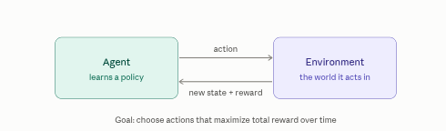

::: {.page-banner}
{fig-alt="Machine Learning in R — From Scratch without Tears"}
:::

# Chapter 19: Reinforcement Learning

> **Level**: Advanced | **Estimated Time**: 5–6 hours

---

## 19.1 Overview

Reinforcement learning is how you teach an agent to make good decisions by letting it try things and rewarding it when it does well - learning from consequences instead of from labeled examples. It's how you'd train a dog, and it's how systems learn to play games, drive, or run robots.

The contrast with the models we've been discussing is the key. A CNN classifier learns from labeled data: every training image comes with the right answer. RL has no answer key. Instead the agent acts, sees what happens, and gets a reward signal,  a number saying "that was good" or "that was bad",  and its only job is to figure out, through trial and error, which actions lead to the most reward over time. Nobody tells it the correct move; it discovers that from the rewards.

Everything in RL runs on one loop between two players. Reinforcement learning is one continuous conversation between an agent and its environment.



This loop runs over and over - thousands or millions of times — and that repetition is where the learning happens. Each cycle: the agent looks at the current state, picks an action, the environment responds with a new state and a reward, and the agent nudges its strategy based on whether that reward was good or bad. Do this enough and it converges on behavior that racks up the most reward.

The core vocabulary, in plain terms:

The state is the current situation - the board position in chess, the pixels on screen in a video game, the sensor readings for a robot. The action is one of the choices available in that state. The reward is the single number the environment hands back saying how good that was: +1 for winning a point, −1 for crashing, 0 for nothing much. And the policy is the agent's strategy — its learned rule for "in this state, take that action." Learning, ultimately, means improving the policy.

Two ideas are what make RL genuinely hard, and interesting.

The first is delayed reward. The reward for a good move often doesn't arrive until much later. A chess sacrifice looks bad the instant you make it but wins the game twenty moves on. So the agent can't just chase immediate reward - it has to learn which early actions lead to good outcomes down the line. This is the credit-assignment problem: figuring out which of your past decisions deserve the credit (or blame) for a reward that shows up much later.

The second is the explore–exploit tradeoff. Should the agent exploit what it already knows works, or explore something new that might work even better? Always exploiting means it never discovers the great strategy it hasn't tried; always exploring means it never cashes in on what it learned. Balancing the two is central to every RL method — like deciding whether to reorder your favorite dish or gamble on something new on the menu.

Where this fits with everything else we've covered: unlike the supervised models (CNNs, Transformers trained on labeled data) and the generative models (VAEs, GANs, diffusion trained to mimic a dataset), RL learns from interaction and consequences, with no dataset of right answers. It's also the ingredient behind RLHF - reinforcement learning from human feedback — which is a major part of how language models like me get fine-tuned: the "reward" becomes a signal for how helpful humans found a response.

---

## 19.2 Key Terminology

| Term | Meaning |
|------|---------|
| **State ($s$)** | Current situation of the agent |
| **Action ($a$)** | Choice the agent makes |
| **Reward ($r$)** | Immediate feedback signal |
| **Policy ($\pi$)** | Agent's strategy: $\pi(s) \to a$ |
| **Episode** | One complete run (start to terminal state) |
| **Return ($G$)** | Total discounted reward from step $t$: $G_t = r_t + \gamma r_{t+1} + \gamma^2 r_{t+2} + \cdots$ |
| **Value $V(s)$** | Expected return starting from state $s$ |
| **Q-value $Q(s,a)$** | Expected return taking action $a$ in state $s$ |

**Discount factor** $\gamma \in [0,1]$: how much future rewards matter.
- $\gamma=0$: myopic (only immediate reward)
- $\gamma=1$: infinite horizon (values future equally)

---

## 19.4 Theory

Reinforcement Learning: The Math (For Dummies)

Imagine teaching a dog to sit. It tries stuff, gets a treat or nothing, and slowly figures out what works. Reinforcement Learning is exactly that… but with math.

Here's the simplest recipe:

1. There's a **State** ($s$): what situation you're in. (Like "dog is standing.")
2. You can take an **Action** ($a$): do something. (Say, "sit.")
3. You get a **Reward** ($r$): a score for how good that was. ($+1$ for a treat, $0$ for nothing.)

The big goal: FIND A STRATEGY (called a **policy** $\pi$) that tells you what to do in every situation to get the most reward over time—not just now, but long term.

The math behind the learning part: you want to figure out "if I'm in state $s$ and take action $a$, how good will that be *in the end*?"
That's called the **Q-value** ($Q(s,a)$).

The magic formula (The Bellman equation):

$$
Q(s, a) = \text{expected reward for doing } a \text{ in } s \text{ now}
          + \text{future rewards if you keep doing your best after that}
$$

Or, more mathy:
$$
Q(s, a) = \mathbb{E}\left[r + \gamma \cdot \max_{a'} Q(s', a')\right]
$$
- $r$ = immediate reward
- $s'$ = new situation after doing $a$
- $\gamma$ ("gamma") = "how much do we care about the future?" (value from 0 to 1)

Your job as the agent: keep updating your guesses for $Q(s, a)$ every time you try stuff and see what happens, until you get really good at guessing which choices pay off.

THAT'S the math behind training a dog to sit… Or a robot to walk, or a game AI to beat Super Mario.

## 19.5 From-Scratch R Implementation

```{r}
# ================================================================================
# Q-Learning From Scratch (Explained for Dummies)
# ================================================================================
# Let's walk through a simple Q-learning agent that learns to solve a maze.
# What's happening? The agent is dropped into a grid. It moves until it either
# reaches a goal (+10 points), falls into a trap (-10 points) or keeps wandering (-0.1 per step).
# At first, it knows nothing and learns entirely through trial and error.
#
# Concepts:
# - State:       Which cell the agent is on
# - Action:      Go up, down, left, or right
# - Reward:      Points for reaching certain cells (+10 for goal, -10 for trap, -0.1 per move)
# - Q-table:     A big table the agent fills out with "how good is it to do this move from here?"
# - Policy:      "In each cell, what's the best move?" (gets this from the Q-table)
# - Epsilon-greedy: Sometimes the agent explores randomly, other times it picks its best known move
# - Learning:    The Q-table slowly gets better by looking both at what happened now, and what the
#                future could hold

set.seed(0)  # For reproducibility

# ---------------------
# 0. Define the maze
# ---------------------
# Each cell can be:
#   S - Start
#   G - Goal (+10 points)
#   X - Trap (-10 points)
#   # - Wall (can't enter)
#   . - Open (okay to step here)
# Positions are (row, col) pairs, kept 0-indexed (as in the original) to match the grid math below.
ROWS <- 5; COLS <- 5
WALLS <- list(c(1, 1), c(2, 1), c(3, 1), c(1, 3), c(2, 3), c(3, 3))
TRAP <- c(1, 4)
GOAL <- c(4, 4)
START <- c(0, 0)

# Small helper: is `pos` one of the (row,col) pairs in `set_list`?
is_in <- function(pos, set_list) any(sapply(set_list, function(w) all(w == pos)))

draw_maze <- function() {
  for (r in 0:(ROWS - 1)) {
    row <- ""
    for (c in 0:(COLS - 1)) {
      pos <- c(r, c)
      if (is_in(pos, WALLS)) row <- paste0(row, " # ")
      else if (all(pos == TRAP)) row <- paste0(row, " X ")
      else if (all(pos == GOAL)) row <- paste0(row, " G ")
      else if (all(pos == START)) row <- paste0(row, " S ")
      else row <- paste0(row, " . ")
    }
    cat(row, "\n")
  }
}

cat("The maze (S=start, G=goal +10, X=trap -10, #=wall):\n")
draw_maze()

# -----------------------------
# 1. The maze environment
# -----------------------------
# Each action: up, down, left, or right
ACTIONS <- list(c(-1, 0), c(1, 0), c(0, -1), c(0, 1))
ARROWS <- c("^", "v", "<", ">")  # Just for showing policy later

# What happens if the agent tries to move? `a` is 0-indexed (0..3) to match ACTIONS/ARROWS.
step_env <- function(state, a) {
  r <- state[1]; c <- state[2]
  d <- ACTIONS[[a + 1]]
  nr <- r + d[1]; nc <- c + d[2]
  # If the move hits a wall or goes off the edge, stay put and get -0.1
  if (!(nr >= 0 && nr < ROWS && nc >= 0 && nc < COLS) || is_in(c(nr, nc), WALLS)) {
    return(list(state = state, reward = -0.1, done = FALSE))
  }
  # If we reach the goal, get +10 and we're done
  if (all(c(nr, nc) == GOAL)) return(list(state = c(nr, nc), reward = 10.0, done = TRUE))
  # If we land in a trap, get -10 and we're done
  if (all(c(nr, nc) == TRAP)) return(list(state = c(nr, nc), reward = -10.0, done = TRUE))
  # Otherwise, a normal move: move and lose 0.1 for the step
  list(state = c(nr, nc), reward = -0.1, done = FALSE)
}

# -----------------------------------------
# 2. The Q-table: agent's "brain"
# -----------------------------------------
# It stores its guesses about the value of each action from each cell.
# Indexed as Q[r+1, c+1, a+1] since R arrays are 1-indexed but state/action ids stay 0-indexed.
Q <- array(0, dim = c(ROWS, COLS, 4))

# Learning parameters:
ALPHA <- 0.1     # How strongly new experiences count vs. old guesses
GAMMA <- 0.95    # How much agent cares about future reward vs. reward now
EPISODES <- 3000 # How many times to let the agent try the maze and learn

recent <- c()

for (ep in 1:EPISODES) {
  state <- START
  # Epsilon: starts high (lots of exploring), shrinks as agent learns (more exploiting)
  eps <- max(0.05, 1.0 - (ep - 1) / (EPISODES * 0.7))
  total <- 0.0
  for (step_i in 1:100) {  # Don't let it wander forever on one episode
    r <- state[1]; c <- state[2]
    # Choose an action:
    #   with probability eps: random action (exploring)
    #   otherwise: pick action with highest Q-value (exploiting)
    if (runif(1) < eps) {
      a <- sample(0:3, 1)
    } else {
      a <- which.max(Q[r + 1, c + 1, ]) - 1
    }

    # Take the action, get reward and new state
    res <- step_env(state, a)
    nxt <- res$state; reward <- res$reward; done <- res$done
    nr <- nxt[1]; nc <- nxt[2]
    total <- total + reward

    # --- Update Q-table (the "Bellman update") ---
    #   Q(s,a) <- Q(s,a) + ALPHA * (reward + GAMMA * max_a' Q(s',a') - Q(s,a))
    #   Translation: Move your guess for Q(s,a) toward "reward now, plus best you could ever do from nxt"
    best_next <- if (done) 0.0 else max(Q[nr + 1, nc + 1, ])
    Q[r + 1, c + 1, a + 1] <- Q[r + 1, c + 1, a + 1] + ALPHA * (reward + GAMMA * best_next - Q[r + 1, c + 1, a + 1])

    state <- nxt
    if (done) break
  }
  recent <- c(recent, total)
  if (ep %% 500 == 0) {
    cat(sprintf("episode %4d | avg reward (last 500): %6.2f\n", ep, mean(tail(recent, 500))))
  }
}

# --------------------------------
# 3. Show what the agent learned
# --------------------------------
# In each cell, print the arrow for the best learned action
cat("\nLearned policy (arrow = best move the agent found in each cell):\n")
for (r in 0:(ROWS - 1)) {
  row <- ""
  for (c in 0:(COLS - 1)) {
    pos <- c(r, c)
    if (is_in(pos, WALLS)) row <- paste0(row, " # ")
    else if (all(pos == TRAP)) row <- paste0(row, " X ")
    else if (all(pos == GOAL)) row <- paste0(row, " G ")
    else row <- paste0(row, " ", ARROWS[which.max(Q[r + 1, c + 1, ])], " ")
  }
  cat(row, "\n")
}

# ------------------------------------------
# 4. Watch it run with only its "best moves"
# ------------------------------------------
cat("\nGreedy run from start:\n")
state <- START; path <- list(START); done <- FALSE
for (i in 1:30) {
  r <- state[1]; c <- state[2]
  a <- which.max(Q[r + 1, c + 1, ]) - 1
  res <- step_env(state, a)
  state <- res$state; done <- res$done
  path[[length(path) + 1]] <- state
  if (done) break
}
cat("  ", paste(sapply(path, function(p) sprintf("(%d, %d)", p[1], p[2])), collapse = " -> "), "\n")
cat(if (all(state == GOAL)) "  reached the GOAL!\n" else "  did not reach the goal\n")
```

---

## 14.6 RL Algorithm Zoo

| Algorithm | Type | Key Idea |
|-----------|------|---------|
| Q-Learning | Model-free, off-policy | Tabular Q-table |
| SARSA | Model-free, on-policy | Learn from actual actions |
| DQN | Model-free, off-policy | Q-function as neural net |
| Policy Gradient | Policy-based | Directly optimize policy |
| Actor-Critic | Policy + Value | Two networks |
| PPO | Policy-based | Stable policy updates |

---

##  Exercises

1. What is the difference between on-policy (SARSA) and off-policy (Q-Learning)?
2. Implement **SARSA** — the update rule uses the actual next action instead of max.
3. Why does Q-Learning need experience replay and target networks in the DQN setting?
4. What happens if $\gamma=1$ in an infinite-horizon task?

---

**← Previous:** [Chapter 18: Generative Learning](chapter-18-generative-models.qmd)
**→ Next:** [Chapter 20: Model Evaluation & Best Practices](chapter-20-model-evaluation.qmd)
